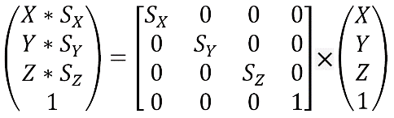
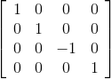

### 3.4.2　缩放矩阵

缩放矩阵用于改变物体的大小或者将点向原点相反方向移动。虽然缩放点这个操作乍一看有点奇怪，不过OpenGL中的物体都是用一组或多组的点定义的。因此，缩放物体涉及缩放它的点的集合。

缩放矩阵变换由单位矩阵和位于A00, A11, A22的X、Y、Z缩放因子组成。图3.4中展示了缩放矩阵的形式和当它与齐次坐标点相乘的效果：所得的结果是经过缩放值修改后的新点。

<b class="my_markdown">图3.4　缩放矩阵变换</b>

GLM中有一些函数是用于构建与点相乘的缩放矩阵的。其中相关的操作有：

+ glm::scale(x, y, z) 构建缩放(x, y, z)的矩阵；
+ mat4 × vec4。

缩放还可以用来切换坐标系。例如，我们可以用缩放来在给定右手坐标系的情况下确定左手坐标。从图3.1中我们可以看到通过反转Z坐标就可以在右手坐标系和左手坐标系中切换，因此，用来切换坐标系的缩放矩阵变换是：

