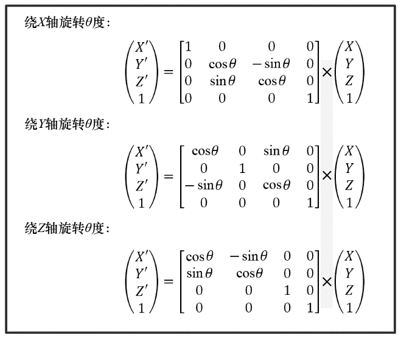

### 3.4.3　旋转矩阵

旋转会稍微复杂一些，因为在3D空间中旋转物体需要指定旋转轴和旋转的角度或弧度。

在16世纪中叶，数学家莱昂哈德· 欧拉表明，围绕任何轴的旋转都可以表示为绕X、Y、Z轴旋转的组合[EU76]。围绕这3个轴的旋转角度被称为欧拉角。这个被称为欧拉定理的发现，对我们很有用，因为对于每个坐标轴的旋转可以用矩阵变换来表示。

旋转变换有3种，分别是绕X、Y和Z轴旋转，见图3.5。同时GLM中也有一些用于构建旋转矩阵的函数。

+ glm::rotate(mat4, θ, x, y, z)构建绕 X, Y, Z轴旋转θ度的缩放矩阵。
+ mat4 × vec4。

<b class="my_markdown">图3.5　旋转变换矩阵</b>

实践中，当3D空间中旋转轴不穿过原点时，物体使用欧拉角进行旋转需要几个额外的步骤。一般有：

（1）平移旋转轴以使它经过原点；

（2）绕X、Y和Z轴旋转适当的欧拉角；

（3）复原步骤（1）中的平移。

图3.5中所示的3个旋转变换都有自己有趣的特性，即反向旋转的矩阵恰等于其转置矩阵。通过观察之前这些矩阵，同时有cos(−θ) = cos(θ)和sin(−θ) = −sin(θ)，即可验证。后面将会用到这个特性。

欧拉角在某些3D图形应用中会导致一些瑕疵。因此，通常在计算旋转时推荐使用四元数。有兴趣探索四元数的读者可以寻求很多已有的资源（如[KU98]）。欧拉角足以满足我们的大部分需求。

