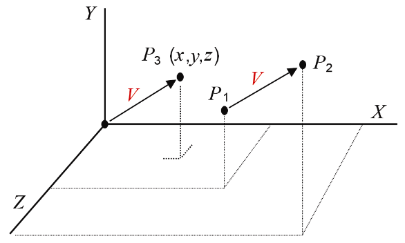
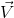
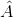

### 3.5　向量

向量表示大小和方向。它们没有特定位置。“移动”向量并不改变它所代表的含义。

记录向量的方法各式各样，如：一端带箭头的线段、二元组（幅度，方向）或两点之差。在3D图形学中，向量一般用空间中的单个点表示，向量的大小是原点到该点的距离，方向则是原点到该点的方向。在图3.6中，向量**V**可以用点P1和P2之间的差表示，也可以等价地用原点到P3来表示。在我们的所有应用中，我们都简单地将**V**表示为(x, y, z)，即我们用来表示P3的符号。

<b class="my_markdown">图3.6　向量**V**的两种表示</b>

用与表示点相同的方式来表示向量很方便，因为我们对点和向量用同样的矩阵变换。不过这也会使人困惑。因此，我们有时候会在向量上加一个小箭头（如）。许多图形系统并不区分点和向量，如GLSL和GLM，它们所提供的vec3/vec4类型既能用来存储点，又能用来存储向量。有的系统（例如本书Java早期版本中所用到的graphicslib3D库）对于点和向量有着不同的类，强制使用适当的类来进行所需的操作。对于点和向量使用同一种类型还是不同的类型哪个更好这件事上仍然没有定论。

在GLM和GLSL中有许多3D图形学中经常用到的向量操作。如假设有向量**A**(u, v, w)和**B**(x, y, z)：

**加减法：**

**A** ± **B** = (u ± x, v ± y, w ± z)

glm: vec3 ± vec3

GLSL: vec3 ± vec3

**归一化（变为长度 =1）：**

 = **A**/|**A**| = **A**/sqrt(u2+v2+w2), 其中 |**A**| ≡ 向量**A**的长度

glm: normalize(vec3) 或 normalize(vec4)

GLSL: normalize(vec3) 或normalize(vec4)

**点积：**

**A**·**B** = ux + vy + wz

glm: dot(vec3,vec3) 或dot(vec4,vec4)

GLSL: dot(vec3,vec3) 或dot(vec4,vec4)

**叉积：**

**A** × **B** = (vz-wy, wx-uz, uy-vx)

glm: cross(vec3,vec3)

GLSL: cross(vec3,vec3)

其他有用的向量函数如magnitude（在GLSL和GLM中是length()）、reflection和refraction（在GLSL和GLM中都有）。

我们现在仔细看一下点积和叉积函数。

