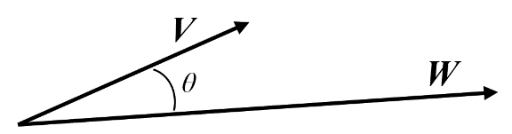
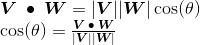
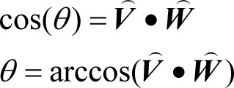
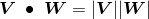
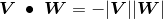
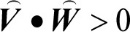
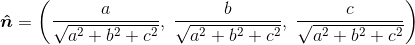

### 3.5.1　点积的应用

在本书中的程序大量使用了点积。点积最重要也最基本的应用是求解两向量夹角。设有向量**V**和**W**，计算其夹角为θ。

因此，如果**V**和**W**是正规化向量（有着单位长度的向量——这里用“^”标记正规化），则有：

有趣的是，我们后面会看到通常用到的是cos(θ)，而非θ。因此，这两个推导出的公式都很有用。

点积同时还有许多其他用途。

+ 求解向量的大小：。
+ 求解两向量是否正交，若正交，则。
+ 求解两向量是否平行，若平行，则。
+ 求解两向量是否平行但指向相反方向，若满足，则。
+ 求解两向量夹角是否在（−90°～+90°）：。
+ 求解点P=(x, y, z)到平面S=(a, b, c, d)的最小有符号距离。首先，求垂直于S的单位法向量：，以及从原点到平面的最短距离。之后从P到S的最小有符号距离为，其符号由P在S的哪边决定。

