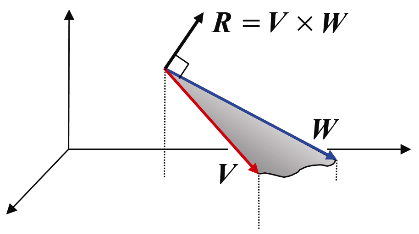
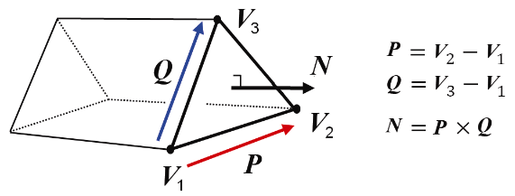

### 3.5.2　叉积的应用

两向量叉积的一个重要特性是，它会生成一个新的向量，新的向量正交（垂直）于之前两个向量所定义的平面。我们会在本书中大量使用到这一特性。

任意两个不共线向量都定义了一个平面。例如考虑两个任意向量**V**和**W**。由于向量可以在不改变含义的情况下进行平移，因此，可以将它们移动到起点相交的位置。图3.7展示了**V**和**W**定义的平面，以及其叉积所得法向量。其所得法向量的方向遵循右手定则，即将右手手指从**V**向**W**卷曲会使得大拇指指向法向量**R**。

<b class="my_markdown">图3.7　叉积得到法向量</b>

注意，这里顺序很重要。**W** ×**V**将会得到与**R**方向相反的向量。

通过叉积来获得法向量的能力对我们后面要学习的光照部分非常重要。为了确定光照效果，我们需要知道所渲染模型的外向法向量。图3.8中展示了一个例子，其中有一个6个点（顶点）构成的简单模型，使用叉积计算来获得其中一面的外向法向量。

<b class="my_markdown">图3.8　计算外向法向量</b>

