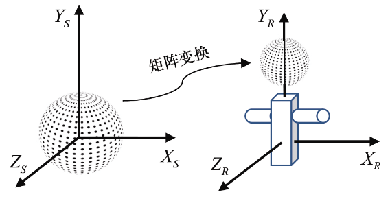

### 3.6　局部和世界空间

3D图形学（用OpenGL或其他框架）常见的应用是模拟三维世界、在其中放入物体并在显示器上观看它。放在3D世界的物体通常用三角形的集合来进行建模。稍后我们会在第6章中详细讲解建模。但是我们可以先了解一下大致的处理过程。

当建立物体的3D模型时，我们通常以最方便的定位方式描述模型。如果模型是个球形，那么我们很可能将球心定位于原点（0,0,0）并赋予它一个方便的半径，比如1。模型定义的空间叫作局部空间（local space）或模型空间（model space）。OpenGL文档使用的术语是物体空间（object space）。

之后这个球形可能用于一个大模型的部分，如成为机器人的头部。这个机器人，当然，定义在它自己的局部/模型空间。我们可以用图3.9所示的矩阵变换通过缩放、旋转和平移，将球形模型放在机器人模型的空间。通过这种方式，可以分层次地构建复杂模型（在4.8节中会进一步通过使用一堆矩阵讲解这个主题）。

<b class="my_markdown">图3.9　球形和机器人的模型空间</b>

使用同样的方式，通过设定物体在模拟世界中的朝向和大小，将物体放在模拟这个世界的空间中，这个空间叫作世界空间。将对象定位及定向在世界空间的矩阵称为模型矩阵或**M**。

