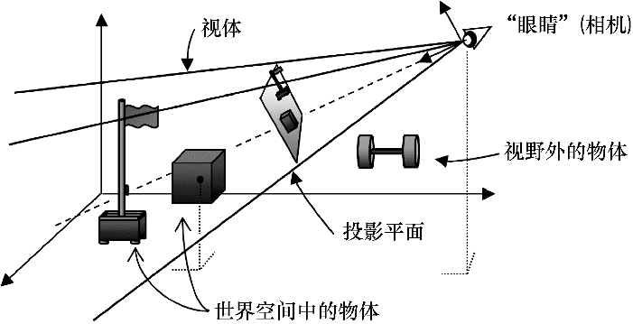
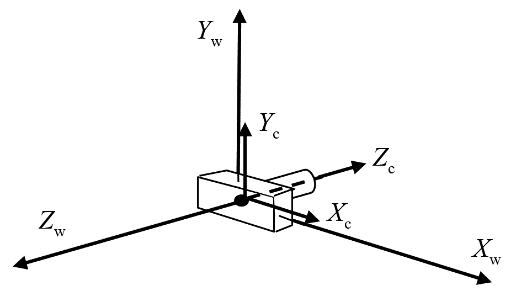
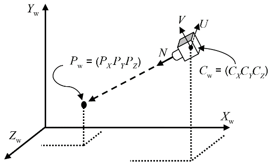
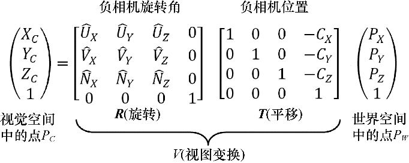

### 3.7　视觉空间和合成相机

到此为止，我们所接触的变换矩阵全都在3D空间中操作。但是，我们最终需要将3D空间——或它的一部分——展示在2D显示器上。为了达成这个目标，我们需要找到一个有利点。正如我们在现实世界通过眼睛从一点观察一样，我们也必须找到一点并确立观察方向作为我们观察虚拟世界的窗口。这个点叫作“视图”或“视觉”空间，或“合成相机”。

如图3.10和图3.12所示，观察3D世界需要：（a）将相机放入世界的某个位置；（b）调整相机的角度，通常需要一套它自己的直角坐标轴U/V/N；（c）定义一个视体（view volume）；（d）将视体内的对象投影到投影平面（projection plane）上。

<b class="my_markdown">图3.10　将相机放入3D世界中</b>

OpenGL有一个固定在原点(0,0,0)并向下看向Z轴负方向的相机，如图3.11所示。

<b class="my_markdown">图3.11　OpenGL固定相机</b>

为了应用OpenGL相机，我们需要做的是将它模拟移动到适合的位置和方向。我们需要先找出在世界中的物体与我们期望的相机位置的相对位置（如物体应该在由图3.12所示相机U、V、N轴定义的“相机空间”中的何处）。给定世界空间中的点PW，我们需要通过变换将它转换成相应相机空间中的点，从而让它看起来好像是我们从期望的相机位置CW进行观看的。我们通过计算它在相机空间中的位置PC实现。已知OpenGL相机位置永远固定在点(0,0,0)，问：我们如何变换来实现上述功能？

<b class="my_markdown">图3.12　相机方向</b>

需要做的变换如下：

（1）将PW平移，其向量为负的期望相机位置。

（2）将PW旋转，其角度为负的期望相机旋转的欧拉角。

我们可以构建一个单一变换矩阵以完成旋转和平移，这个矩阵叫作视图变换（viewing transform）矩阵**V**。矩阵**V**通过合并矩阵**T**（包含负相机期望位置的平移矩阵）和**R**（包含负相机期望旋转的旋转矩阵）。在本例中，从右向左，我们先平移世界空间中的点PW，之后旋转：

PC = **R** ( **T** * PW )

如前所见，通过结合律我们得到如下运算：

PC = ( **R** * **T** ) PW

如果我们将合并后的**R** * **T**存入矩阵**V**，运算成为

PC = **V** * PW

完整的计算以及**T**和**R**的准确内容在图3.13中（我们忽略了对矩阵**R**的推导——推导过程见参考资料[FV95]）。

<b class="my_markdown">图3.13　推导视图矩阵</b>

通常，**V**矩阵与模型矩阵**M**合并成为一个模型-视图（model-view，MV）矩阵：

MV = **V** * **M**

之后，点PM在从自己的模型空间通过如下一个步骤就可以直接转换至相机空间：

PC = MV * PM

在复杂场景中，当我们需要对每个顶点，而非只是一个点做这个变换的时候，这种方法的好处就很明显了。通过预先计算MV，对于空间中每个点的变换只需要我们进行一次矩阵乘法计算。之后，我们将会看到，我们可以将这个过程延伸到与计算更多的合并矩阵，以大量减少每个顶点的计算量。

