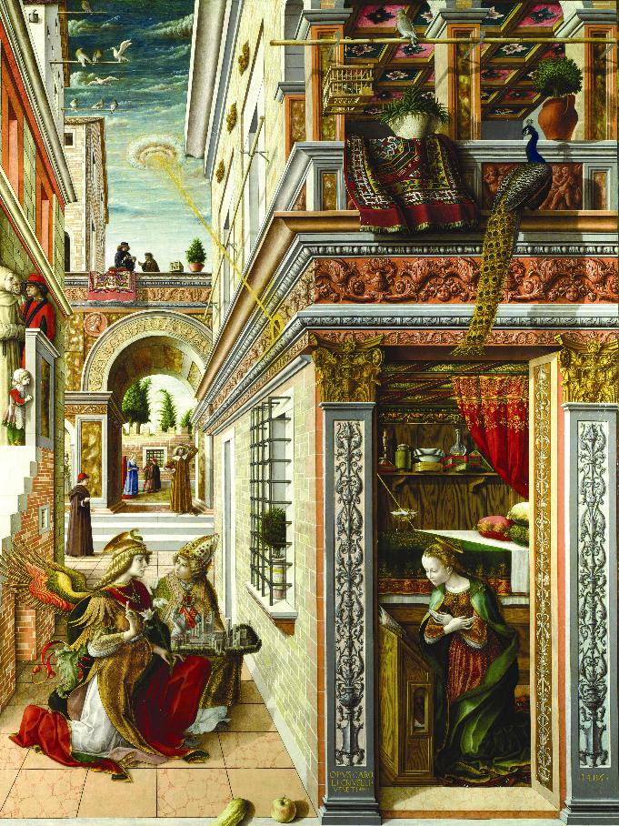
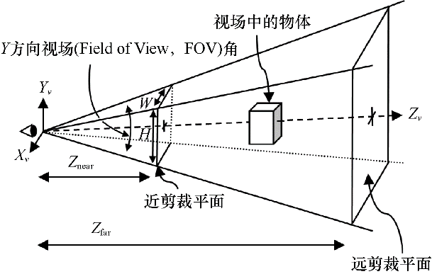
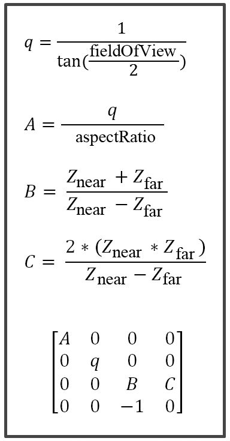

### 3.8.1　透视投影矩阵

透视投影通过使用透视概念模仿我们看真实世界的方式，尝试让2D图像看起来像是3D的。物体近大远小，3D空间中有的平行线用透视法画出来就不再平行。

透视法是15世纪初～16世纪初文艺复兴时期的伟大发现之一，当时的画家开始绘制比前人更加真实的画作。

图3.14中是一个绝好的例子。卡洛·克里韦利在1486年绘制的《圣母领报》（又名《给圣·埃米迪乌斯报喜》目前收藏于伦敦国家美术馆[CR86]）。这幅画明显强烈地使用了透视——右侧建筑的左墙向后的线条戏剧性地一起倾斜。这种画法让人产生了深度感知和画中有3D空间的错觉。这个过程中，在现实中平行的线在画中并不平行。同样，在前景中的人物比在背景中的人物要大。虽然今天我们将这些视为理所当然的，不过算出实现它的变换矩阵还是需要一些数学分析的。

<b class="my_markdown">图3.14　《圣母领报》（卡洛·克里韦利，1486年）</b>

我们通过使用变换矩阵将平行线变为恰当的不平行线来实现这个效果。这个矩阵叫作透视矩阵或者透视变换，通过定义4个参数来进行视体（view volume）的构建。其中4个参数是纵横比、视场、投影平面或近剪裁平面、远剪裁平面。

只有在远近剪裁平面间的物体才会被渲染。近剪裁平面同时也是物体所投影到的平面，通常放在离眼睛或相机较近的位置（如图3.15左侧所示）。我们会在第4章中讨论如何为远剪裁平面选择合适的值。视场是可视空间的纵向角度。纵横比是远近剪裁平面的宽度比高度。通过这些元素所形成的形状叫作视锥（frustum），如图3.15所示。

<b class="my_markdown">图3.15　透视视体或视锥</b>

透视矩阵用于将3D空间中的点变换至近剪裁平面上合适的位置，它的构建需要先计算q、A、B、C的值，之后用这些值来构建透视矩阵，如图3.16所示（推导过程见参考资料[FV95]）。

<b class="my_markdown">图3.16　构建透视矩阵</b>

生成透视变换矩阵很容易，只需要将所描述的公式插入一个4×4矩阵。GLM库也包含了一个用于构建透视矩阵的函数glm::perspective()。

