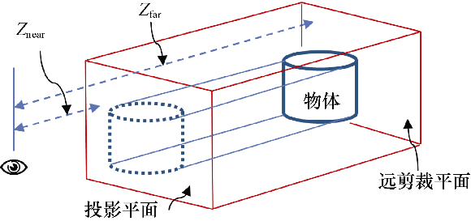
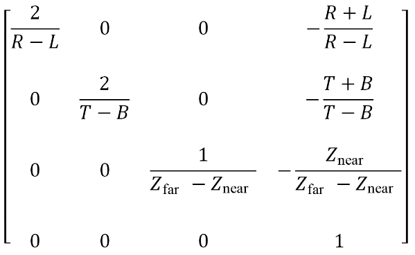

### 3.8.2　正射投影矩阵

在正射投影中，平行线仍然是平行的，即不使用透视，如图3.17所示。正射与透视相反，在视体中的物体不因其距相机距离做任何调整，而直接进行投影。

<b class="my_markdown">图3.17　正射投影</b>

正射投影是一种平行投影，其中所有的投影都与投影平面垂直。正射矩阵通过如下参数构建：（a）从相机到投影平面的距离Znear；（b）从相机到远剪裁平面的距离Zfar；（c）L、R、T、和B的值，其中L和R分别是投影平面左右边界的X坐标，T和B分别是投影平面上下边界的Y坐标，如图3.18所示。

<b class="my_markdown">图3.18　正射投影矩阵</b>

并非所有平行投影都是正射投影，但是其他平行投影不在本书范围内。

平行投影与我们眼睛所见到的真实世界不同。但是它们在很多情况下都有其用处，比如投射阴影、进行3D剪裁以及CAD（计算机辅助设计）中——用在CAD中是因为无论物体如何摆放，其尺寸都不变。无论如何，本书中绝大多数例子使用透视投影。

