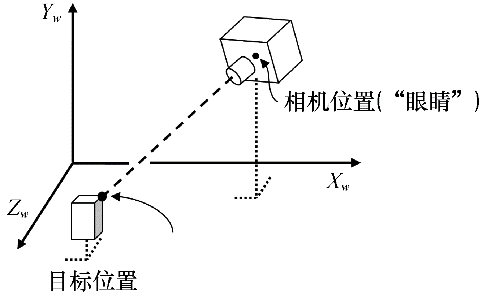
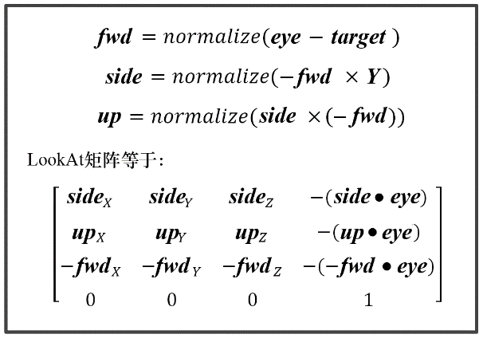

### 3.9　LookAt矩阵

我们最后要学习的变换是LookAt矩阵。当你想要把相机放在某处并看向一个特定的位置时，就需要用到它了，如图3.19所示。当然，用我们已经学到的方法也可以做到，但是这个操作非常频繁，因此为它专门构建一个矩阵通常比较有用。

<b class="my_markdown">图3.19　LookAt的元素</b>

LookAt变换依然由相机旋转决定。我们通过指定大致旋转朝向的向量（如世界Y轴）。通常，可以通过一系列叉积获得相机旋转的正面、侧面以及上面。图3.20展示了计算过程，从相机位置（眼睛）、目标位置以及初始向上向量**Y**来构建LookAt矩阵，其推导过程在参考资料[FV95]中。

<b class="my_markdown">图3.20　LookAt矩阵</b>

我们可以将这个过程构建为一个C++/OpenGL实用函数，通过指定相机位置、目标位置以及初始“向上”向量**Y**，构建一个LookAt矩阵。由于GLM中已经有一个用来构建LookAt矩阵的函数glm::lookAt()，我们用它就可以了。稍后本书第8章生成阴影的时候会用到这个函数。

