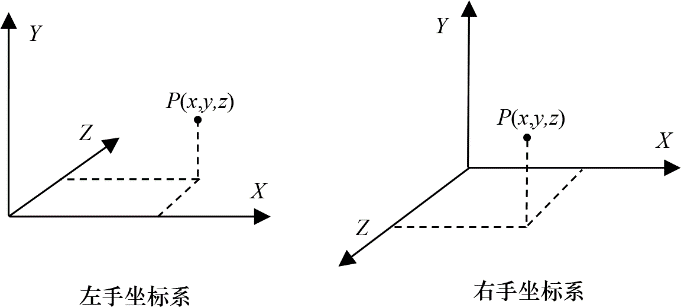

### 3.1　3D坐标系统

3D空间通常用3个坐标轴X、Y和Z来表示。这3个轴可以以两种方式来布置：左手或右手（它们是以轴的朝向来命名的，通过左手或右手大拇指与食指、中指成直角来进行构造）。[1]如图3.1所示。

<b class="my_markdown">图3.1　3D坐标系统</b>

知道图形编程环境所使用的坐标系是很重要的。例如，OpenGL中的坐标系大体是右手坐标系，而Direct3D中大体是左手坐标系。在本书中，除非特别说明，否则我们都是用右手坐标系。

