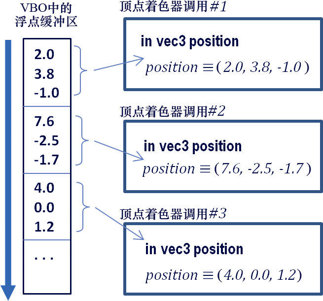

### 4.1　缓冲区和顶点属性

想要绘制一个对象，它的顶点数据需要被发送给顶点着色器。通常会把顶点数据在C++端放入一个缓冲区，并把这个缓冲区和着色器中声明的顶点属性相关联。要完成这件事，有好几个步骤，有些步骤只需要做一次，而如果是动画场景的话，有些步骤需要每帧都做一次：

只做一次的步骤—— 一般是在init()中。

（1）创建一个缓冲区。

（2）将顶点数据复制到缓冲区。

每帧都要做的步骤—— 一般是在display()中。

（1）启用包含了顶点数据的缓冲区。

（2）将这个缓冲区和一个顶点属性相关联。

（3）启用这个顶点属性。

（4）使用glDrawArrays(…)绘制对象。

所有缓冲区通常在程序开始的时候统一创建，可以在init()中，或者在被init()调用的函数中。在OpenGL中，缓冲区被包含在顶点缓冲对象（Vertex Buffer Object，VBO）中，VBO在C++/OpenGL应用程序中被声明和实例化。一个场景可能需要很多VBO，所以常常会在init()中生成并填充若干个VBO，这样在你的程序需要绘制一个或多个VBO的时候就可以直接使用。

缓冲区使用特定的方式和顶点属性交互。当glDrawArrays()被执行时，缓冲区中的数据开始流动，从缓冲区的开头开始，按顺序流过顶点着色器。像第2章中介绍的一样，顶点着色器对每个顶点执行一次。3D空间中的顶点需要3个数值，所以着色器中的顶点属性常常会以vec3类型接收到这3个数值。然后，对缓冲区中的每组这3个数值，着色器会被调用，如图4.1所示。


<center class="my_markdown"><b class="my_markdown">图4.1　在VBO和顶点属性之间的数据传递</b></center>

OpenGL中还有一种相关的结构，叫作顶点数组对象（Vertex Array Object，VAO）。OpenGL的3.0版本引入了VAO，作为一种组织缓冲区的方法，让缓冲区在复杂场景中更容易操控。OpenGL要求至少创建一个VAO，对我们现在来说一个就够了。

举个例子，假设我们想要显示两个对象。在C++端，我们可以声明一个VAO和两个相关的VBO（每个对象一个），就像这样：

```c
GLuint vao[1];     // OpenGL 要求这些数值以数组的形式指定
GLuint vbo[2];
…
glGenVertexArrays(1, vao);
glBindVertexArray(vao[0]);
glGenBuffers(2, vbo);
```

glGenVertexArrays()和glGenBuffers()这两个OpenGL命令分别创建VAO和VBO，并返回它们的整数型ID。我们把这些ID存进整数型数组vao和vbo中。这两个命令各自有两个参数，第一个是要创建多少个ID，第二个是用来保存返回的ID的数组。glBindVertexArrays()命令的目的是将指定的VAO标记为“活跃”，这样生成的缓冲区<sup class="my_markdown">[1]</sup>就会和这个VAO相关联。

每个缓冲区需要有在顶点着色器中声明的相应的顶点属性变量。顶点属性通常是着色器中首先被声明的变量。在我们的立方体例子中，用来接收立方体顶点的顶点属性可以在顶点着色器中这样声明：

```c
layout (location = 0) in vec3 position;
```

关键字in意思是“输入”（input），表示这个顶点属性将会从缓冲区中接收数值（我们以后会看到，顶点属性也可以用来“输出”）。像我们之前看到的一样，“vec3”的意思是着色器的每次调用会抓到3个浮点类型数值（分别表示x、y、z，它们组成一个顶点数据）。变量的名字是“position”。命令中“layout (location=0)”这部分叫作“layout修饰符”，也就是我们把顶点属性和特定缓冲区关联起来的方法。这意味着，这个顶点属性的识别号是0，我们后面会用到。

我们把一个模型的顶点加载到缓冲区（VBO）的方式取决于模型的顶点数值存储在哪里。在第6章中，我们将会看到通常如何使用建模工具（比如Blender <sup class="my_markdown">[BL16]</sup>或者Maya <sup>[MA16]</sup>）创建模型、导出成标准文件格式（比如.obj，在第6章会介绍）并导入到C++/OpenGL应用程序。我们还会看到模型的顶点如何被临时计算出来，或者在管线中使用细分着色器生成出来。

现在，假设我们想要绘制一个立方体，并且假定我们的立方体的顶点数据在C++/OpenGL应用程序中的数组中直接指定。在这种情况下，我们需要（a）将这些值复制到我们之前生成的两个缓冲区中的一个之中。为此，我们需要使用OpenGL的glBindBuffer()命令将缓冲区（例如，第0个缓冲区）标记为“活跃”；并且（b）使用glBufferData()命令将包含顶点数据的数组复制进活跃缓冲区（这里应该是第0个VBO）。假设顶点存储在名为vPositions的浮点类型数组中，以下C++代码<sup class="my_markdown">[2]</sup>会将这些值复制到第0个VBO中：

```c
glBindBuffer(GL_ARRAY_BUFFER, vbo[0]);
glBufferData(GL_ARRAY_BUFFER, sizeof(vPositions), vPositions, GL_STATIC_DRAW);
```

接下来，我们向display()中添加代码，将缓冲区中的值发送到着色器中的顶点属性。我们通过以下3个步骤来实现：（a）使用glBindBuffer()命令标记这个缓冲区为“活跃”，正如上所述；（b）将活跃缓冲区与着色器中的顶点属性相关联；（c）启用顶点属性。以下代码行实现了这些步骤：

```c
glBindBuffer(GL_ARRAY_BUFFER, vbo[0]);                     // 标记第0个缓冲区为"活跃"
glVertexAttribPointer(0, 3, GL_FLOAT, GL_FALSE, 0, 0);     // 将第0个属性关联到缓冲区
glEnableVertexAttribArray(0);                              // 启用第0个顶点属性
```

现在，当我们执行glDrawArrays()时，第0个VBO中的数据将被传输给拥有位置0的layout修饰符的顶点属性中。这会将立方体的顶点数据发送到着色器。

