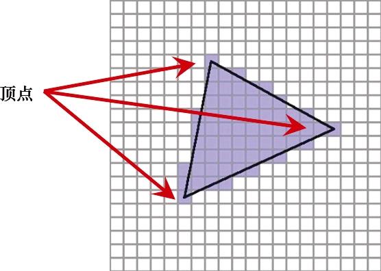

### 4.3　顶点属性插值

相较于如何处理统一变量，了解如何在OpenGL管线中处理顶点属性非常重要。回想一下，在片段着色器光栅化之前，由顶点定义的图元（例如，三角形）被转换为片段。光栅化过程会线性插值顶点属性值，以便显示的像素能无缝连接建模的曲面。

相比之下，统一变量的行为类似于初始化过的常量，并且在每次顶点着色器调用（即从缓冲区发送的每个顶点）中保持不变。统一变量本身不是插值的；无论有多少顶点，它始终包含相同的值。

光栅着色器对顶点属性进行的插值在很多方面都很有用。稍后，我们将使用光栅化来插值颜色、纹理坐标和曲面法向量。重要的是要理解通过缓冲区发送到顶点属性的所有值都将在管线中被进一步插值。

我们在顶点着色器中看到顶点属性被声明为“in”，表示它们从缓冲区接收值。顶点属性还可以改为声明为“out”，这意味着它们会将值发送到管线中的下一个阶段。例如，顶点着色器中的以下声明将指定一个名为“color”的顶点属性，该属性输出vec4类型的值：

```c
out vec4 color;
```

没有必要为顶点位置声明一个“out”变量，因为OpenGL有一个内置的vec4变量用于此目的，它的名字叫作gl_Position。在顶点着色器中，我们将矩阵变换应用于传入的顶点（之前声明为位置的顶点），并将结果赋值给gl_Position：

```c
gl_Position = proj_matrix * mv_matrix * position;
```

然后，变换后的顶点将自动输出到光栅着色器，最终将相应的像素位置发送到片段着色器。

光栅化过程如图4.2所示。在glDrawArrays()函数中指定GL_TRIANGLES时，光栅化是逐个三角形完成的。首先沿着连接顶点的线开始插值，其精度级别和像素显示密度相关。然后通过沿连接边缘像素的水平线插值来填充三角形的内部空间中的像素。


<center class="my_markdown"><b class="my_markdown">图4.2　顶点的光栅化</b></center>

