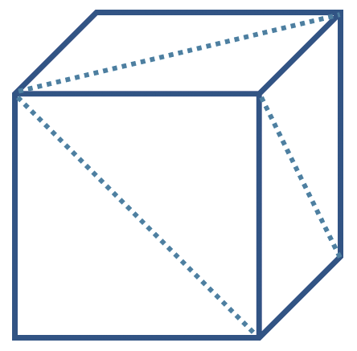
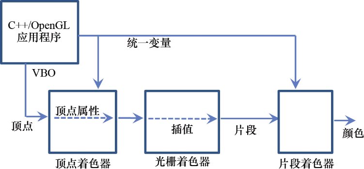
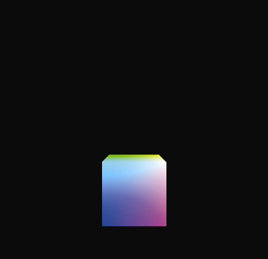
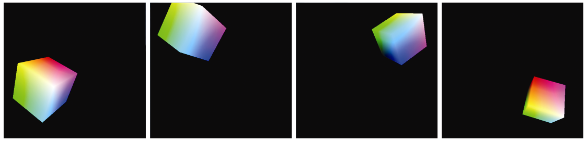

### 4.5　我们的第一个3D程序—— 一个3D立方体

是时候将所有部分组合在一起了！为了构建一个完整的C++/OpenGL/GLSL系统并在3D“世界”中渲染我们的立方体，到目前为止介绍过的所有机制都需要被整合在一起，并完美协调。我们可以重用我们之前在第2章中看到的一些代码。具体来说，我们不会再重复讲解以下这些用来读取包含着色器代码的文件，编译和链接它们，以及检测GLSL错误的函数；事实上，回想一下，我们已将它们移到“Utils.cpp”文件中：

```c
•  createShaderProgram()
•  readShaderSource()
•  checkOpenGLError()
•  printProgramLog()
•  printShaderLog()
```

在给定了Y轴的指定视场角、屏幕纵横比以及所需的近、远剪裁平面（在4.9节中讨论了如何为近剪裁平面和远剪裁平面选择适当的值）的情况下，我们还需要一个构建透视矩阵的工具函数。虽然我们可以自己轻松编写这样的函数，但GLM已经包含了一个：

```c
glm::perspective(<field of view>, <aspect ratio>, <near plane>, <far plane>);

```

我们现在可以构建完整的3D立方体程序了，如下面的程序4.1所示。

程序4.1　简单的红色立方体

```c
C++/OpenGL 应用程序
#include <GL\glew.h>
#include <GLFW\glfw3.h>
#include <string>
#include <iostream>
#include <fstream>
#include <cmath>
#include <glm\glm.hpp>
#include <glm\gtc\type_ptr.hpp>
#include <glm\gtc\matrix_transform.hpp>
#include "Utils.h"
using namespace std;
#define numVAOs 1
#define numVBOs 2
float cameraX, cameraY, cameraZ;
float cubeLocX, cubeLocY, cubeLocZ;
GLuint renderingProgram;
GLuint vao[numVAOs];
GLuint vbo[numVBOs];
// 分配在 display() 函数中使用的变量空间，这样它们就不必在渲染过程中分配
GLuint mvLoc, projLoc;
int width, height;
float aspect;
glm::mat4 pMat, vMat, mMat, mvMat;
void setupVertices(void) {    // 36个顶点，12个三角形，组成了放置在原点处的2×2×2立方体
   float vertexPositions[108] = {
      -1.0f, 1.0f, -1.0f, -1.0f, -1.0f, -1.0f, 1.0f, -1.0f, -1.0f,
      1.0f, -1.0f, -1.0f, 1.0f, 1.0f, -1.0f, -1.0f, 1.0f, -1.0f,
      1.0f, -1.0f, -1.0f, 1.0f, -1.0f, 1.0f, 1.0f, 1.0f, -1.0f,
      1.0f, -1.0f, 1.0f, 1.0f, 1.0f, 1.0f, 1.0f, 1.0f, -1.0f,
      1.0f, -1.0f, 1.0f, -1.0f, -1.0f, 1.0f, 1.0f, 1.0f, 1.0f,
      -1.0f, -1.0f, 1.0f, -1.0f, 1.0f, 1.0f, 1.0f, 1.0f, 1.0f,
      -1.0f, -1.0f, 1.0f, -1.0f, -1.0f, -1.0f, -1.0f, 1.0f, 1.0f,
      -1.0f, -1.0f, -1.0f, -1.0f, 1.0f, -1.0f, -1.0f, 1.0f, 1.0f,
      -1.0f, -1.0f, 1.0f, 1.0f, -1.0f, 1.0f, 1.0f, -1.0f, -1.0f,
      1.0f, -1.0f, -1.0f, -1.0f, -1.0f, -1.0f, -1.0f, -1.0f, 1.0f,
      -1.0f, 1.0f, -1.0f, 1.0f, 1.0f, -1.0f, 1.0f, 1.0f, 1.0f,
      1.0f, 1.0f, 1.0f, -1.0f, 1.0f, 1.0f, -1.0f, 1.0f, -1.0f
   };
   glGenVertexArrays(1, vao);
   glBindVertexArray(vao[0]);
   glGenBuffers(numVBOs, vbo);
   glBindBuffer(GL_ARRAY_BUFFER, vbo[0]);
   glBufferData(GL_ARRAY_BUFFER, sizeof(vertexPositions), vertexPositions, GL_STATIC_DRAW);
}
void init(GLFWwindow* window) {
   renderingProgram = Utils::createShaderProgram("vertShader.glsl", "fragShader.glsl");
   cameraX = 0.0f; cameraY = 0.0f; cameraZ = 8.0f;
   cubeLocX = 0.0f; cubeLocY = -2.0f; cubeLocZ = 0.0f; // 沿Y轴下移以展示透视
   setupVertices();
}
void display(GLFWwindow* window, double currentTime) {
   glClear(GL_DEPTH_BUFFER_BIT);
   glUseProgram(renderingProgram);
   // 获取MV矩阵和投影矩阵的统一变量
   mvLoc = glGetUniformLocation(renderingProgram, "mv_matrix");
   projLoc = glGetUniformLocation(renderingProgram, "proj_matrix");
   // 构建透视矩阵
   glfwGetFramebufferSize(window, &width, &height);
   aspect = (float)width / (float)height;
   pMat = glm::perspective(1.0472f, aspect, 0.1f, 1000.0f); // 1.0472 radians = 60 degrees
   // 构建视图矩阵、模型矩阵和视图-模型矩阵
   vMat = glm::translate(glm::mat4(1.0f), glm::vec3(-cameraX, -cameraY, -cameraZ));
   mMat = glm::translate(glm::mat4(1.0f), glm::vec3(cubeLocX, cubeLocY, cubeLocZ));
   mvMat = vMat * mMat;
   // 将透视矩阵和MV矩阵复制给相应的统一变量
   glUniformMatrix4fv(mvLoc, 1, GL_FALSE, glm::value_ptr(mvMat));
   glUniformMatrix4fv(projLoc, 1, GL_FALSE, glm::value_ptr(pMat));
   // 将VBO关联给顶点着色器中相应的顶点属性
   glBindBuffer(GL_ARRAY_BUFFER, vbo[0]);
   glVertexAttribPointer(0, 3, GL_FLOAT, GL_FALSE, 0, 0);
   glEnableVertexAttribArray(0);
   // 调整OpenGL设置，绘制模型
   glEnable(GL_DEPTH_TEST);
   glDepthFunc(GL_LEQUAL);
   glDrawArrays(GL_TRIANGLES, 0, 36);
}
int main(void) {                            // main()和之前的没有变化
    if (!glfwInit()) { exit(EXIT_FAILURE); }
    glfwWindowHint(GLFW_CONTEXT_VERSION_MAJOR, 4);
    glfwWindowHint(GLFW_CONTEXT_VERSION_MINOR, 3);
    GLFWwindow* window = glfwCreateWindow(600, 600, "Chapter 4 - program 1", NULL, NULL);
    glfwMakeContextCurrent(window);
    if (glewInit() != GLEW_OK) { exit(EXIT_FAILURE); }
    glfwSwapInterval(1);
    init(window);
    while (!glfwWindowShouldClose(window)) {
        display(window, glfwGetTime());
        glfwSwapBuffers(window);
        glfwPollEvents();
    }
    glfwDestroyWindow(window);
    glfwTerminate();
    exit(EXIT_SUCCESS);
}
顶点着色器（文件名：“vertShader.glsl”）
#version 430
layout (location=0) in vec3 position;
uniform mat4 mv_matrix;
uniform mat4 proj_matrix;
void main(void)
{ gl_Position = proj_matrix * mv_matrix * vec4(position,1.0);
}
片段着色器（文件名：“fragShader.glsl”）
#version 430
out vec4 color;
uniform mat4 mv_matrix;
uniform mat4 proj_matrix;
void main(void)
{ color = vec4(1.0, 0.0, 0.0, 1.0);
}
```

程序4.1的输出如图4.3所示（见彩插）。让我们仔细看看程序4.1中的代码。重要的是，我们要了解所有部分的工作原理以及它们如何协同工作。


<center class="my_markdown"><b class="my_markdown">图4.3　程序4.1的输出。从(0,0,8)看位于(0,−2,0)的红色立方体</b></center>

下面查看由init()调用的函数setupVertices()。在此函数的开头，声明一个名为vertexPositions的数组，其中包含36个组成立方体的顶点。首先你可能想知道为什么这个立方体有36个顶点，逻辑上一个立方体应该只需要8个顶点。答案是我们需要用三角形来构建我们的立方体，因此6个立方体面中的每一个都需要由两个三角形构成，总共6×2=12个三角形（见图4.4）。由于每个三角形由3个顶点指定，因此总共有36个顶点。由于每个顶点具有3个值(x, y, z)，因此数组中总共有36×3=108个值。确实，每个顶点都参与了多个三角形的组成，但我们仍然分别指定每个顶点，因为现在我们会将每个三角形的顶点分别发送到管线。


<center class="my_markdown"><b class="my_markdown">图4.4　由三角形组成的立方体</b></center>

立方体在它自己的坐标系中定义，中心为(0,0,0)，它的角在X、Y和Z这3条轴上分别位于−1.0～+1.0。setupVertices()的其余部分建立了VAO和两个VBO（尽管只使用了一个）并将立方体顶点加载到第0个VBO缓冲区中。

请注意，init()函数负责执行只需要执行一次的任务：读取着色器代码并构建渲染程序，并将立方体顶点加载到VBO中[通过调用setupVertices()]。请注意，它还给定了立方体和相机在世界中的位置。稍后我们将为立方体设置动画，并了解如何移动相机，到那个时候我们可能需要去除这个固定的位置。

现在让我们看一下display()函数。回想一下，display()可以被重复调用，并且调用它的速率被称为帧率。也就是说，通过不断地快速绘制和重绘场景或帧，就可以实现动画。通常需要在渲染帧之前清除深度缓冲区，以便正确地进行隐藏面消除（不清除深度缓冲区有时会导致每个曲面都被移除，从而导致完全黑屏）。默认情况下，OpenGL中的深度值范围为0.0～1.0。调用glClear(GL_DEPTH_BUFFER_BIT)就可以清除深度缓冲区，这会使用默认值（通常为1.0）来填充深度缓冲区。

接下来，display()通过调用glUseProgram()来启用着色器，在GPU上安装GLSL代码。回想一下，这并不会运行着色器程序，但它会让后续的OpenGL调用能够确定着色器的顶点属性和统一变量位置。display()函数接下来获取统一变量位置，构建透视、视图和模型矩阵<sup class="my_markdown">[3]</sup>，将视图和模型矩阵结合成单一的MV矩阵，并将透视和MV矩阵赋值给它们相应的统一变量。在这里，值得注意的是对translate()函数的GLM调用的形式：

```c
vMat = glm::translate(glm::mat4(1.0f), glm::vec3(-cameraX, -cameraY, -cameraZ));
```

看起来有点神秘的调用通过以下方式构建了一个变换矩阵：从单位矩阵开始（使用glm::mat4(1.0f)构造函数）和以向量的形式指定变换值（使用glm::vec3(x,y,z)构造函数）。许多GLM变换操作使用这种方法。

接下来，display()函数启用了包含立方体顶点数据的缓冲区，并将其附加到第0个顶点属性，以准备将顶点数据发送到着色器。

display()函数做的最后一件事是通过调用glDrawArrays()来绘制模型，指定模型由三角形组成并且总共有36个顶点。对glDrawArrays()的调用通常在其他调整这个模型的渲染设置的命令之前。<sup class="my_markdown">[4]</sup>在这个例子中，有两个这样的命令，这两个命令都与深度测试相关。回忆一下第2章，OpenGL使用深度测试来进行隐藏面消除。在这里，我们启用深度测试并指定希望OpenGL使用的特定深度测试。此处显示的设置对应第2章中的说明；在本书的后续内容中，我们将看到这些命令的其他用途。

最后，说一说着色器。首先，请注意它们都包含相同的统一变量声明块。虽然并不总是一定要这样做，但在特定渲染程序中的所有着色器中包含相同的统一变量声明块通常是一种好习惯。

还要注意，顶点着色器中传入的顶点属性的position变量上是否存在layout修饰符。由于它的位置被指定为“0”，因此display()函数可以简单地通过在glVertexAttribPointer()函数调用的第一个参数和glEnableVertexAttribArray()函数调用中使用0来引用此变量。请注意，position顶点属性被声明为vec3类型，因此需要将其转换为vec4类型，以便与将要用它乘以的4×4矩阵兼容。这个转换是用vec4(position,1.0)完成的，它用名为“position”的变量构建一个vec4，在新添加的第四个点中放置一个值1.0。

顶点着色器中的乘法将矩阵变换应用于顶点，将其转换为相机空间（请注意从右到左的结合顺序）。这些值被放入内置的OpenGL输出变量gl_Position中，然后继续通过管线并由光栅着色器进行插值。

然后插值后的像素位置（称为片段）被发送到片段着色器（Fragment Shader）。回想一下，片段着色器的主要目的是设置输出像素的颜色。以类似于顶点着色器的方式，片段着色器逐个处理像素，并为每个像素单独调用。在我们的例子中，它固定地输出对应于红色的值。由于前面指出的原因，统一变量已包含在片段着色器中，即使它们在此示例中并未被使用。

图4.5展示了从C++/OpenGL应用程序开始并通过管线的数据流概况。


<center class="my_markdown"><b class="my_markdown">图4.5　程序4.1的数据流</b></center>

让我们对着色器进行一些轻微的修改。特别是，我们将根据每个顶点的位置为每个顶点指定一种颜色，并将该颜色放在输出的顶点属性varyingColor中。同样，修改片段着色器以接收传入的颜色（由光栅着色器插值）并使用它来设置输出像素的颜色。请注意，代码中也将位置乘以1/2，然后加1/2，以将取值范围从[−1…+1]转换为[0…1]。还要注意的是，通常约定在程序员定义的插值顶点属性变量名称中包含单词“varying”。每个着色器中的更改都被高亮了，结果如下所示。

修改后的顶点着色器：

```c
#version 430
layout (location=0) in vec3 position;
uniform mat4 mv_matrix;
uniform mat4 proj_matrix;
out vec4 varyingColor;
void main(void)
{ gl_Position = proj_matrix * mv_matrix * vec4(position,1.0);
    varyingColor = vec4(position,1.0) * 0.5 + vec4(0.5, 0.5, 0.5, 0.5); } 

```

修改后的片段着色器：

```c
#version 430
in vec4 varyingColor;
out vec4 color;
uniform mat4 mv_matrix;
uniform mat4 proj_matrix;
void main(void)
{ color = varyingColor;
}

```

请注意，因为颜色是从顶点着色器在顶点属性（varyingColor）中发出的，所以它们也由光栅着色器进行插值！它的效果可以在图4.6（见彩插）中看到，从一个角到另一个角的颜色在整个立方体中明显是被插值了。


<center class="my_markdown"><b class="my_markdown">图4.6　有插值颜色的立方体</b></center>

另请注意，顶点着色器中的“out”变量varyingColor也是片段着色器中的“in”变量。两个着色器知道顶点着色器中的哪个变量提供片段着色器中的哪个变量，因为它们在两个着色器中具有相同的名称“varyingColor”。

由于我们的main()函数包含一个渲染循环，我们可以像在程序2.6中那样为我们的立方体设置动画，方法是使用基于时间变化的平移和旋转来构建模型矩阵。例如，程序4.1中display()函数中的代码可以修改如下（突出显示更改）：

```c
glClear(GL_DEPTH_BUFFER_BIT);
glClear(GL_COLOR_BUFFER_BIT); . . .
// 使用当前时间来计算x，y和z的不同变换
tMat = glm::translate(glm::mat4(1.0f),    glm::vec3(sin(0.35f*currentTime)*2.0f, cos(0.52f*currentTime)*2.0f, sin(0.7f*currentTime)*2.0f)); rMat = glm::rotate(glm::mat4(1.0f), 1.75f*(float)currentTime, glm::vec3(0.0f, 1.0f, 0.0f)); rMat = glm::rotate(rMat, 1.75f*(float)currentTime, glm::vec3(1.0f, 0.0f, 0.0f)); rMat = glm::rotate(rMat, 1.75f*(float)currentTime, glm::vec3(0.0f, 0.0f, 1.0f)); // 用1.75来调整旋转速度
mMat = tMat * rMat;

```

在模型矩阵中使用当前时间（以及各种三角函数）会使立方体看起来在空间中翻滚。请注意，添加此动画说明了每次通过display()清除深度缓冲区以确保正确进行隐藏面消除的重要性。如图4.6所示，它还需要清除颜色缓冲区；否则，立方体会在移动时留下痕迹。

translate()和rotate()函数是GLM库的一部分。另外，请注意最后一行中的矩阵乘法——操作中tMat和rMat的顺序很重要。它计算两个变换的结合，平移放在左边，旋转放在右边。当顶点随后乘以此矩阵时，计算从右到左进行，这意味着首先完成旋转，然后才是平移。变换的应用顺序很重要，改变顺序会导致不同的行为。图4.7显示了为立方体设置了动画后显示的一些帧。


<center class="my_markdown"><b class="my_markdown">图4.7　为3D立方体设置动画（“翻滚”）</b></center>

