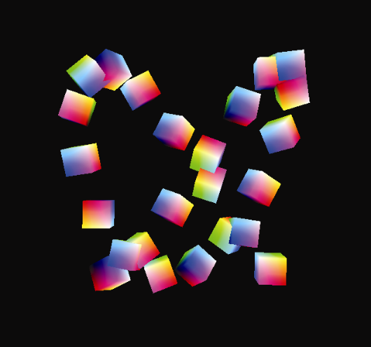

### 4.6　渲染一个对象的多个副本

现在将我们学到的知识扩展到渲染多个对象。在我们解决在单个场景中渲染多种不同的模型的常见情况之前，让我们先考虑更简单的情形——同一模型多次出现。例如，假设我们希望扩展前面的示例，以便呈现“一大群”（24个）翻滚的立方体。我们可以将display()函数中构建MV矩阵并绘制立方体的代码（如下所示突出显示部分），移动到一个执行24次的循环中来完成此操作。我们利用循环变量来计算立方体的旋转和平移参数，以便每次绘制立方体时，都会构建不同的模型矩阵。（我们还将摄像机放置在正Z轴的下方，这样我们就可以看到所有的立方体。）图4.8显示了一帧由此产生的动画场景。

```c
void display(GLFWwindow* window, double currentTime) {
   . . .
   for (i=0; i<24; i++)    { tf = currentTime + i;    // tf == "time factor（时间因子）"，声明为浮点类型
     tMat = glm::translate(glm::mat4(1.0f), glm::vec3(sin(.35f*tf)*8.0f, cos(.52f*tf)*8.0f,
                                                                           sin(.70f*tf)*8.0f));
     rMat = glm::rotate(glm::mat4(1.0f), 1.75f*tf, glm::vec3(0.0f, 1.0f, 0.0f));
     rMat = glm::rotate(rMat, 1.75f*tf, glm::vec3(1.0f, 0.0f, 0.0f));
     rMat = glm::rotate(rMat, 1.75f*tf, glm::vec3(0.0f, 0.0f, 1.0f));
     mMat = tMat * rMat;
     mvMat = vMat * mMat;
     glUniformMatrix4fv(mvLoc, 1, GL_FALSE, glm::value_ptr(mvMat));
     glUniformMatrix4fv(projLoc, 1, GL_FALSE, glm::value_ptr(pMat));
     glBindBuffer(GL_ARRAY_BUFFER, vbo[0]);
     glVertexAttribPointer(0, 3, GL_FLOAT, GL_FALSE, 0, 0);
     glEnableVertexAttribArray(0);
     glEnable(GL_DEPTH_TEST);
     glDepthFunc(GL_LEQUAL);
     glDrawArrays(GL_TRIANGLES, 0, 36);
   } }

```


<center class="my_markdown"><b class="my_markdown">图4.8　多个翻滚的立方体</b></center>

