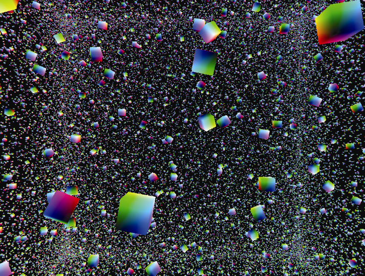

### 实例化

实例化（Instancing）提供了一种机制，可以只用一个C++/OpenGL调用就告诉显卡渲染一个对象的多个副本。这可以带来显著的性能好处，特别是当有数千甚至数百万的对象被绘制时——例如渲染在场地中的许多花朵的时候。

我们首先将我们的C++/OpenGL应用程序中的glDrawArrays()调用改为glDrawArrays- Instanced()。这样，我们就可以要求OpenGL绘制尽可能多的副本。我们可以指定绘制如下24个立方体：

```c
glDrawArraysInstanced(GL_TRIANGLES, 0, 36, 24);

```

使用实例化时，顶点着色器可以访问内置变量gl_InstanceID，这是一个整数，指向当前正在处理对象的第几个实例。

为了使用实例化来重复我们以前的翻滚立方体示例，我们需要将构建不同模型矩阵的计算[先前在display()中的循环内实现]移动到顶点着色器中。由于GLSL不提供平移或旋转函数，并且我们无法从着色器内部调用GLM，因此我们需要使用程序3.1中的工具函数。我们还需要将C++/OpenGL应用程序中的“时间因子”通过统一变量传递给顶点着色器。我们还需要将模型和视图矩阵传递到单独的统一变量中，因为对每个立方体的模型矩阵都需要进行旋转计算。我们对代码的修改，包括C++/OpenGL应用程序中的修改以及新的顶点着色器中的修改，如程序4.2所示。

程序4.2　实例化——24个动画立方体

```c
顶点着色器：
#version 430
layout (location=0) in vec3 position;
uniform mat4 m_matrix;            // 这些是分开的模型和视图矩阵
uniform mat4 v_matrix; uniform mat4 proj_matrix;
uniform float tf;                 // 用于动画和放置立方体的时间因子
out vec4 varyingColor;
mat4 buildRotateX(float rad);     // 矩阵变换工具函数的声明
mat4 buildRotateY(float rad);     // GLSL 要求函数先声明后调用
mat4 buildRotateZ(float rad); mat4 buildTranslate(float x, float y, float z);
void main(void)
{ float i = gl_InstanceID + tf;   // 取值基于时间因子，但是对每个立方体示例也都是不同的
  float a = sin(2.0 * i) * 8.0;   // 这些是用来平移的 x、y、z 分量
  float b = sin(3.0 * i) * 8.0;   float c = sin(4.0 * i) * 8.0;
  // 构建旋转和平移矩阵，将会应用于当前立方体的模型矩阵
  mat4 localRotX = buildRotateX(1000*i);   mat4 localRotY = buildRotateY(1000*i);   mat4 localRotZ = buildRotateZ(1000*i);   mat4 localTrans = buildTranslate(a,b,c);
  // 构建模型矩阵，然后是模型-视图矩阵
  mat4 newM_matrix = m_matrix * localTrans * localRotX * localRotY * localRotZ;   mat4 mv_matrix = v_matrix * newM_matrix;
  gl_Position = proj_matrix * mv_matrix * vec4(position,1.0);
  varyingColor = vec4(position,1.0) * 0.5 + vec4(0.5, 0.5, 0.5, 0.5);
}
// 构建平移矩阵的工具函数（来自第 3 章）
mat4 buildTranslate(float x, float y, float z)
{ mat4 trans = mat4(1.0, 0.0, 0.0, 0.0,
                    0.0, 1.0, 0.0, 0.0,
                    0.0, 0.0, 1.0, 0.0,
                    x, y, z, 1.0 );
  return trans;
}
// 用来绕 X、Y、Z 轴旋转的类似函数（也来自第 3 章）
. . .
C++/OpenGL 应用程序（在display()函数中）
  . . .
  // 构建（和变换）mMat的计算被移动到顶点着色器中去了
  // 在 C++ 应用程序中不再需要构建MV矩阵
  glUniformMatrix4fv(vLoc, 1, GL_FALSE, glm::value_ptr(vMat));   // 着色器需要视图矩阵的统一变量
  timeFactor = ((float)currentTime);                             // 为了获得时间因子信息
  tfLoc = glGetUniformLocation(renderingProgram, "tf");          // （着色器也需要它）
  glUniform1f(tfLoc, (float)timeFactor);   . . .
  glDrawArraysInstanced(GL_TRIANGLES, 0, 36, 24);

```

程序4.2的输出结果与前一个示例相同，可以在前面的图4.8中看到。

实例化让我们可以极大地扩展对象的副本数量；在这个例子中，即使对于很普通的GPU，实现100 000个立方体的动画仍然是可行的。对代码的更改主要是一些常量的修改，是为了将大量立方体进一步分散开，如下所示。

顶点着色器如下：

```c
. . .
float a = sin(203.0 * i/8000.0) * 403.0;
float b = cos(301.0 * i/4001.0) * 401.0;
float c = sin(400.0 * i/6003.0) * 405.0;
. . .

```

C++/OpenGL 应用程序如下：

```c
. . .
cameraZ = 420.0f; // 将摄像机沿着Z轴再移远一些，以看到更多的立方体
. . .
glDrawArraysInstanced(GL_TRIANGLES, 0, 36, 100000);

```

输出结果如图4.9所示。


<center class="my_markdown"><b class="my_markdown">图4.9　实例化：100 000个动画立方体</b></center>

