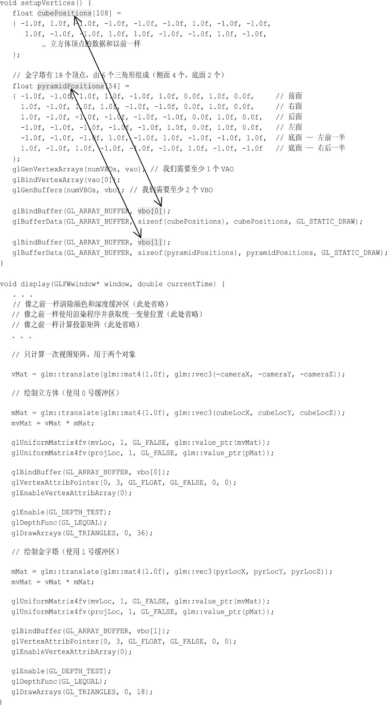
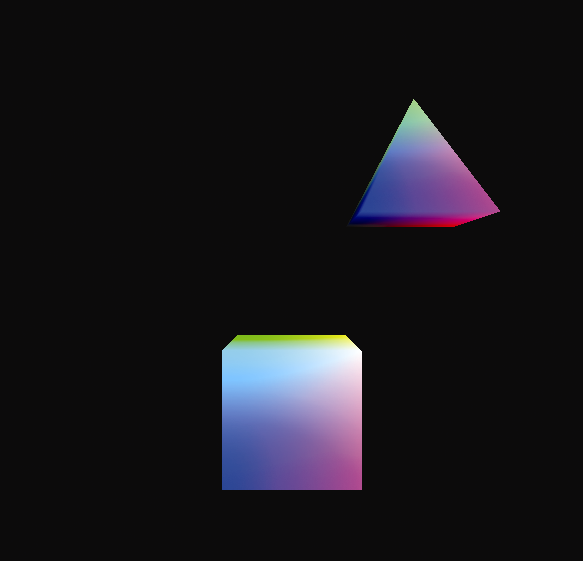

### 4.7　在同一个场景中渲染多个不同模型

要在单个场景中渲染多个模型，一种简单的方法是为每个模型使用单独的缓冲区。每个模型都需要自己的模型矩阵，这样我们就需要为我们渲染的每个模型生成一个新的模型-视图矩阵。还需要为每个模型单独调用glDrawArrays()。因此，我们需要修改init()和display()函数。

另一个考虑因素是我们是否需要为我们想要绘制的每个对象使用不同的着色器或不同的渲染程序。事实证明，在许多情况下，我们可以为我们绘制的各种对象使用相同的着色器（以及相同的渲染程序）。只有当它们由不同的图元（例如线而不是三角形）组成，或者涉及复杂的照明或其他效果的时候，我们才会需要为各种对象使用不同的渲染程序。目前并没有这么复杂，因此我们可以重用相同的顶点和片段着色器，而只需修改我们的C++/OpenGL应用程序，以便在调用display()时将各个模型发送给管线。

让我们继续添加一个简单的金字塔，这样我们的场景就包括一个立方体和一个金字塔。程序4.3中显示了对代码的相关修改。我们突出显示了一些关键细节，例如当我们指定使用这个还是那个缓冲区的地方，以及我们指定模型中包含的顶点数的地方。注意，金字塔由6个三角形组成——侧面4个，底面2个，总共6×3=18个顶点。

包含立方体和金字塔的场景显示结果如图4.10所示。

程序4.3　立方体和金字塔

<b class="my_markdown">图4.10　3D立方体和金字塔</b>

关于程序4.3的其他一些值得注意的小细节如下所示。

+ 需要声明变量pyrLocX、pyrLocY和pyrLocZ，然后在init()中将它们初始化为所需的金字塔的位置，就像对立方体位置所做的那样。
+ 在display()的开始构建视图矩阵vMat，然后在立方体和金字塔的模型-视图矩阵中都用到。
+ 顶点和片段着色器代码被省略了——它们和4.5节中的一样。

