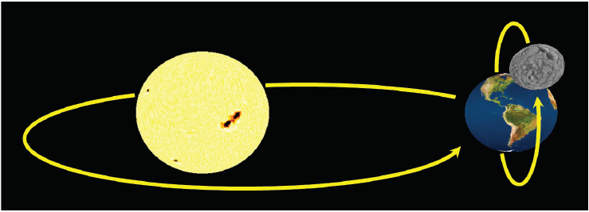
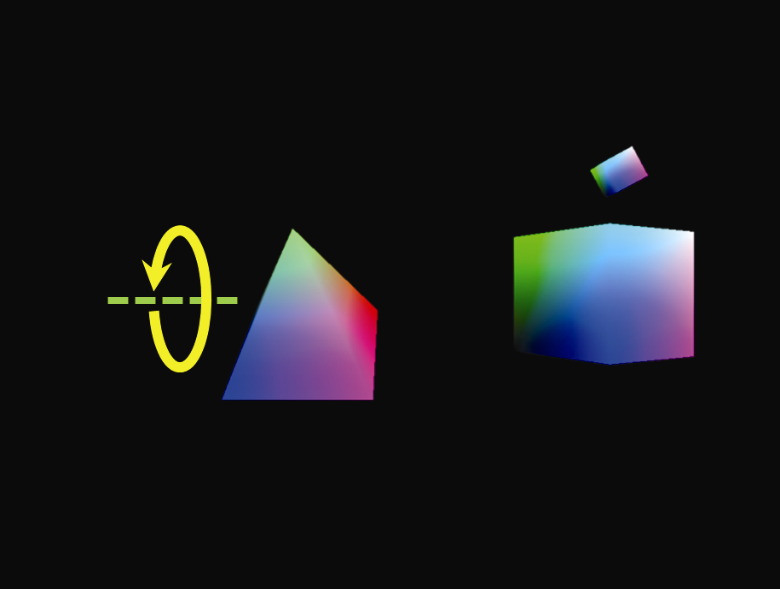

### 4.8　矩阵堆栈

到目前为止，我们渲染的模型都是由一组顶点构成的。然而，实际上我们通常希望通过组装较小的简单模型来构建复杂的模型。例如，可以通过分别绘制头部、身体、腿部和手臂来创建“机器人”的模型，这当中每个部件都是一个单独的模型。以这种方式构建的对象通常称为分层模型。构建分层模型的棘手部分是跟踪所有模型-视图矩阵并确保它们完美协调——否则机器人可能会散成几块！

分层模型不仅可用于构建复杂对象——它们还可以用来生成复杂场景。例如，考虑一下我们的行星地球围绕太阳旋转的方式，以及月球围绕地球旋转的方式。这样的一个场景如图4.11<sup class="my_markdown">[5]</sup>所示。计算月球在太空中的实际路径可能很复杂。然而，如果我们能够组合代表两条简单圆形路径的变换——月球围绕地球旋转的路径和地球围绕太阳旋转的路径——我们就能避免直接计算月球的轨迹。


<center class="my_markdown"><b class="my_markdown">图4.11　行星系统动画（太阳和地球的纹理来自<sup class="my_markdown">[HT16]</sup>，月球纹理来自<sup>[NA16]</sup>）</b></center>

事实证明，我们可以使用矩阵堆栈轻松地完成此操作。顾名思义，矩阵堆栈是一堆变换矩阵。正如我们将看到的，矩阵堆栈使得创建和管理复杂的分层对象和场景变得容易，它使得变换可以构建在其他变换之上（或者从其他变换中被移除）。

OpenGL有一个内置的矩阵堆栈，但作为旧的固定功能（非可编程）管线的一部分，它早已被弃用<sup class="my_markdown">[OL16]</sup>。但是，C++标准模板库（STL）有一个名为“stack”的类，通过使用它构建mat4的堆栈，它可以相对简单直接地当作矩阵堆栈使用。正如我们将看到的，复杂场景中通常需要的许多模型、视图和模型-视图矩阵可以由单个stack<glm::mat4>实例替换。

我们将首先检查实例化和使用C++堆栈的基本命令，然后使用一个堆栈来构建复杂的动画场景。我们将通过以下方法使用C++堆栈类。

+ push()：在堆栈顶部创建一个新的条目。我们通常会把目前在堆栈顶部的矩阵复制一份，并和其他的变换结合，然后再利用这个命令把新的矩阵副本推入堆栈中。
+ pop()：移除（并返回）最顶部的矩阵。
+ top()：在不移除的情况下，返回堆栈最顶部矩阵的引用。
+ <stack>.top() *= rotate（构建旋转矩阵的参数）。
+ <stack>.top() *= scale（构建缩放矩阵的参数）。　　←---　直接对堆栈顶部的矩阵应用变换。
+ <stack>.top() *= translate（构建平移矩阵的参数）。　　←---　直接对堆栈顶部的矩阵应用变换。

如前面列表中所示，“*=”运算符在mat4中被重载，因此它可以用于连接矩阵。因此，我们通常将它用于向矩阵堆栈顶部的矩阵添加平移、旋转等，正如我们展示出来的这些形式。

现在，我们不再通过创建mat4的实例来构建变换，而是使用push()命令在堆栈顶部创建新的矩阵。然后再根据需要将期望的变换应用于堆栈顶部的新创建的矩阵。

推入堆栈的第一个矩阵通常是视图矩阵。它上面的矩阵是复杂程度越来越高的模型-视图矩阵；也就是说，它们应用了越来越多的模型变换。这些变换既可以直接应用，也可以先结合其他矩阵。

在我们的行星系统示例中，位于视图矩阵正上方的矩阵将是太阳的MV矩阵。在它之上的矩阵将是地球的MV矩阵，由太阳的MV矩阵的副本和应用于其之上的地球模型矩阵变换组成。也就是说，地球的MV矩阵是通过将行星的变换结合到太阳的变换中而建立的。同样，月球的MV矩阵位于行星的MV矩阵之上，并通过将月球的模型矩阵变换应用于紧邻其下方的行星的MV矩阵来构建。

在渲染月球之后，可以通过从堆栈中“弹出”第一个月球的矩阵（将堆栈的顶部恢复到行星的模型-视图矩阵），然后重复第二个月球的过程，来渲染第二个“月球”。

基本方法如下。

（1）我们声明我们的堆栈，给它起名为“mvStack”。

（2）当相对于父对象创建新对象时，调用“mvStack.push(mvStack.top())”。

（3）应用新对象所需的变换，也就是将所需的变换乘以它。

（4）完成对象或子对象的绘制后，调用“mvStack.pop()”从矩阵堆栈顶部移除其模型-视图矩阵。

在后面的章节中，我们将学习如何创建球体并使它们看起来像行星和卫星。就目前而言，为了简单起见，我们将使用我们的金字塔和几个立方体构建一个“行星系统”。

表4.1概述了使用矩阵堆栈的display()函数通常是什么结构。

<center class="my_markdown"><b class="my_markdown">表4.1　使用矩阵堆栈的display()函数的结构</b></center>

| 配置 | •　实例化矩阵堆栈 |
| :-----  | :-----  | :-----  | :-----  |
| 摄像机 | •　将新矩阵推入堆栈（这将实例化一个空的视图矩阵） | •　将变换应用于堆栈顶部的视图矩阵 |
| 父对象 | •　将新矩阵推入堆栈（这将是父MV矩阵——对第一个父对象来说，它直接复制一份视图矩阵） | •　应用变换，将父对象的模型矩阵和复制的视图矩阵结合 | •　发送最顶层的矩阵（即对顶点着色器中的MV矩阵统一变量使用"glm::value_ptr()"） | •　绘制父对象 |
| 子对象 | •　将新矩阵推入堆栈。这将是子对象的MV矩阵，最初直接复制一份父对象的MV矩阵 | •　应用变换，将子对象的模型矩阵和复制的父MV矩阵结合 | •　发送最顶层的矩阵（即对顶点着色器中的MV矩阵统一变量使用"glm:: value_ptr()"） | •　绘制子对象 |
| 清理 | •　将子对象的MV矩阵弹出堆栈 | •　将父对象的MV矩阵弹出堆栈 | •　将视图矩阵弹出堆栈 |

请注意，金字塔（“太阳”）绕自己的轴旋转是在它自己的局部坐标空间中，不影响“子对象”（这里指行星和月亮）。因此，“太阳”的旋转（如图4.12所示）被推到堆栈上，但是在绘制“太阳”之后，它必须从堆栈中移除（弹出）。


<center class="my_markdown"><b class="my_markdown">图4.12　金字塔（“太阳”）的旋转</b></center>

大立方体（行星）围绕太阳的旋转（如图4.13（左）所示）将影响月球的运动，因此它被推到堆栈上并在绘制月球时保持在那里。相比之下，行星在其轴上的旋转（如图4.13（右）所示）是局部的，不会影响月亮，因此在绘制月球之前它需要被从堆栈中弹出。

<center class="my_markdown"><b class="my_markdown">图4.13　大立方体（行星）围绕太阳的旋转（左）和行星在其轴上的旋转（右）</b></center>

类似地，我们会将变换推入堆栈以进行月球的旋转（围绕行星及其轴），如图4.14所示。

<center class="my_markdown"><b class="my_markdown">图4.14　月球的旋转（围绕行星及其轴）</b></center>

以下是“行星”的步骤顺序。

+ push()将是行星MV矩阵中也会影响子对象的部分。
+ translate(...)将太阳周围的行星运动结合到行星的MV矩阵中。在这个例子中，我们使用三角运算来计算行星运动的平移。
+ push()将是行星的完整MV矩阵，也包括它的轴旋转。
+ rotate(...)结合行星的轴旋转（稍后会弹出，不会影响子对象）。
+ glm::value_ptr(mvStack.top())获取MV矩阵，然后将其发送到MV统一变量。
+ 绘制星球。
+ pop()将行星MV矩阵从堆栈中移除，暴露出它下面行星MV矩阵的不包括行星轴旋转的早期副本（因此只有行星的平移会影响月亮）。

现在我们可以编写完整的display()函数，如程序4.4所示。

程序4.4　使用矩阵堆栈的简单太阳系

```c
stack<glm::mat4> mvStack;
void display(GLFWwindow* window, double currentTime) {
   // 配置背景、深度缓冲区、渲染程序，以及和原来一样的投影矩阵
   . . .
   // 将视图矩阵推入堆栈
   vMat = glm::translate(glm::mat4(1.0f), glm::vec3(-cameraX, -cameraY, -cameraZ));    mvStack.push(vMat);
   // ---------------------- 金字塔 == 太阳 --------------------------------------------
   mvStack.push(mvStack.top());    mvStack.top() *= glm::translate(glm::mat4(1.0f), glm::vec3(0.0f, 0.0f, 0.0f)); // 太阳位置
   mvStack.push(mvStack.top());    mvStack.top() *= glm::rotate(glm::mat4(1.0f), (float)currentTime, glm::vec3(1.0f, 0.0f, 0.0f));                                                                                    // 太阳旋转
   glUniformMatrix4fv(mvLoc, 1, GL_FALSE, glm::value_ptr(mvStack.top()));
   glBindBuffer(GL_ARRAY_BUFFER, vbo[1]);
   glVertexAttribPointer(0, 3, GL_FLOAT, GL_FALSE, 0, 0);
   glEnableVertexAttribArray(0);
   glEnable(GL_DEPTH_TEST);
   glEnable(GL_LEQUAL);
   glDrawArrays(GL_TRIANGLES, 0, 18);    // 绘制太阳
   mvStack.pop();                        // 从堆栈中移除太阳的轴旋转
   //----------------------- 立方体 == 行星 ---------------------------------------------
   mvStack.push(mvStack.top());    mvStack.top() *=       glm::translate(glm::mat4(1.0f), glm::vec3(sin((float)currentTime)*4.0, 0.0f, cos((float)          currentTime)*4.0));    mvStack.push(mvStack.top());    mvStack.top() *= glm::rotate(glm::mat4(1.0f), (float)currentTime, glm::vec3(0.0, 1.0, 0.0));                                                                                // 行星旋转
   glUniformMatrix4fv(mvLoc, 1, GL_FALSE, glm::value_ptr(mvStack.top()));
   glBindBuffer(GL_ARRAY_BUFFER, vbo[0]);
   glVertexAttribPointer(0, 3, GL_FLOAT, GL_FALSE, 0, 0);
   glEnableVertexAttribArray(0);
   glDrawArrays(GL_TRIANGLES, 0, 36);      // 绘制行星
   mvStack.pop();                          // 从堆栈中移除行星的轴旋转
   //----------------------- 小立方体 == 月球 -----------------------------------
   mvStack.push(mvStack.top());    mvStack.top() *=      glm::translate(glm::mat4(1.0f), glm::vec3(0.0f, sin((float)currentTime)*2.0,                                                              cos((float)currentTime)*2.0));    mvStack.top() *= glm::rotate(glm::mat4(1.0f), (float)currentTime, glm::vec3(0.0, 0.0, 1.0));                                                               // 月球旋转
   mvStack.top() *= glm::scale(glm::mat4(1.0f), glm::vec3(0.25f, 0.25f, 0.25f)); // 让月球小一些
   glUniformMatrix4fv(mvLoc, 1, GL_FALSE, glm::value_ptr(mvStack.top()));
   glBindBuffer(GL_ARRAY_BUFFER, vbo[0]);
   glVertexAttribPointer(0, 3, GL_FLOAT, GL_FALSE, 0, 0);
   glEnableVertexAttribArray(0);
   glDrawArrays(GL_TRIANGLES, 0, 36);         // 绘制月球
   // 从堆栈中移除月球缩放、旋转、位置矩阵，行星位置矩阵，太阳位置矩阵，和视图矩阵
   mvStack.pop(); mvStack.pop(); mvStack.pop(); mvStack.pop(); }

```

矩阵堆栈操作已突出显示。有几个值得注意的细节：

+ 我们在模型矩阵中引入了缩放操作。我们希望月球比行星更小，所以我们在为月球构建MV矩阵时调用了scale()。
+ 在这个例子中，我们使用三角运算sin()和cos()来计算行星绕太阳的旋转（作为平移的方式），以及月球绕行星的旋转。
+ 两个缓冲区#0和#1分别包含立方体和金字塔的顶点。
+ 注意在glUniformMatrix()命令中调用的glm::value_ptr(mvMatrix.top())函数。这个调用获取了堆栈顶部矩阵中的值，然后将这些值发送到统一变量（在本例中为太阳、行星以及月球的MV矩阵）。

此处省略顶点和片段着色器代码——它们与前一个示例相同。我们还移动了金字塔（“太阳”）和摄像机的初始位置，以使场景在屏幕上居中。

