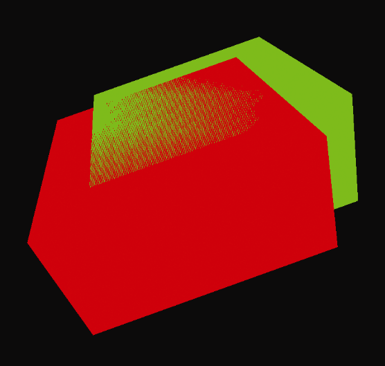

### 4.9　应对“Z冲突”伪影

回想一下，在渲染多个对象时，OpenGL使用Z缓冲区算法（Z-buffer algorithm）（如图 2.14所示）来进行隐藏面消除。通常情况下，通过选择最接近相机的相应片段的颜色作为像素的颜色，这种方法解决了哪些物体的曲面可见并呈现到屏幕，而哪些曲面位于其他物体后面因此不应该被渲染。

然而，有时候场景中的两个物体表面重叠并位于重合的平面中，这使得Z缓冲区算法难以确定应该渲染两个表面中的哪一个（因为两者都不“最接近”摄像机）。发生这种情况时，浮点舍入误差可能会导致渲染表面的某些部分使用其中一个对象的颜色，而其他部分则使用另一个对象的颜色。这种不自然的伪影被称为Z冲突（Z-fighting）或深度冲突（Depth-fighting），因为这种效果是渲染的片段在Z缓冲区中相互对应的像素条目上“冲突斗争”的结果。图4.15（见彩插）显示了两个具有重叠重合（顶）面的盒子之间的Z冲突示例。

<b class="my_markdown">图4.15　Z冲突示例</b>

创建地形或阴影时经常会出现这种情况。在这种情况下，有时Z冲突是可以预知的，并且校正它的常用方法是稍微移动一个物体，使得表面不再是共面的。我们将在第8章中看到这样的例子。

Z冲突还可能是由于深度缓冲器中的值的精度有限。对于由Z缓冲器算法处理的每个像素，其深度信息的精度受深度缓冲器中可存储的位数限制。用于构建透视矩阵的近剪裁平面和远剪裁平面之间的范围越大，具有相似（但不相等）的实际深度的两个对象的点在深度缓冲区中的数值表示越可能相同。因此，程序员可以选择适当的近、远剪裁平面值来最小化两个平面之间的距离，同时仍然确保场景必需的所有对象都位于视锥内。

同样重要的是要理解，由于透视变换的影响，改变近剪裁平面值可能比对远剪裁平面进行等效变化对于Z冲突伪影具有更大的影响。因此，建议避免选择太靠近眼睛的近剪裁平面。

本书前面的例子只是简单地使用了0.1和1000的值（在我们对perspective()的调用中）用于近剪裁平面和远剪裁平面。这些可能需要针对您的场景进行调整。

