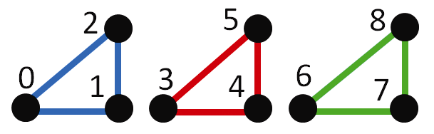
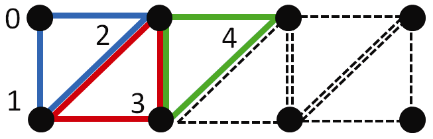
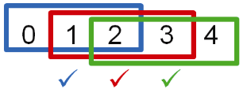
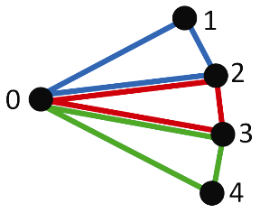
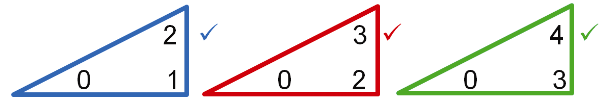
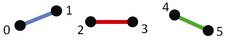
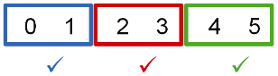
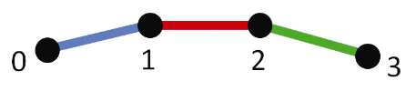
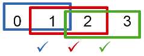

### 4.10　图元的其他选项

OpenGL支持许多图元类型——到目前为止我们已经看到了两个：GL_TRIANGLES和GL_POINTS。事实上，还有好几个其他的选择。OpenGL支持的所有可用图元类型都属于三角形、线、点或者补丁的类别。以下是一个完整的清单。

三角形图元：

| GL_TRIANGLES |  | 本书中常见的图元类型。管线中传递的每3个顶点数据组成一个三角形： | 顶点：等 | 三角形： |
| :-----  | :-----  | :-----  | :-----  | :-----  | :-----  | :-----  |
| GL_TRIANCLE_STRIP |  | 管线中传递的每个顶点实际上和之前的两个顶点组成一个三角形： | 顶点： | 三角形：等 |
| GL_TRIANGLE_FAN |  | 管线中传递的每对顶点和最开始的第一个顶点组成一个三角形： | 顶点：　 0　 1　 2　 3　 4　等 | 三角形： |
| GL_TRIANGLES_ADJACENCY | 仅用于几何着色器。允许着色器访问当前三角形的顶点，以及额外的相邻顶点 |
| GL_TRIANGLE_STRIP_ADJACENCY | 仅用于几何着色器。类似 GL_TRIANGLES_ADJACENCY，除了三角形顶点像 GL_TRIANGLE_STRIP 中一样互相重叠 |

线图元：

| GL_LINES |  | 管线中传递的每两个顶点组成一条线： | 顶点： | 线：等 |
| :-----  | :-----  | :-----  | :-----  | :-----  | :-----  | :-----  |
| GL_LINE_STRIP |  | 管线中传递的每个顶点和前一个顶点组成一条线： | 顶点： | 线：等 |
| GL_LINE_LOOP | 跟GL_LINE_STRIP一样，除了第一个顶点和最后一个顶点之间也会组成一条线 |
| GL_LINES_ADJACENCY | 仅用于几何着色器。允许着色器访问当前线的顶点，以及额外的相邻顶点 |
| GL_LINE_STRIP_ADJACENCY | 类似GL_LINES_ADJACENCY，除了线顶点像GL_LINE_STRISTRIP中一样互相重叠 |

点图元：

| GL_POINTS | 管线中传递的每个顶点是一个点 || :-----  | :-----  | :-----  | :-----  |

补丁图元：

| GL_PATCH | 仅用于细分着色器。指示一组顶点从顶点着色器传递到细分控制着色器，在这里它们通常用于将曲面细分网格成形为曲面 || :-----  | :-----  | :-----  | :-----  |

