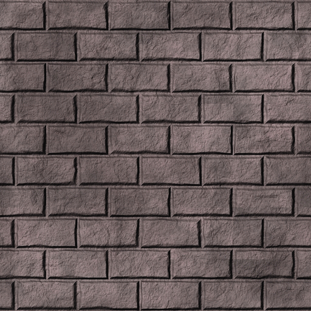

### 5.3　创建纹理对象

假设此处显示的纹理图像（如图5.3所示）存储在名为“brick1.jpg”<sup class="my_markdown">[LU16]</sup>的文件中。


<center class="my_markdown"><b class="my_markdown">图5.3　纹理图像</b></center>

如前所示，我们可以通过调用loadTexture()函数来加载此图像，如下所示：

```c
GLuint brickTexture = Utils::loadTexture("brick1.jpg");
```

回想一下，纹理对象由整型ID标识，因此brickTexture的类型为GLuint。

