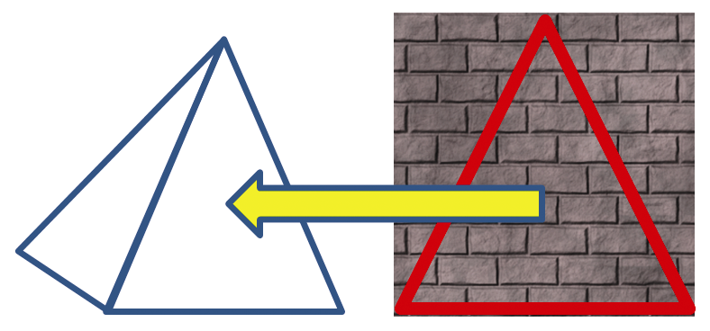
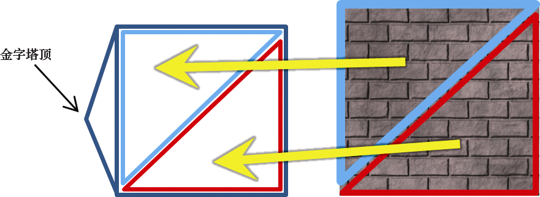
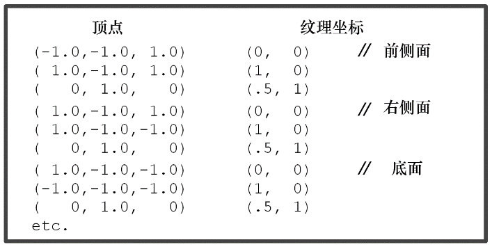

### 5.4　构建纹理坐标

我们的金字塔有4个三角形侧面和底部的正方形底面。虽然在几何上这只需要5个点，但我们得用三角形来渲染它。这需要4个三角形用于侧面，以及2个三角形用于正方形底面，总共6个三角形。每个三角形有3个顶点，必须在模型中指定总共6×3 = 18个顶点。

我们已经在程序4.3的浮点数组pyramidPositions[ ]中列出了金字塔的几何顶点。我们可以通过多种方式定位纹理坐标，以便将砖纹理绘制到金字塔上。一种简单（尽管不完美）的方法是使图像的顶部中心对应于金字塔的尖顶，如图5.4所示。

<b class="my_markdown">图5.4　纹理图像的顶部中心对应金字塔的尖顶</b>

我们可以为所有4个三角形侧面这样做。我们还需要绘制金字塔的正方形底面，它由2个三角形组成。一个简单而合理的方法是用图片中的整个区域为其添加纹理（图5.5所示的金字塔已被向后放倒，一个侧面朝下）。

<b class="my_markdown">图5.5　为金字塔底面添加纹理</b>

对程序4.3中前9个金字塔顶点使用这个非常简单的策略，相应的顶点和纹理坐标数据组如图5.6所示。

<b class="my_markdown">图5.6　金字塔的纹理坐标（部分清单）</b>

