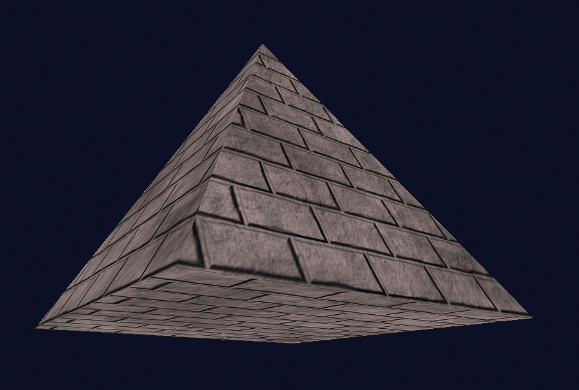

### 5.7　纹理贴图：示例程序

程序5.1将前面介绍的步骤合并为一个程序。输出结果显示了用砖图像纹理贴图的金字塔，如图5.7所示。两个旋转（代码清单中未显示）被添加到金字塔的模型矩阵中以暴露金字塔的底面。


<center class="my_markdown"><b class="my_markdown">图5.7　使用砖图像纹理贴图后的金字塔</b></center>

现在，根据需要，通过更改loadTexture()调用中的文件名，将砖纹理图像替换为其他纹理图像是一件简单的事情。例如，如果我们用图像文件“ice.jpg”<sup class="my_markdown">[LU16]</sup>替换“brick1.jpg”，我们得到的结果如图5.8所示。


<center class="my_markdown"><b class="my_markdown">图5.8　使用“冰”图像纹理贴图后的金字塔</b></center>

程序5.1　砖纹理的金字塔

```c
C++/OpenGL应用程序
#include <SOIL2/soil2.h>
// 其他#include和以前一样
. . .
#define numVAOs 1
#define numVBOs 2
// 摄像机和对象位置、渲染程序、VAO和VBO的变量和以前一样
. . .
// 显示函数的变量分配和以前一样
. . .
GLuint brickTexture;
void setupVertices(void) {
   float pyramidPositions[54] = { /* 如程序4.2中列出的数据 */
   float pyrTexCoords[36] = {
       0.0f, 0.0f, 1.0f, 0.0f, 0.5f, 1.0f,    0.0f, 0.0f, 1.0f, 0.0f, 0.5f, 1.0f,
       0.0f, 0.0f, 1.0f, 0.0f, 0.5f, 1.0f,    0.0f, 0.0f, 1.0f, 0.0f, 0.5f, 1.0f,
       0.0f, 0.0f, 1.0f, 1.0f, 0.0f, 1.0f,    1.0f, 1.0f, 0.0f, 0.0f, 1.0f, 0.0f
   };
   // . . . 像以前一样生成VAO和至少两个VBO，并加载两个缓冲区：
   glBindBuffer(GL_ARRAY_BUFFER, vbo[0]);
   glBufferData(GL_ARRAY_BUFFER, sizeof(pyramidPositions), pyramidPositions, GL_STATIC_DRAW);
   glBindBuffer(GL_ARRAY_BUFFER, vbo[1]);
   glBufferData(GL_ARRAY_BUFFER, sizeof(pyrTexCoords), pyrTexCoords, GL_STATIC_DRAW);
}
void init(GLFWwindow* window) {
   // 渲染程序配置、摄像机和对象位置没有改变
   . . .
   brickTexture = Utils::loadTexture("brick1.jpg");
}
void display(GLFWwindow* window, double currentTime) {
   . . .
   // 背景颜色配置、深度缓冲区、渲染程序，以及M、V、MV、PROJ矩阵没有变化
   . . .
   glBindBuffer(GL_ARRAY_BUFFER, vbo[0]);
   glVertexAttribPointer(0, 3, GL_FLOAT, GL_FALSE, 0, 0);
   glEnableVertexAttribArray(0);
   glBindBuffer(GL_ARRAY_BUFFER, vbo[1]);
   glVertexAttribPointer(1, 2, GL_FLOAT, GL_FALSE, 0, 0);
   glEnableVertexAttribArray(1);
   glActiveTexture(GL_TEXTURE0);
   glBindTexture(GL_TEXTURE_2D, brickTexture);
   glEnable(GL_DEPTH_TEST);
   glDepthFunc(GL_LEQUAL);
   glDrawArrays(GL_TRIANGLES, 0, 18);
}
// main() 和以前一样
顶点着色器
#version 430
layout (location=0) in vec3 pos;
layout (location=1) in vec2 texCoord;
out vec2 tc;        // 纹理坐标输出到光栅着色器用于插值
uniform mat4 mv_matrix;
uniform mat4 proj_matrix;
layout (binding=0) uniform sampler2D samp;     // 顶点，着色器中未使用
void main(void)
{ gl_Position = proj_matrix * mv_matrix * vec4(pos,1.0);
  tc = texCoord;
}
片段着色器
#version 430
in vec2 tc;      // 输入插值过的材质坐标
out vec4 color;
uniform mat4 mv_matrix;
uniform mat4 proj_matrix;
layout (binding=0) uniform sampler2D samp;
void main(void)
{ color = texture(samp, tc);
}
```

