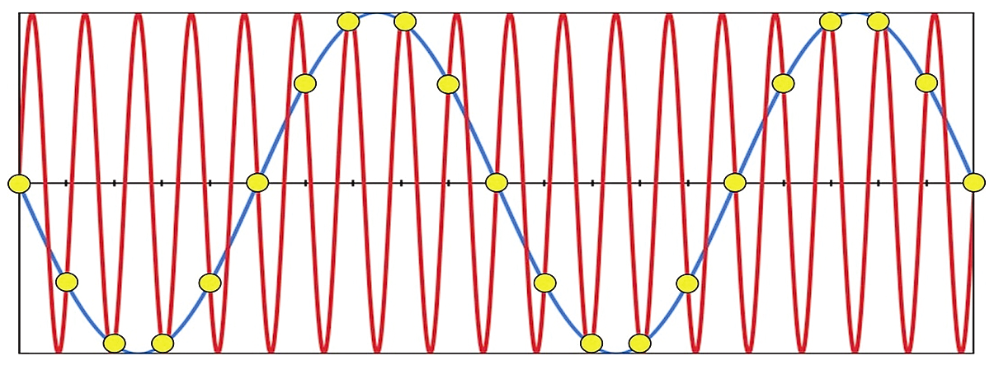
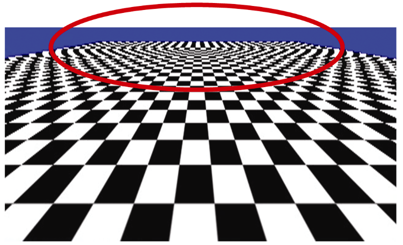
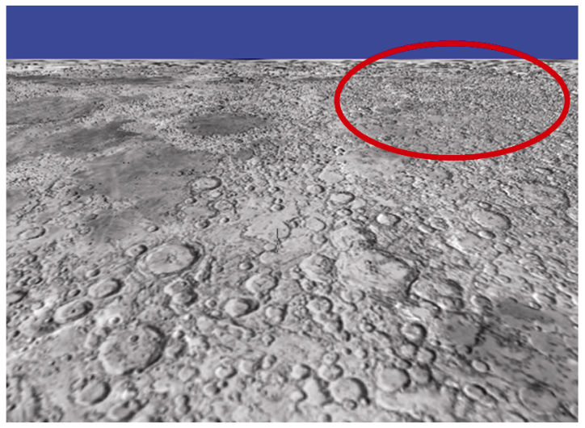
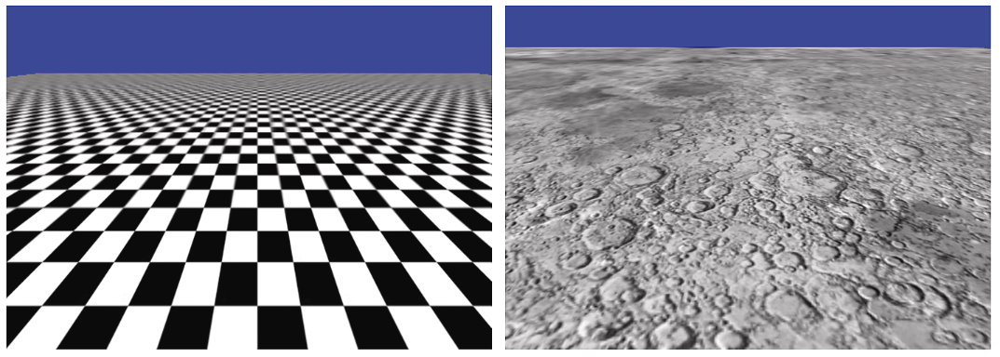
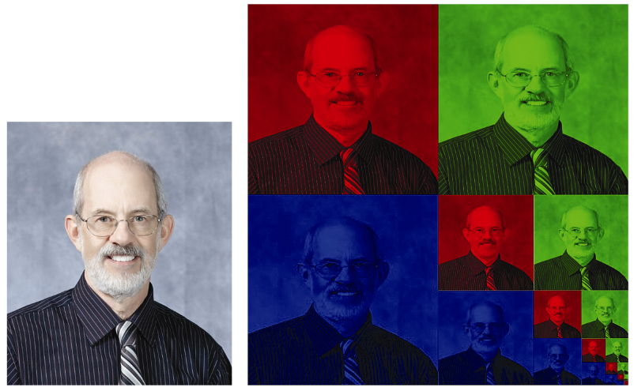
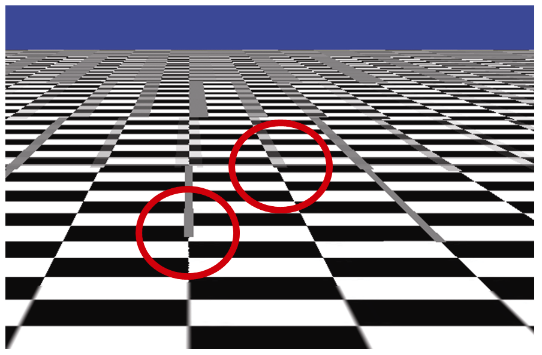
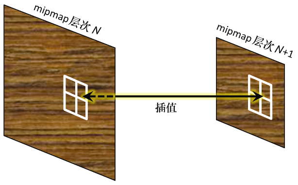

### 5.8　多级渐远纹理贴图

纹理贴图经常会在渲染图像中产生各种不期望的伪影。这是因为纹理图像的分辨率或长宽比很少与被纹理贴图的场景中区域的分辨率或长宽比相匹配。

当图像分辨率小于所绘制区域的分辨率时，会出现一种很常见的伪影。在这种情况下，需要拉伸图像以覆盖整个区域，就会变得模糊（并且可能变形）。根据纹理的性质，有时可以通过改变纹理坐标分配方式来对抗这种情况，使得纹理需要较少的拉伸。另一种解决方案是使用更高分辨率的纹理图像。

相反的情况是当图像纹理的分辨率大于被绘制区域的分辨率时。可能并不是很容易理解为什么这会造成问题，但确实如此！在这种情况下，可能会出现明显的叠影伪影，从而产生奇怪的错误图案，或移动物体中的“闪烁”效果。

叠影是由采样错误引起的。它通常与信号处理有关，不充分采样的信号被重建时，看起来会具有和实际不同的特性（例如波长）。例子如图5.9所示（见彩插）。原始波形显示为红色，沿波形的黄点代表采样点。如果采样点被用于重建波形，并且采样频率不足，则可能会定义出不同的波形（以蓝色显示）。


<center class="my_markdown"><b class="my_markdown">图5.9　不充分采样造成的叠影</b></center>

类似地，在纹理贴图中，当稀疏地采样高分辨率（和高细节）图像时（例如使用统一采样器变量时），提取到的颜色将不足以反映图像中的实际细节，而是可能看起来很随机。如果纹理图像具有重复图案，则叠影可能导致生成与原始图像不同的图案。如果被纹理贴图的对象正在移动，则纹素查找中的舍入误差可能导致给定纹理坐标处的采样像素的不断变化，从而在被绘制对象的表面上产生不希望的闪烁效果。

图5.10显示了一个立方体顶部的倾斜渲染特写，该立方体使用大尺寸高分辨率棋盘图像进行纹理贴图。


<center class="my_markdown"><b class="my_markdown">图5.10　纹理贴图中的叠影</b></center>

在图像顶部附近明显发生了混叠，棋盘的欠采样产生了“条纹”效果。虽然我们无法在静止图像中展示，但如果这是一个动画场景，则看起来的图案可能会在各种不正确的图案（包括图示的这一个在内）之间波动。

另一个例子如图5.11所示，其中的立方体已经使用月球表面的图像<sup class="my_markdown">[HT16]</sup>进行纹理贴图。乍一看，这张图片显得清晰而细节丰富。然而，图像右上部分的某些细节是错误的，并且当立方体对象（或相机）移动时会导致“闪烁”。（不幸的是，我们无法在静止图像中清楚地显示闪烁效果。）


<center class="my_markdown"><b class="my_markdown">图5.11　纹理贴图中的“闪烁”</b></center>

使用多级渐远纹理贴图（Mipmapping）技术可以在很大程度上校正这一类的采样误差伪影，它需要用各种分辨率创建纹理图像的不同版本。然后，OpenGL使用最适合正在处理的这一点处的分辨率的纹理图像进行纹理贴图。更好的是，可以为被贴图的区域使用最适合的分辨率的纹理图像的平均颜色。多级渐远纹理贴图应用于图5.10和图5.11中的图像的结果如图5.12所示。


<center class="my_markdown"><b class="my_markdown">图5.12　多级渐远纹理贴图结果</b></center>

多级渐远纹理贴图通过一种巧妙的机制来工作，它在纹理图像中存储相同图像的连续的一系列较低分辨率的副本，所用的纹理图像比原始图像大1/3。这是通过将图像的R、G和B分量分别存储在纹理图像空间的3个1/4中来实现的，然后在剩余的1/4图像空间中对于同一图像重复相当于原始分辨率1/4的处理。重复该细分直到剩余象限太小而不包含任何有用的图像数据。示例图像和生成的多级渐远纹理的可视化如图5.13所示（见彩插）。


<center class="my_markdown"><b class="my_markdown">图5.13　为图片生成多级渐远纹理</b></center>

这种将几个图像填充到一个小空间中的方法（只比存储原始图像所需的空间大一点）是Mipmapping得名的原因。MIP代表拉丁语Multum In Parvo <sup class="my_markdown">[WI83]</sup>，意思是“在很小的空间里有很多东西”。

实际给对象添加纹理时，可以通过多种方式对多级渐远纹理进行采样。在OpenGL中，可以通过将GL_TEXTURE_MIN_FILTER参数设置为所需的缩小方法来选择多级渐远纹理的采样方式，可以选取以下方法之一。

+ GL_NEAREST_MIPMAP_NEAREST
+ 选择具有与纹素区域最相似的分辨率的多级渐远纹理。然后，它获得所需纹理坐标的最近纹素。
+ GL_LINEAR_MIPMAP_NEAREST
+ 选择具有与纹素区域最相似的分辨率的多级渐远纹理。然后它取最接近纹理坐标的4个纹素的插值。这被称为“线性过滤”。
+ GL_NEAREST_MIPMAP_LINEAR
+ 选择具有与纹素区域最相似的分辨率的2个多级渐远纹理。然后，它从每个多级渐远纹理获取纹理坐标的最近纹素并对其进行插值。这被称为“双线性过滤”。
+ GL_LINEAR_MIPMAP_LINEAR
+ 选择具有与纹素区域最相似的分辨率的2个多级渐远纹理。然后，它取各自最接近纹理坐标的4个纹素，并计算插值。这被称为“三线性过滤”，如图5.11所示。

三线性过滤通常是比较好的选择，因为较低的混合级别通常会产生伪影，例如多级渐远纹理级别之间的可见分离。图5.14显示了只启用了线性过滤的使用多级渐远纹理的棋盘的特写。请注意在多级渐远纹理的边界处垂直线突然从粗变为细（图中圈出的位置的伪影）。相比之下，图5.15中的示例使用了三线性过滤。


<center class="my_markdown"><b class="my_markdown">图5.14　线性过滤伪影</b></center>


<center class="my_markdown"><b class="my_markdown">图5.15　三线性过滤</b></center>

OpenGL提供了丰富的多级渐远纹理支持。有一些机制可用于构建你自己的多级渐远纹理级别，或者让OpenGL为你构建它们。在大多数情况下，OpenGL自动构建的多级渐远纹理已足够。这是通过将以下代码行添加进getTextureObject()函数之后立即执行的Utils:: loadTexture()函数（前面的5.1节中介绍过）中实现的：

```c
glBindTexture(GL_TEXTURE_2D, textureID);
glTexParameteri(GL_TEXTURE_2D, GL_TEXTURE_MIN_FILTER, GL_LINEAR_MIPMAP_LINEAR);
glGenerateMipmap(GL_TEXTURE_2D);
```

这通知OpenGL生成多级渐远纹理。使用glBindTexture()调用激活砖纹理，然后glTexParameteri()函数调用启用前面列出的缩小方法之一，例如上面调用中显示的GL_LINEAR_MIPMAP_LINEAR，它启用三线性过滤。

构建多级渐远纹理后，可以通过再次调用glTexParameteri()来更改过滤选项（尽管这很少需要），例如在display函数中。甚至可以通过选择GL_NEAREST或GL_LINEAR来禁用多级渐远纹理。

对于关键应用程序，可以使用您喜欢的任何图像编辑软件自行构建多级渐远纹理。然后可以通过为每个多级渐远纹理级别重复调用OpenGL的glTexImage2D()函数来创建纹理对象，并将它们添加为多级渐远纹理级别。对这种方法的进一步讨论超出了本书的范围。

