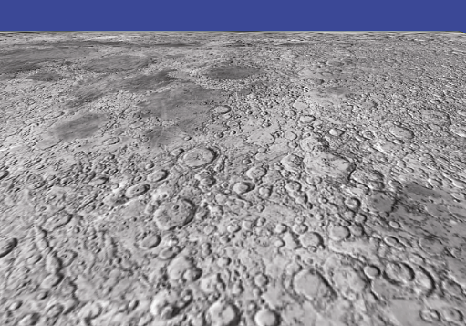

### 5.9　各向异性过滤

多级渐远纹理贴图有时看起来比非多级渐远纹理贴图更模糊，尤其是当被贴图对象以严重倾斜的视角渲染时。我们在图5.12中看到了一个这样的例子，使用多级渐远纹理减少伪影的同时也减少了图像细节（与图5.11相比）。

这种细节的丢失是因为当物体倾斜时，其基元看起来沿一个轴（即宽度或高度）比沿另一个轴更小。当OpenGL为图元贴图时，它选择适合两个轴中较小的轴的多级渐远纹理（以避免“闪烁”伪影）。在图5.12中，表面远离观察者倾斜，因此每个渲染图元将使用适合其更小的高度的多级渐远纹理，这可能对其宽度来说分辨率太小了。

一种恢复一些丢失细节的方法是使用各向异性过滤（AF）。标准的多级渐远纹理贴图以各种正方形分辨率（例如256像素×256像素、128像素×128像素等）对纹理图像进行采样，而AF却以多种矩形分辨率对纹理进行采样，例如256像素×128像素、64像素×128像素等。这使得从各种角度观看并同时在纹理中保留尽可能多的细节成为可能。

各向异性过滤比标准多级渐远纹理贴图在计算上代价更高，并且不是OpenGL的必需部分。但是，大多数显卡都支持AF（这被称为OpenGL扩展），而OpenGL确实提供了一种查询显卡是否支持AF的方法，以及一种访问AF的方法。生成多级渐远纹理贴图后立即添加代码：

```c
. . .
// 如果启用多级渐远纹理贴图
glBindTexture(GL_TEXTURE_2D, textureID);
glTexParameteri(GL_TEXTURE_2D, GL_TEXTURE_MIN_FILTER, GL_LINEAR_MIPMAP_LINEAR);
glGenerateMipmap(GL_TEXTURE_2D);
// 如果还启用各向异性过滤
if (glewIsSupported("GL_EXT_texture_filter_anisotropic")) {     GLfloat anisoSetting = 0.0f;     glGetFloatv(GL_MAX_TEXTURE_MAX_ANISOTROPY_EXT, &anisoSetting);     glTexParameterf(GL_TEXTURE_2D, GL_TEXTURE_MAX_ANISOTROPY_EXT, anisoSetting); }

```

对glewIsSupported()的调用测试显卡是否支持AF。如果支持，我们将其设置为支持的最大采样程度，这个最大值使用glGetFloatv()获取。然后使用glTexParameterf()将其应用于激活纹理对象。结果如图5.16所示。请注意，图5.11中的大部分丢失细节已经恢复，同时仍然消除了闪烁的伪影。


<center class="my_markdown"><b class="my_markdown">图5.16　各向异性过滤</b></center>

