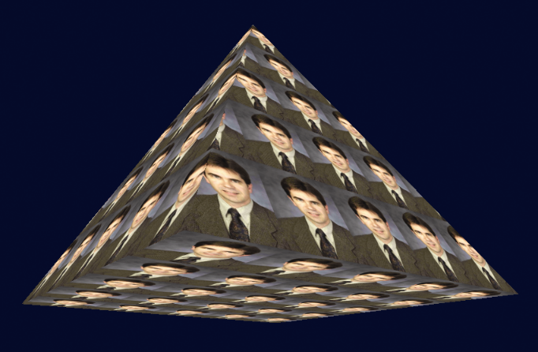
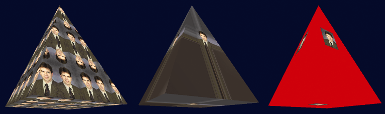

### 5.10　环绕和平铺

到目前为止，我们假设纹理坐标都落在[0…1]范围内。但是，OpenGL实际上支持任何取值的纹理坐标。有几个选项可以用来指定当纹理坐标超出范围[0…1]时会发生什么。使用glTexParameteri()设置所需的行为，选项如下。

+ GL_REPEAT：忽略纹理坐标的整数部分，生成重复或“平铺”图案。这是默认行为。
+ GL_MIRRORED_REPEAT：忽略整数部分，但是当整数部分为奇数时坐标反转，因此重复的图案在正常和镜像之间交替。
+ GL_CLAMP_TO_EDGE：小于0或大于1的坐标分别设置为0和1。
+ GL_CLAMP_TO_BORDER：将[0…1]以外的纹素设置成指定的边框颜色。

例如，考虑一个金字塔，其纹理坐标已在[0…5]范围，而不是通常的[0…1]范围内定义。默认行为（GL_REPEAT），使用前面图5.2中显示的纹理图像，将导致纹理在表面上重复五次（有时称为“平铺”），如图5.17所示。


<center class="my_markdown"><b class="my_markdown">图5.17　使用GL_REPEAT环绕的纹理坐标</b></center>

为了使平铺块的外观在正常和镜像之间交替，我们可以指定以下内容：

```c
glTexParameteri(GL_TEXTURE_2D, GL_TEXTURE_WRAP_S, GL_MIRRORED_REPEAT);
glTexParameteri(GL_TEXTURE_2D, GL_TEXTURE_WRAP_T, GL_MIRRORED_REPEAT);
```

通过将GL_MIRRORED_REPEAT替换为GL_CLAMP_TO_EDGE，可以指定将小于0或大于1的值分别设置为0和1。

可以按如下方式来指定小于0或大于1的值输出“边框”颜色：

```c
glTexParameteri(GL_TEXTURE_2D, GL_TEXTURE_WRAP_S, GL_CLAMP_TO_BORDER);
glTexParameteri(GL_TEXTURE_2D, GL_TEXTURE_WRAP_T, GL_CLAMP_TO_BORDER);
float redColor[4] = { 1.0f, 0.0f, 0.0f, 1.0f };
glTexParameterfv(GL_TEXTURE_2D, GL_TEXTURE_BORDER_COLOR, redColor);
```

图5.18（见彩插）中分别（从左到右）显示了每一个选项（镜像重复、夹紧到边缘和夹紧到边框）的效果，纹理坐标范围为−2～+3。


<center class="my_markdown"><b class="my_markdown">图5.18　使用不同环绕选项的金字塔材质贴图</b></center>

在中间的示例（夹紧到边缘）中，沿纹理图像边缘的像素向外复制。注意，作为副作用，金字塔面的左下和右下区域分别从纹理图像的左下和右下像素获得它们的颜色。

