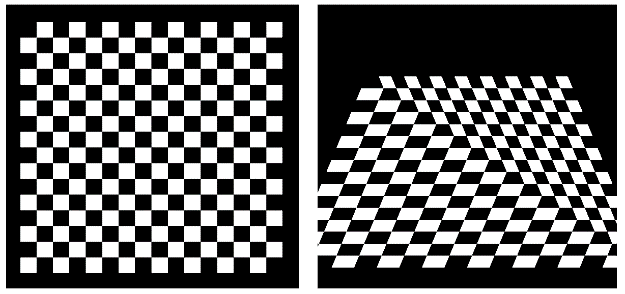
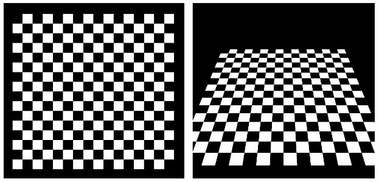

### 5.11　透视变形

我们已经看到，当纹理坐标从顶点着色器传递到片段着色器时，它们通过光栅着色器并被插值。我们还看到，这是自动线性插值的结果，总是在顶点属性上执行。

然而，在纹理坐标的情况下，线性插值可能导致具有透视投影的3D场景中的可以察觉的失真。

考虑一个由两个三角形组成的矩形，纹理贴图是棋盘图像，面向相机。当矩形围绕X轴旋转时，矩形的顶部会倾斜并远离相机，而矩形的下半部分则更靠近相机。因此，我们希望顶部的方块变小，底部的方块变大。但是，纹理坐标的线性插值将导致所有正方形的高度相等。沿着构成矩形的两个三角形之间的对角线的失真加剧。产生的失真如图5.19所示。


<center class="my_markdown"><b class="my_markdown">图5.19　纹理透视失真</b></center>

幸运的是，存在用于校正透视失真的算法，并且默认情况下，OpenGL在光栅化期间会应用透视校正算法<sup class="my_markdown">[OP14]</sup>。图5.20显示了由OpenGL正确呈现的相同的旋转棋盘。


<center class="my_markdown"><b class="my_markdown">图5.20　OpenGL透视校正</b></center>

虽然不常见，但可以通过在包含纹理坐标的顶点属性的声明中添加关键字“noperspective”来禁用OpenGL的透视校正。必须在顶点着色器和片段着色器中都这样添加。例如，顶点着色器中的顶点属性将声明如下：

```c
noperspective out vec2 texCoord;
```

片段着色器中的相应属性声明：

```c
noperspective in vec2 texCoord;
```

实际上，我使用了这种语法来生成图5.19中的扭曲棋盘格。

