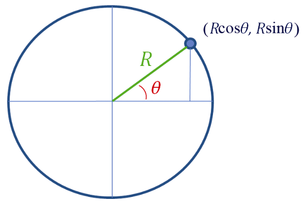
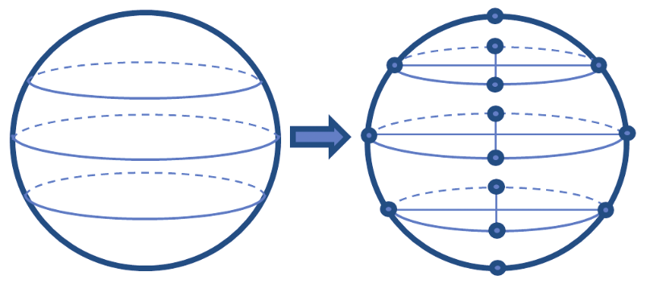
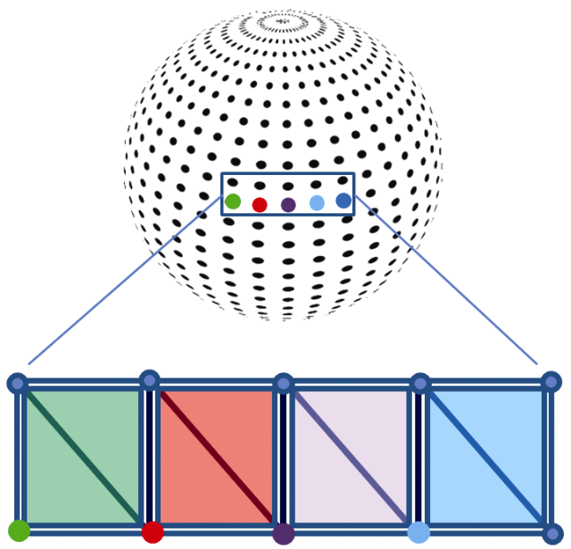
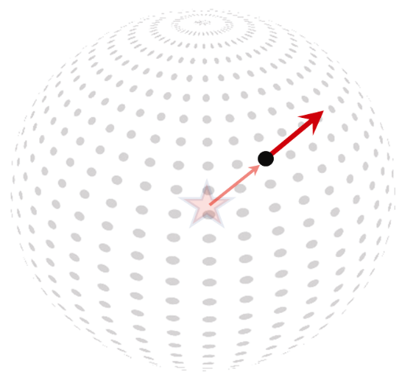
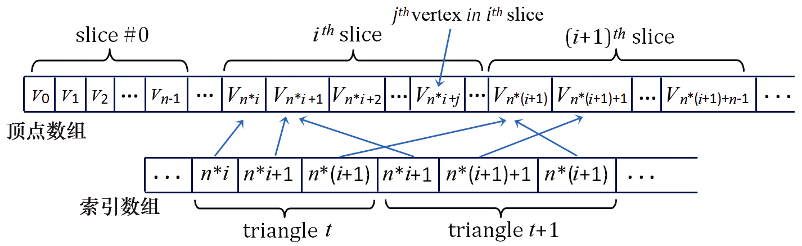
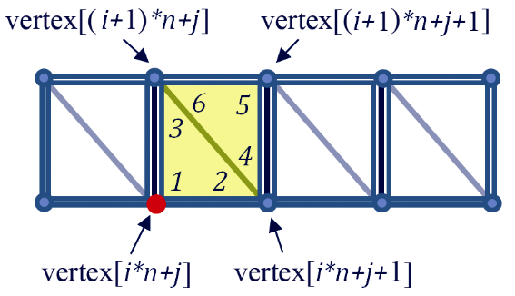
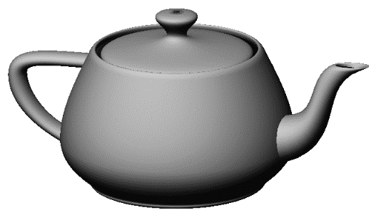

### 6.1　程序构建模型——构建一个球体

某些类型的对象（例如球体、圆锥体等）具有数学定义，这些定义有助于算法生成。例如，对于半径为R的圆，围绕其圆周的点的坐标可以被很好地定义（见图6.1）。


<center class="my_markdown"><b class="my_markdown">图6.1　构成圆周的点</b></center>

我们可以系统地使用圆的几何知识来通过算法建立球体模型。我们的策略如下。

（1）在整个球体上，选择表示一系列圆形“水平切片”的精度。见图6.2的左侧。

（2）将每个圆形切片的圆周细分为若干个点。见图6.2的右侧。更多的点和水平切片可以生成更精确、更平滑的球体模型。在我们的模型中，每个切片将具有相同数量的点。


<center class="my_markdown"><b class="my_markdown">图6.2　构建圆形顶点</b></center>

（3）将顶点分组为三角形。一种方法是逐步遍历顶点，在每一步构建两个三角形。例如，当我们沿着图6.3中球体上5个彩色顶点这一行移动时，对于这5个顶点中的每一个，我们构建了以相应颜色显示的两个三角形（见彩插，下面将更详细地描述这些步骤）。


<center class="my_markdown"><b class="my_markdown">图6.3　将顶点组合成三角形</b></center>

（4）根据纹理图像的性质选择纹理坐标。在球体的情况下，存在许多地形纹理图像，假设我们选择这种纹理图像，想象一下，让这个图像围绕球体“包裹”，我们可以根据图像中纹素的最终对应位置为每个顶点指定纹理坐标。

（5）对于每个顶点，通常还希望生成法向量（Normal Vector）——垂直于模型表面的向量。我们将很快在第7章中将它们用于光照。

确定法向量可能很棘手，但是在球体的情况下，从球体中心指向顶点的向量恰好等于该顶点的法向量！图6.4说明了这个特点（球体的中心用“星形”表示）。


<center class="my_markdown"><b class="my_markdown">图6.4　球体顶点法向量</b></center>

一些模型使用索引定义三角形。请注意，在图6.3中，每个顶点出现在多个三角形中，这将导致每个顶点被多次指定。我们不希望这样做，而是会存储每个顶点一次，然后为三角形的每个角指定索引，引用所需的顶点。我们需要存储每个顶点的位置、纹理坐标和法向量，因此这么做可以为大型模型节省内存。

顶点存储在一维数组中，从最下面的水平切片中的顶点开始。使用索引时，关联的索引数组包括每个三角形角的条目。其内容是顶点数组中的整型引用（具体地说，是下标）。假设每个切片包含n个顶点，顶点数组以及相应索引数组的示例部分，如图6.5所示。


<center class="my_markdown"><b class="my_markdown">图6.5　顶点数组和相应的索引数组</b></center>

然后，我们可以从球体底部开始，围绕每个水平切片以圆形方式遍历顶点。当我们访问每个顶点时，我们构建两个三角形，在其右上方形成一个方形区域，如图6.3所示。我们将整个处理过程组织成嵌套循环，如下所示。

```c
对于球体中的每个水平切片i（i的取值从0到球体中的所有切片）
{  对于切片 i 中的每个顶点 j（j 的取值从 0 到切片中的所有顶点）
   {  计算顶点 j 的指向右边相邻顶点、上方顶点，以及右上方顶点的两个三角形的索引
}  }
```

例如，考虑图6.3中的“红色”顶点（图6.6中重复出现）。这个顶点位于图6.6所示的黄色三角形的左下方，按照我们刚刚描述的循环，它的索引序号是i*n+j，其中i是当前正在处理的切片（外循环），j是当前正在该切片中处理的顶点（内循环），n是每个切片的顶点数。图6.6显示了这个顶点（红色）以及它的3个相关的相邻顶点（见彩插），每个顶点都有公式显示它们的索引序号。


<center class="my_markdown"><b class="my_markdown">图6.6　第i个切片中的第j个顶点的索引序号（n = 每个切片的顶点数）</b></center>

然后使用这4个顶点构建为此（红色）顶点生成的两个三角形（以黄色显示）。这两个三角形的索引表中的6个条目在图中以数字1～6的顺序表示。注意，条目3和6都指向相同的顶点，对于条目2和4也是如此。当我们到达以红色突出显示的顶点（即vertex[i*n+j]）时由此定义的两个三角形是由这6个顶点构成的——其中一个三角形的条目标记为1、2、3，引用的顶点包括vertex[i*n+j]、vertex[i*n+j+1]和vertex[(i+1)*n+j]；另一个三角形的条目标记为4、5、6，引用的顶点包括vertex[i*n+j+1]、vertex[(i+1)*n+j+1]和vertex[(i+1)*n+j]。

程序6.1显示了我们的球体模型的实现，类名为Sphere。生成的球体的中心位于原点。这里还显示了使用Sphere的代码。请注意，每个顶点都存储在包含GLM类vec2和vec3实例的C++向量中（这与之前的示例不同，之前顶点存储在浮点数组中）。vec2和vec3包括了获得所需的x、y和z分量浮点值的方法，然后就可以如前所述将它们放入浮点缓冲区。我们将这些值存储在可变长度C++向量中，因为长度取决于运行时指定的切片数。

请注意Sphere类中三角形索引的计算，如前面的图6.6所述。变量“prec(precision)”指的是“精度”，在这里它被用来确定球形切片的数量和每个切片中的顶点数量。因为纹理贴图完全包裹在球体周围，所以在纹理贴图的左右边缘相交的每个点处需要一个额外的重合顶点。因此，顶点的总数是(prec+1)*(prec+1)。由于每个顶点生成6个三角形索引，因此索引的总数是prec*prec*6。

程序6.1　程序生成的球体

```c
球体类（Sphere.cpp）
#include <cmath>
#include <vector>
#include <iostream>
#include <glm\glm.hpp>
#include "Sphere.h"
using namespace std;
Sphere::Sphere() {
  init(48);
}
Sphere::Sphere(int prec) {   // prec是精度，也就是切片的数量
  init(prec);
}
float Sphere::toRadians(float degrees) { return (degrees * 2.0f * 3.14159f) / 360.0f; }
void Sphere::init(int prec) {
  numVertices = (prec + 1) * (prec + 1);
  numIndices = prec * prec * 6;
  // std::vector::push_back() 在向量的末尾增加一个新元素，并为向量长度加 1
  for (int i = 0; i < numVertices; i++) { vertices.push_back(glm::vec3()); }
  for (int i = 0; i < numVertices; i++) { texCoords.push_back(glm::vec2()); }
  for (int i = 0; i < numVertices; i++) { normals.push_back(glm::vec3()); }
  for (int i = 0; i < numIndices; i++) { indices.push_back(0); }
  // 计算三角形顶点
  for (int i = 0; i <= prec; i++) {
      for (int j = 0; j <= prec; j++) {
          float y = (float)cos(toRadians(180.0f - i * 180.0f / prec));
          float x = -(float)cos(toRadians(j*360.0f / prec)) * (float)abs(cos(asin(y)));
          float z = (float)sin(toRadians(j*360.0f / prec)) * (float)abs(cos(asin(y)));
          vertices[i*(prec + 1) + j] = glm::vec3(x, y, z);
          texCoords[i*(prec + 1) + j] = glm::vec2(((float)j / prec), ((float)i / prec));
          normals[i*(prec + 1) + j] = glm::vec3(x,y,z);
      }
  }
  // 计算三角形索引
  for (int i = 0; i<prec; i++) {
      for (int j = 0; j<prec; j++) {
          indices[6 * (i*prec + j) + 0] = i*(prec + 1) + j;
          indices[6 * (i*prec + j) + 1] = i*(prec + 1) + j + 1;
          indices[6 * (i*prec + j) + 2] = (i + 1)*(prec + 1) + j;
          indices[6 * (i*prec + j) + 3] = i*(prec + 1) + j + 1;
          indices[6 * (i*prec + j) + 4] = (i + 1)*(prec + 1) + j + 1;
          indices[6 * (i*prec + j) + 5] = (i + 1)*(prec + 1) + j;
      }
  }
}
// 读取函数
int Sphere::getNumVertices() { return numVertices; }
int Sphere::getNumIndices() { return numIndices; }
std::vector<int> Sphere::getIndices() { return indices; }
std::vector<glm::vec3> Sphere::getVertices() { return vertices; }
std::vector<glm::vec2> Sphere::getTexCoords() { return texCoords; }
std::vector<glm::vec3> Sphere::getNormals() { return normals; }
球体头文件（Sphere.h）
#include <cmath>
#include <vector>
#include <glm\glm.hpp>
class Sphere
{
private:
   int numVertices;
   int numIndices;
   std::vector<int> indices;
   std::vector<glm::vec3> vertices;
   std::vector<glm::vec2> texCoords;
   std::vector<glm::vec3> normals;
   void init(int);
   float toRadians(float degrees);
public:
   Sphere(int prec);
   int getNumVertices();
   int getNumIndices();
   std::vector<int> getIndices();
   std::vector<glm::vec3> getVertices();
   std::vector<glm::vec2> getTexCoords();
   std::vector<glm::vec3> getNormals();
};
使用球体类
. . .
#include "Sphere.h"
. . .
Sphere mySphere(48);
. . .
void setupVertices(void) {
   std::vector<int> ind = mySphere.getIndices();
   std::vector<glm::vec3> vert = mySphere.getVertices();
   std::vector<glm::vec2> tex = mySphere.getTexCoords();
   std::vector<glm::vec3> norm = mySphere.getNormals();
   std::vector<float> pvalues;     // 顶点位置
   std::vector<float> tvalues;     // 纹理坐标
   std::vector<float> nvalues;     // 法向量
   int numIndices = mySphere.getNumIndices();
   for (int i = 0; i < numIndices; i++) {
       pvalues.push_back((vert[ind[i]]).x);
       pvalues.push_back((vert[ind[i]]).y);
       pvalues.push_back((vert[ind[i]]).z);
       tvalues.push_back((tex[ind[i]]).s);
       tvalues.push_back((tex[ind[i]]).t);
       nvalues.push_back((norm[ind[i]]).x);
       nvalues.push_back((norm[ind[i]]).y);
       nvalues.push_back((norm[ind[i]]).z);
   }
   glGenVertexArrays(1, vao);
   glBindVertexArray(vao[0]);
   glGenBuffers(3, vbo);
   // 把顶点放入缓冲区 #0
   glBindBuffer(GL_ARRAY_BUFFER, vbo[0]);
   glBufferData(GL_ARRAY_BUFFER, pvalues.size()*4, &pvalues[0], GL_STATIC_DRAW);
   // 把纹理坐标放入缓冲区 #1
   glBindBuffer(GL_ARRAY_BUFFER, vbo[1]);
   glBufferData(GL_ARRAY_BUFFER, tvalues.size()*4, &tvalues[0], GL_STATIC_DRAW);
   // 把法向量放入缓冲区 #2
   glBindBuffer(GL_ARRAY_BUFFER, vbo[2]);
   glBufferData(GL_ARRAY_BUFFER, nvalues.size()*4, &nvalues[0], GL_STATIC_DRAW);
}
在display()中
. . .
glDrawArrays(GL_TRIANGLES, 0, mySphere.getNumIndices());
. . .
```

使用Sphere类时，每个顶点位置和法向量需要3个值，但每个纹理坐标只需要两个值。这反映在Sphere.h文件中显示的向量（vertices、texCoords和normals）的声明中，稍后数据从这些向量中加载到缓冲区中。

值得注意的是，虽然在构建球体的过程中使用了索引，但存储在VBO中的最终球体顶点数据不使用索引。相反，当setupVertices()循环遍历球体索引时，它会在VBO中为每个索引条目生成单独的（通常是冗余的）顶点条目。OpenGL确实有一种索引顶点数据的机制；为简单起见，我们在此示例中没有使用它，但我们将在下一个示例中使用OpenGL的索引。

从几何形状到现实世界的物体，使用程序的方式可以创建许多其他的模型。其中最著名的一个是“犹他茶壶”<sup class="my_markdown">[CH16]</sup>，在1975年由马丁 · 纽厄尔（Martin Newell）开发，使用各种贝塞尔曲线和曲面。OpenGL Utility Toolkit（或“GLUT”）<sup>[GL16]</sup>甚至包括了绘制茶壶的程序（见图6.7）。我们在本书中没有涉及GLUT，但贝塞尔曲面将在第11章中介绍。


<center class="my_markdown"><b class="my_markdown">图6.7　OpenGL GLUT茶壶</b></center>

