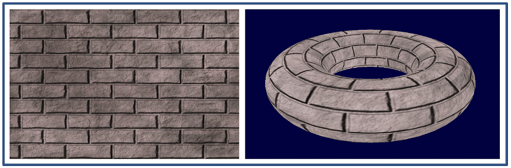

### 6.2.2　OpenGL中的索引

在我们的球体和环面模型中，我们生成一个引用顶点数组的整型索引数组。在球体的情况下，我们使用索引列表来构建一组完整的单个顶点，并将它们加载到VBO中，就像我们在前面章节的示例中所做的那样。实例化环面并将其顶点、法向量等加载到缓冲区中可以采用与程序6.1中类似的方式完成，但我们将使用OpenGL的索引。

使用OpenGL索引时，我们还需要将索引本身加载到VBO中。我们生成一个额外的VBO用于保存索引。由于每个索引值只是一个整型引用，我们首先将索引数组复制到整型的C++向量中，然后使用glBufferData()将向量加载到新增的VBO中，指定VBO的类型为GL_ELEMENT_ARRAY_BUFFER（这会告诉OpenGL这个VBO包含索引）。执行此操作的代码可以添加到setupVertices()：

```c
std::vector<int> ind = myTorus.getIndices();      // 环面索引的读取函数返回整型向量类型的索引
. . .
glBindBuffer(GL_ELEMENT_ARRAY_BUFFER, vbo[3]);    // vbo #3是新增的VBO
glBufferData(GL_ELEMENT_ARRAY_BUFFER, ind.size()*4, &ind[0], GL_STATIC_DRAW);
```

在display()方法中，我们将glDrawArrays()调用替换为glDrawElements()调用，它告诉OpenGL利用索引VBO来查找要绘制的顶点。我们还使用glBindBuffer()启用包含索引的VBO，指定哪个VBO包含索引并且是GL_ELEMENT_ARRAY_BUFFER类型。代码如下：

```c
numTorusIndices = myTorus.getNumIndices();
glBindBuffer(GL_ELEMENT_ARRAY_BUFFER, vbo[3]);
glDrawElements(GL_TRIANGLES, numTorusIndices, GL_UNSIGNED_INT, 0);
```

有趣的是，即使我们在C++/OpenGL应用程序中进行了更改，实现了索引，用于绘制球体的着色器对于环面来说仍然可以继续工作，不需要修改。OpenGL能够识别GL_ELEMENT_ARRAY_BUFFER的存在并利用它来访问顶点属性。

程序6.2显示了一个基于Baker实现的名为Torus的类。“内”和“外”变量指的是图6.9中相应的内半径和外半径。prec变量具有与球体类似的作用，对顶点数量和索引数量进行类似的计算。相比之下，确定法向量比使用球体复杂得多。我们使用了Baker描述中给出的策略，其中计算了两个切向量（Baker称为sTangent和tTangent，尽管通常称为“切向量（tangent）”和“副切向量（bitangent）”），它们的叉乘积形成法向量。

在本书的其余部分中，我们将在许多示例中使用此环面类（以及前面描述的球体类）。

程序6.2　程序生成的环面

```c
Torus 类（Torus.cpp）
#include <cmath>
#include <vector>
#include <iostream>
#include "Torus.h"
using namespace std;
Torus::Torus() {
   prec = 48;
   inner = 0.5f;
   outer = 0.2f;
   init();
}
Torus::Torus(float innerRadius, float outerRadius, int precIn) {
   prec = precIn;
   inner = innerRadius;
   outer = outerRadius;
   init();
}
float Torus::toRadians(float degrees) { return (degrees * 2.0f * 3.14159f) / 360.0f; }
void Torus::init() {
   numVertices = (prec + 1) * (prec + 1);
   numIndices = prec * prec * 6;
   for (int i = 0; i < numVertices; i++) { vertices.push_back(glm::vec3()); }
   for (int i = 0; i < numVertices; i++) { texCoords.push_back(glm::vec2()); }
   for (int i = 0; i < numVertices; i++) { normals.push_back(glm::vec3()); }
   for (int i = 0; i < numVertices; i++) { sTangents.push_back(glm::vec3()); }
   for (int i = 0; i < numVertices; i++) { tTangents.push_back(glm::vec3()); }
   for (int i = 0; i < numIndices; i++) { indices.push_back(0); }
   // 计算第一个环
   for (int i = 0; i < prec + 1; i++) {
        float amt = toRadians(i*360.0f / prec);
        // 绕原点旋转点，形成环，然后将它们向外移动
        glm::mat4 rMat = glm::rotate(glm::mat4(1.0f), amt, glm::vec3(0.0f, 0.0f, 1.0f));
        glm::vec3 initPos(rMat * glm::vec4(outer, 0.0f, 0.0f, 1.0f));
        vertices[i] = glm::vec3(initPos + glm::vec3(inner, 0.0f, 0.0f));
        // 为环上的每个顶点计算纹理坐标
        texCoords[i] = glm::vec2(0.0f, ((float)i / (float)prec));
        // 计算切向量和法向量，第一个切向量是绕Z轴旋转的Y轴
        rMat = glm::rotate(glm::mat4(1.0f), amt, glm::vec3(0.0f, 0.0f, 1.0f));
        tTangents[i] = glm::vec3(rMat * glm::vec4(0.0f, -1.0f, 0.0f, 1.0f));
        sTangents[i] = glm::vec3(glm::vec3(0.0f, 0.0f, -1.0f));   // 第二个切向量是 -Z 轴
        normals[i] = glm::cross(tTangents[i], sTangents[i]);      // 它们的叉乘积就是法向量
   }
   // 绕Y轴旋转最初的那个环，形成其他的环
   for (int ring = 1; ring < prec + 1; ring++) {
        for (int vert = 0; vert < prec + 1; vert++) {
        // 绕Y轴旋转最初那个环的顶点坐标
        float amt = (float)( toRadians(ring * 360.0f / prec));
        glm::mat4 rMat = glm::rotate(glm::mat4(1.0f), amt, glm::vec3(0.0f, 1.0f, 0.0f));
        vertices[ring*(prec + 1) + i] = glm::vec3(rMat * glm::vec4(vertices[i], 1.0f));
        // 计算新环顶点的纹理坐标
        texCoords[ring*(prec + 1) + vert] = glm::vec2((float)ring*2.0f / (float)prec, texCoords  
             [vert].t);
        if (texCoords[ring*(prec + 1) + i].s > 1.0) texCoords[ring*(prec+1)+i].s -= 1.0f;
        // 绕Y轴旋转切向量和副切向量
        rMat = glm::rotate(glm::mat4(1.0f), amt, glm::vec3(0.0f, 1.0f, 0.0f));
        sTangents[ring*(prec + 1) + i] = glm::vec3(rMat * glm::vec4(sTangents[i], 1.0f));
          rMat = glm::rotate(glm::mat4(1.0f), amt, glm::vec3(0.0f, 1.0f, 0.0f));
          tTangents[ring*(prec + 1) + i] = glm::vec3(rMat * glm::vec4(tTangents[i], 1.0f));
          // 绕Y轴旋转法向量
          rMat = glm::rotate(glm::mat4(1.0f), amt, glm::vec3(0.0f, 1.0f, 0.0f));
          normals[ring*(prec + 1) + i] = glm::vec3(rMat * glm::vec4(normals[i], 1.0f));
  } }
  // 按照逐个顶点的两个三角形，计算三角形索引
  for (int ring = 0; ring < prec; ring++) {
      for (int vert = 0; vert < prec; vert++) {
          indices[((ring*prec + vert) * 2) * 3 + 0] = ring*(prec + 1) + vert;
          indices[((ring*prec + vert) * 2) * 3 + 1] = (ring + 1)*(prec + 1) + vert;
          indices[((ring*prec + vert) * 2) * 3 + 2] = ring*(prec + 1) + vert + 1;
          indices[((ring*prec + vert) * 2 + 1) * 3 + 0] = ring*(prec + 1) + vert + 1;
          indices[((ring*prec + vert) * 2 + 1) * 3 + 1] = (ring + 1)*(prec + 1) + vert;
          indices[((ring*prec + vert) * 2 + 1) * 3 + 2] = (ring + 1)*(prec + 1) + vert + 1;
} } }
// 环面索引和顶点的访问函数
int Torus::getNumVertices() { return numVertices; }
int Torus::getNumIndices() { return numIndices; }
std::vector<int> Torus::getIndices() { return indices; }
std::vector<glm::vec3> Torus::getVertices() { return vertices; }
std::vector<glm::vec2> Torus::getTexCoords() { return texCoords; }
std::vector<glm::vec3> Torus::getNormals() { return normals; }
std::vector<glm::vec3> Torus::getStangents() { return sTangents; }
std::vector<glm::vec3> Torus::getTtangents() { return tTangents; }
环面头文件（Torus.h）
#include <cmath>
#include <vector>
#include <glm\glm.hpp>
class Torus
{
private:
   int numVertices;
   int numIndices;
   int prec;
   float inner;
   float outer;
   std::vector<int> indices;
   std::vector<glm::vec3> vertices;
   std::vector<glm::vec2> texCoords;
   std::vector<glm::vec3> normals;
   std::vector<glm::vec3> sTangents;
   std::vector<glm::vec3> tTangents;
   void init();
   float toRadians(float degrees);
public:
   Torus();
   Torus(float innerRadius, float outerRadius, int prec);
   int getNumVertices();
   int getNumIndices();
   std::vector<int> getIndices();
   std::vector<glm::vec3> getVertices();
   std::vector<glm::vec2> getTexCoords();
   std::vector<glm::vec3> getNormals();
   std::vector<glm::vec3> getStangents();
   std::vector<glm::vec3> getTtangents();
};
使用 Torus 类（用 OpenGL 索引）
. . .
#include "Torus.h"
. . .
Torus myTorus(0.5f, 0.2f, 48);
. . .
void setupVertices(void) {
   std::vector<int> ind = myTorus.getIndices();
   std::vector<glm::vec3> vert = myTorus.getVertices();
   std::vector<glm::vec2> tex = myTorus.getTexCoords();
   std::vector<glm::vec3> norm = myTorus.getNormals();
   std::vector<float> pvalues;
   std::vector<float> tvalues;
   std::vector<float> nvalues;
   int numVertices = myTorus.getNumVertices();
   for (int i = 0; i < numVertices; i++) {
        pvalues.push_back(vert[i].x);
        pvalues.push_back(vert[i].y);
        pvalues.push_back(vert[i].z);
        tvalues.push_back(tex[i].s);
        tvalues.push_back(tex[i].t);
        nvalues.push_back(norm[i].x);
        nvalues.push_back(norm[i].y);
        nvalues.push_back(norm[i].z);
   }
   glGenVertexArrays(1, vao);
   glBindVertexArray(vao[0]);
   glGenBuffers(4, vbo);           // 像以前一样生成VBO，并新增一个用于索引
   glBindBuffer(GL_ARRAY_BUFFER, vbo[0]);          // 顶点位置
   glBufferData(GL_ARRAY_BUFFER, pvalues.size() * 4, &pvalues[0], GL_STATIC_DRAW);
   glBindBuffer(GL_ARRAY_BUFFER, vbo[1]);          // 纹理坐标
   glBufferData(GL_ARRAY_BUFFER, tvalues.size() * 4, &tvalues[0], GL_STATIC_DRAW);
   glBindBuffer(GL_ARRAY_BUFFER, vbo[2]);          // 法向量
   glBufferData(GL_ARRAY_BUFFER, nvalues.size() * 4, &nvalues[0], GL_STATIC_DRAW);
   glBindBuffer(GL_ELEMENT_ARRAY_BUFFER, vbo[3]);  // 索引
   glBufferData(GL_ELEMENT_ARRAY_BUFFER, ind.size() * 4, &ind[0], GL_STATIC_DRAW);
}
在display()中
. . .
glBindBuffer(GL_ELEMENT_ARRAY_BUFFER, vbo[3]);
glDrawElements(GL_TRIANGLES, myTorus.getNumIndices(), GL_UNSIGNED_INT, 0);

```

请注意，在使用Torus类的代码中，setupVertices()中的循环现在只存储一次与每个顶点关联的数据，而不是每个索引条目存储一次（如球体示例中的情况）。这种差异也反映在要输入VBO的数据的数组声明大小中。另请注意，在环面示例中，不是在检索顶点数据时使用索引值，而是直接将它们简单地加载到VBO #3中。由于此VBO被指定为GL_ELEMENT_ARRAY_BUFFER，OpenGL知道该VBO包含顶点索引。

图6.9显示了实例化环面并使用砖纹理对其进行纹理化的结果。


<center class="my_markdown"><b class="my_markdown">图6.9　程序生成的环面</b></center>

