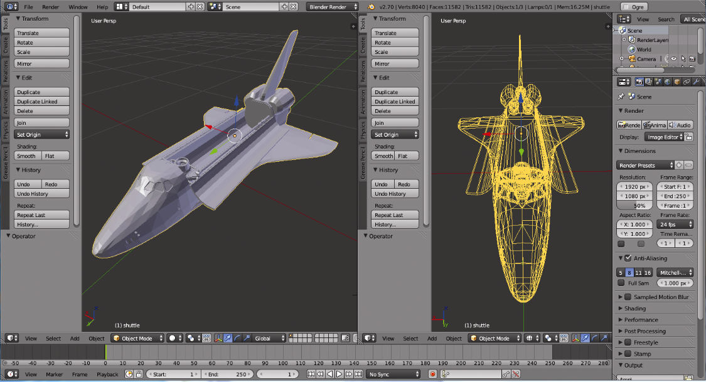
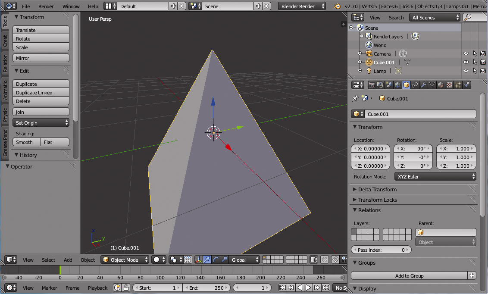
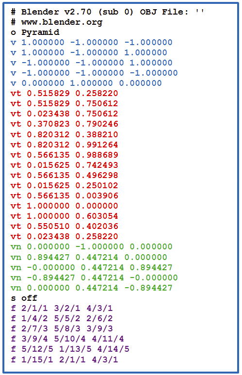
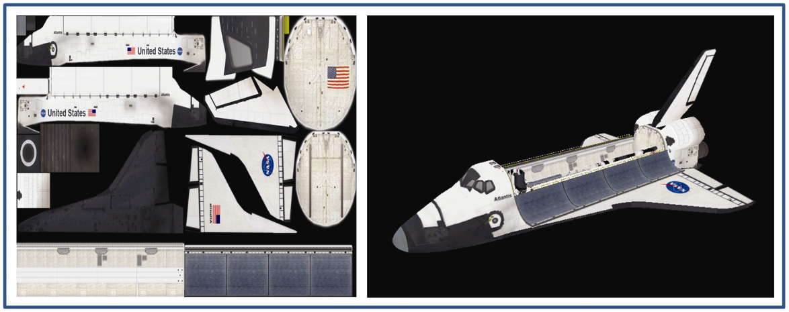

### 6.3　加载外部构建的模型

复杂的3D模型，例如在视频游戏或计算机生成的电影中的人物角色，通常使用建模工具生成。这种“DCC”（数字内容创建）工具使人们（例如艺术家）能够在3D空间中构建任意形状并自动生成顶点、纹理坐标、顶点法向量等。有太多这样的工具，此处无法一一列出，有几个例子是MAYA、Blender、Lightwave、Cinema4D等。Blender是免费和开源的。图6.10显示了编辑3D模型时的Blender屏幕示例。


<center class="my_markdown"><b class="my_markdown">图6.10　Blender模型创建示例<sup class="my_markdown">[BL16]</sup></b></center>

为了让我们在OpenGL场景中使用DCC工具创建的模型，需要以我们可以读取（导入）到我们程序中的格式保存（导出）该模型。有好几种标准的3D模型文件格式；再次说明，有太多无法一一列出，有一些例子是Wavefront（.obj）、3D Studio Max（.3ds）、斯坦福扫描存储库（.ply）、Ogre3D（.mesh），供参考。其中最简单的是Wavefront（通常被称为OBJ），所以我们将仔细讲解它。

OBJ文件很简单，我们可以相对容易地开发一个基本的导入器。在OBJ文件中，通过文本行的形式指定顶点几何数据、纹理坐标、法向量和其他信息。它有一些限制——例如，OBJ文件无法指定模型动画。

OBJ文件中的行，以字符标记开头，表示该行上的数据类型。一些常见的标签包括：

+ v-几何（顶点位置）数据；
+ vt-纹理坐标；
+ vn-顶点法向量；
+ f-面（通常是三角形中的顶点）。

还有其他标签可以用来存储对象名称、使用的材质、曲线、阴影和许多其他细节。我们这里只讨论上面列出的4个标签，这些标签足以导入各种复杂模型。

假设我们使用Blender构建一个简单的金字塔，例如我们为程序4.3开发的金字塔。图6.11是在Blender中创建的类似的金字塔的屏幕截图。


<center class="my_markdown"><b class="my_markdown">图6.11　在Blender中构建的金字塔</b></center>

在Blender中，如果我们现在导出我们的金字塔模型，指定.obj格式，并设置Blender输出纹理坐标和顶点法向量，则会创建一个包含所有这些信息的OBJ文件。生成的OBJ文件如图6.12所示。（纹理坐标的实际值可能因模型的构建方式而异。）


<center class="my_markdown"><b class="my_markdown">图6.12　金字塔导出的OBJ文件</b></center>

我们对OBJ文件的重要部分进行了颜色标记以供参考。顶部以“#”开头的行是由Blender放置的注释，我们的导入器忽略了这些注释。接下来是以“o”开头的行，给出对象的名称。我们的导入器也可以忽略这一行。之后，有一行以“s”开头，指定表面不应该被平滑。我们的代码也会忽略以“s”开头的行。

OBJ文件中的第一部分有实际内容的行是以“v”开头的那些（第4行～第8行）。它们指定金字塔模型的5个顶点相对于原点的X、Y和Z局部空间坐标。在这里，原点位于金字塔的中心。

红色的值（以“vt”开头）是各种纹理坐标。纹理坐标列表比顶点列表长的原因是一些顶点参与多个三角形，并且在这些情况下可能使用不同的纹理坐标。

绿色的值（以“vn”开头）是各种法向量。该列表通常也比顶点列表长（尽管在该示例中不是这样），同样是因为一些顶点参与多个三角形，并且在那些情况下可能使用不同的法向量。

在文件底部附近标记为紫色的值（以“f”开头）指定三角形（即“面”）。在此示例中，每个面（三角形）具有3个元素，每个元素具有由“/”分隔的3个值（OBJ也允许其他格式）。每个元素的值分别是顶点列表、纹理坐标和法向量的索引。例如，第三个面是：

f 2 / 7 / 3　5 / 8 / 3　3 / 9 / 3

这表明顶点列表中的第2个、第5个和第3个顶点（蓝色）组成了一个三角形（请注意OBJ索引从1开始）。相应的纹理坐标是红色部分中纹理坐标列表中的第7项、第8项和第9项。所有3个顶点都具有相同的法向量，也就是以绿色显示的法向量列表中的第3项。

OBJ格式的模型并不要求具有法向量，甚至纹理坐标。如果模型没有纹理坐标或法向量，则面的数值将仅指定顶点索引：

f 2 5 3

如果模型具有纹理坐标，但不具有法向量，则格式如下：

f 2 / 7　5 / 8　3 / 9

并且，如果模型具有法向量但没有纹理坐标，则格式为：

f 2 / / 3　5 / / 3　3 / / 3

模型具有数万个顶点并不罕见。对于所有可以想象的应用场景，几乎都可以在互联网上下载到数百种这样的模型，包括动物、建筑物、汽车、飞机、神话生物、人等。

在互联网上可以获得可以导入OBJ模型的复杂程序各不相同的导入程序。编写一个非常简单的OBJ加载器函数也并不困难，它可以处理我们看到的基本标记（v、vt、vn和f）。程序6.3显示了一个这样的加载器，尽管功能非常有限。它包含一个类来保存任意的导入模型，该模型又调用导入器。

在我们讲述简单OBJ导入器的代码之前，我们必须警告读者其局限性。

+ 它仅支持包含所有3个面属性字段的模型。也就是说，顶点位置、纹理坐标和法向量都必须以f #/#/# #/#/# #/#/#这种形式存在。
+ 材质标签将被忽略——必须使用第5章中描述的方法完成纹理化。
+ 仅支持由单个三角形网格组成的OBJ模型（OBJ格式支持复合模型，但我们的简单导入器不支持）。
+ 它假设每行上的元素只用一个空格分隔。

如果您的OBJ模型不满足上述所有条件，并且您希望使用程序6.3中的简单加载程序导入它，则可能仍然可行。通常可以将这样的模型加载到Blender中，然后将其导出到另一个满足加载器限制条件的OBJ文件中。例如，如果模型不包含法向量，则可以让Blender在导出修改后的OBJ文件时生成法向量。

我们的OBJ加载器的另一个限制与索引有关。在前面的描述中提到了“f”标签允许混合和匹配顶点位置、纹理坐标和法向量的可能性。例如，两个不同的“面”行可以包括指向相同v条目但是不同vt条目的索引。遗憾的是，OpenGL的索引机制不支持这种灵活性——OpenGL中的索引条目只能指向特定的顶点及其属性。这使得在某种程度上编写OBJ模型加载器变得复杂，因为我们不能简单地将三角形面条目中的引用复制到索引数组中。相反，使用OpenGL索引需要确保面条目的v、vt和vn值的整个组合在索引数组中都有自己的引用。一种更简单但效率更低的替代方案是为每个三角形面条目创建一个新顶点。尽管使用OpenGL索引具有节省空间的优势（特别是在加载较大模型时），但为了清晰，我们选择这种更简单的方法。

ModelImporter类包含一个parseOBJ()函数，它逐行读取OBJ文件，分别处理v、vt、vn和f这4种情况。在每种情况下，提取行上的后续数字，首先使用erase()跳过初始的v、vt、vn或f字符，然后使用C++ stringstream类的“>>”运算符提取每个后续参数值，然后将它们存储在C++浮点向量中。当处理面（f）条目时，使用C++浮点向量中的对应条目构建顶点，包括顶点位置、纹理坐标和法向量。

ModelImporter类和ImportedModel类包含在同一个文件中，ImportedModel类通过将导入的顶点放入vec2和vec3对象的向量中，简化了加载和访问OBJ文件顶点的过程。回想一下这些GLM类；我们在这里使用它们来存储顶点位置、纹理坐标和法向量。然后，ImportedModel类中的读取函数使它们可用于C++/OpenGL应用程序，其方式与Sphere和Torus类中的方式相同。

在ModelImporter和ImportedModel类之后是一系列调用示例，加载OBJ文件，然后将顶点信息传输到一组VBO中以供后续渲染。

图6.13显示了从NASA网站<sup class="my_markdown">[NA16]</sup>下载的OBJ格式的航天飞机渲染模型，使用程序6.3中的代码导入，并使用程序5.1中的代码和相应的带有各向异性过滤的NASA纹理图像文件进行纹理化。该纹理图像是使用UV映射的示例，其中模型中的纹理坐标被仔细地映射到纹理图像的特定区域。（如第5章所述，UV映射的细节超出了本书的范围。）


<center class="my_markdown"><b class="my_markdown">图6.13　带有纹理的NASA航天飞机模型</b></center>

程序6.3　简化的（有限制的）OBJ加载器

```c
ImportedModel和ModelImporter类(ImportedModel.cpp)
#include <fstream>
#include <sstream>
#include <glm\glm.hpp>
#include "ImportedModel.h"
using namespace std;
// ------------ ImportedModel类
ImportedModel::ImportedModel(const char *filePath) {
  ModelImporter modelImporter = ModelImporter();
  modelImporter.parseOBJ(filePath);           // 使用modelImporter获取顶点信息
  numVertices = modelImporter.getNumVertices();
  std::vector<float> verts = modelImporter.getVertices();
  std::vector<float> tcs = modelImporter.getTextureCoordinates();
  std::vector<float> normals = modelImporter.getNormals();
  for (int i = 0; i < numVertices; i++) {
      vertices.push_back(glm::vec3(verts[i*3], verts[i*3+1], verts[i*3+2]));
      texCoords.push_back(glm::vec2(tcs[i*2], tcs[i*2+1]));
      normalVecs.push_back(glm::vec3(normals[i*3], normals[i*3+1], normals[i*3+2]));
} }
int ImportedModel::getNumVertices() { return numVertices; }       // accessors
std::vector<glm::vec3> ImportedModel::getVertices() { return vertices; }
std::vector<glm::vec2> ImportedModel::getTextureCoords() { return texCoords; }
std::vector<glm::vec3> ImportedModel::getNormals() { return normalVecs; }
// -------------- ModelImporter类
ModelImporter::ModelImporter() {}
void ModelImporter::parseOBJ(const char *filePath) {
   float x, y, z;
   string content;
   ifstream fileStream(filePath, ios::in);
   string line = "";
   while (!fileStream.eof()) {
      getline(fileStream, line);
      if (line.compare(0, 2, "v ") == 0) {           // 顶点位置（"v"的情况）
         stringstream ss(line.erase(0, 1));
         ss >> x; ss >> y; ss >> z;                  // 提取顶点位置数值
         vertVals.push_back(x);
         vertVals.push_back(y);
         vertVals.push_back(z);
      }
      if (line.compare(0, 2, "vt") == 0) {           // 纹理坐标（"vt"的情况）
         stringstream ss(line.erase(0, 2));
         ss >> x; ss >> y;                           // 提取纹理坐标数值
         stVals.push_back(x);
         stVals.push_back(y);
      }
      if (line.compare(0, 2, "vn") == 0) {           // 顶点法向量（"vn"的情况）
         stringstream ss(line.erase(0, 2));
         ss >> x; ss >> y; ss >> z;                  // 提取法向量数值
         normVals.push_back(x);
         normVals.push_back(y);
         normVals.push_back(z);
      }
      if (line.compare(0, 2, "f") == 0) {            // 三角形面（"f"的情况）
         string oneCorner, v, t, n;
         stringstream ss(line.erase(0, 2));
         for (int i = 0; i < 3; i++) {
            getline(ss, oneCorner, ' ');             // 提取三角形面引用
            stringstream oneCornerSS(oneCorner);
            getline(oneCornerSS, v, '/');
            getline(oneCornerSS, t, '/');
            getline(oneCornerSS, n, '/');
            int vertRef = (stoi(v) - 1) * 3;         // "stoi"将字符串转化为整型
            int tcRef = (stoi(t) - 1) * 2;
            int normRef = (stoi(n) - 1) * 3;
            triangleVerts.push_back(vertVals[vertRef]);     // 构建顶点向量
            triangleVerts.push_back(vertVals[vertRef + 1]);
            triangleVerts.push_back(vertVals[vertRef + 2]);
            textureCoords.push_back(stVals[tcRef]);         // 构建纹理坐标向量
            textureCoords.push_back(stVals[tcRef + 1]);
            normals.push_back(normVals[normRef]);           // 法向量的向量
            normals.push_back(normVals[normRef + 1]);
            normals.push_back(normVals[normRef + 2]);
} } } }
int ModelImporter::getNumVertices() { return (triangleVerts.size()/3); }     // 读取函数
std::vector<float> ModelImporter::getVertices() { return triangleVerts; }
std::vector<float> ModelImporter::getTextureCoordinates() { return textureCoords; }
std::vector<float> ModelImporter::getNormals() { return normals; }
ImportedModel 和 ModelImporter 头文件（ImportedModel.h）
#include <vector>
class ImportedModel
{
private:
   int numVertices;
   std::vector<glm::vec3> vertices;
   std::vector<glm::vec2> texCoords;
   std::vector<glm::vec3> normalVecs;
public:
   ImportedModel(const char *filePath);
   int getNumVertices();
   std::vector<glm::vec3> getVertices();
   std::vector<glm::vec2> getTextureCoords();
   std::vector<glm::vec3> getNormals();
};
class ModelImporter
{
private:
   // 从OBJ文件读取的数值
   std::vector<float> vertVals;
   std::vector<float> stVals;
   std::vector<float> normVals;
   // 保存为顶点属性以供后续使用的数值
   std::vector<float> triangleVerts;
   std::vector<float> textureCoords;
   std::vector<float> normals;
public:
   ModelImporter();
   void parseOBJ(const char *filePath);
   int getNumVertices();
   std::vector<float> getVertices();
   std::vector<float> getTextureCoordinates();
   std::vector<float> getNormals();
};
使用模型导入器
. . .
ImportedModel myModel("shuttle.obj");        // 在顶层声明中
. . .
void setupVertices(void) {
   std::vector<glm::vec3> vert = myModel.getVertices();
   std::vector<glm::vec2> tex = myModel.getTextureCoords();
   std::vector<glm::vec3> norm = myModel.getNormals();
   int numObjVertices = myModel.getNumVertices();
   std::vector<float> pvalues;       // 顶点位置
   std::vector<float> tvalues;       // 纹理坐标
   std::vector<float> nvalues;       // 法向量
   for (int i = 0; i < numObjVertices(); i++) {
      pvalues.push_back((vert[i]).x);
      pvalues.push_back((vert[i]).y);
      pvalues.push_back((vert[i]).z);
      tvalues.push_back((tex[i]).s);
      tvalues.push_back((tex[i]).t);
      nvalues.push_back((norm[i]).x);
      nvalues.push_back((norm[i]).y);
      nvalues.push_back((norm[i]).z);
   }
   glGenVertexArrays(1, vao);
   glBindVertexArray(vao[0]);
   glGenBuffers(numVBOs, vbo);
   // 顶点位置的VBO
   glBindBuffer(GL_ARRAY_BUFFER, vbo[0]);
   glBufferData(GL_ARRAY_BUFFER, pvalues.size() * 4, &pvalues[0], GL_STATIC_DRAW);
   // 纹理坐标的VBO
   glBindBuffer(GL_ARRAY_BUFFER, vbo[1]);
   glBufferData(GL_ARRAY_BUFFER, tvalues.size() * 4, &tvalues[0], GL_STATIC_DRAW);
   // 法向量的VBO
   glBindBuffer(GL_ARRAY_BUFFER, vbo[2]);
   glBufferData(GL_ARRAY_BUFFER, nvalues.size() * 4, &nvalues[0], GL_STATIC_DRAW);
}
在display()中
. . .
glDrawArrays(GL_TRIANGLES, 0, myModel.getNumVertices());
```

