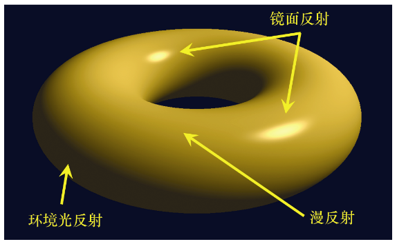

### 7.1　光照模型

我们所观察到的光是高能量源发出的光子，经过反射直到一些光子到达我们的眼睛的产物。不幸的是，在计算上模拟这个自然过程是不可行的，因为这需要模拟并跟踪大量光子的运动，即向我们的场景添加海量的对象（和矩阵）。因此，我们需要的是光照模型。

光照模型（Lighting model）有时也被称为着色模型（Shading model），在着色器编程存在的情况下，这可能有点令人困惑。有时又使用术语反射模型（Reflection model），进一步使术语复杂化。我们将尽力坚持使用简单而实用的术语。

现在最常见的光照模型称为“ADS”模型，因为它们基于标记为A、D和S的3种类型的反射。

+ 环境光反射（Ambient reflection）模拟低级光照，影响场景中的所有物体。
+ 漫反射（Diffuse reflection）根据光线的入射角度调整物体亮度。
+ 镜面反射（Specular reflection）用以展示物体的光泽，通过在物体表面上，光线最直接地反射到我们的眼睛的位置，策略性地放置适当大小的高光来实现。

ADS模型可用于模拟不同的光照效果和各种材质。

图7.1（见彩插）展示了位置光对于闪亮黄金环面的环境光反射、漫反射和镜面反射分量。

<b class="my_markdown">图7.1　ADS光照分量</b>

回想一下，场景的绘制最终是由片段着色器为屏幕上的每个像素输出颜色而实现的。使用ADS光照模型需要指定由于像素的RGBA输出值上的光照而产生的分量。因素包括：

+ 光源类型及其环境、漫反射和镜面反射特性；
+ 对象材质的环境、漫反射和镜面反射特征；
+ 对象的材质指定为“光泽”；
+ 光线照射物体的角度；
+ 从中查看场景的角度。

