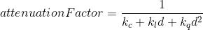
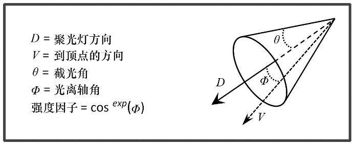

### 7.2　光源

光源有许多类型，每种光源具有不同的特性，需要不同的步骤来模拟其效果。常见光源类型有：

+ 全局光（通常称为“全局环境光”，因为它仅包含环境光组件）；
+ 定向光（或“远距离光”）；
+ 位置光（或“点光源”）；
+ 聚光灯。

全局环境光是最简单的光源模型。它没有光源位置——无论场景中的对象在何处，其上的每个像素都有着相同的光照。全球环境光照模拟了现实世界中的一种光线现象，即光线经过很多次反射，其光源和方向都已经无法确定。全局环境光仅具有环境光反射分量，用RGBA值设定；它没有漫反射或镜面反射分量。例如，全局环境光可以定义如下：

```c
float globalAmbient[4] = { 0.6f, 0.6f, 0.6f, 1.0f };
```

RGBA的取值范围为0～1，全局环境光通常被建模为偏暗的白光，其中RGB各值设为0～1的相同的小数，alpha设置为1。

定向光或远距离光也没有源位置，但它具有方向。它可以用来模拟光源距离非常远，以至于光线接近平行的情况，例如阳光。通常在这种情况下，我们可能只对建模光照感兴趣，而对发光的物体不感兴趣。定向光对物体的影响取决于光照角度，物体在朝向定向光的一侧比在切向或相对侧更亮。建模定向光需要指定其方向（以向量形式）及其环境、漫反射和镜面特征（以RGBA值）。指向Z轴负方向的红色定向光可以指定如下：

```c
float dirLightAmbient[4] = { 0.1f, 0.0f, 0.0f, 1.0f }; 
float dirLightDiffuse[4] = { 1.0f, 0.0f, 0.0f, 1.0f }; 
float dirLightSpecular[4] = { 1.0f, 0.0f, 0.0f, 1.0f }; 
float dirLightDirection[3] = { 0.0f, 0.0f, -1.0f };
```

在已经有全局环境光的情况下，定向光的环境光分量看起来似乎是多余的。然而，当光源“开启”或“关闭”时，全局环境光和定向光的环境光分量的区别就很明显了。当“开启”时，总环境光分量将如预期的那样增加。上面的例子中，我们只使用了很小的环境光分量。在实际场景中，应当根据场景的需要平衡两个环境光分量。

位置光在3D场景中具有特定位置。靠近场景的光源，例如台灯，蜡烛等。像定向光一样，位置光的效果取决于撞击角度；但是，它没有方向，因为它对场景中的每个顶点的光照方向都不同。位置光还可以包含衰减因子，以模拟它们的强度随距离减小的程度。与我们看到的其他类型的光源一样，位置光具有指定为RGBA值的环境光反射、漫反射和镜面反射特性。位置（5,2,−3）处的红色位置光可以指定如下例：

```c
float posLightAmbient[4] = { 0.1f, 0.0f, 0.0f, 1.0f };
float posLightDiffuse[4] = { 1.0f, 0.0f, 0.0f, 1.0f };
float posLightSpecular[4] = { 1.0f,0.0f, 0.0f, 1.0f };
float posLightLocation[3] = { 5.0f, 2.0f, -3.0f };
```

衰减因子有多种建模方式。其中一种方式是使用恒定、线性和二次方（分别称为k<sub class="my_markdown">c</sub>, k<sub class="my_markdown">l</sub>和k<sub class="my_markdown">q</sub>）衰减，并引入非负可调参数。这些参数与离光源的距离（d）结合进行计算：



将这个因子与光的强度相乘可以使距光更远时，光的强度衰减更多。注意，k<sub class="my_markdown">c</sub>应当永远设置为大于等于1的值，从而使得衰减因子落入[0…1]区间，并当d增大时接近于0。

聚光灯（spotlight）同时具有位置和方向。其“锥形”效果可以使用0°～90°的截光角θ来模拟，指定光束的半宽度，并使用衰减指数来模拟随光束角度的强度变化。如图7.2所示，我们确定聚光灯方向与从聚光灯到像素的向量之间的角度φ。当φ小于θ时，我们通过将φ的余弦提高到衰减指数来计算强度因子（当φ大于θ时，强度因子设置为0）。结果是强度因子的范围为0～1。衰减指数会影响当角度φ增加时，强度因子趋于0的速率。然后将强度因子乘以光的强度以模拟锥形效果。


<center class="my_markdown"><b class="my_markdown">图7.2　聚光灯参数</b></center>

位于（5,2,−3）向下照射Z轴负方向的红色聚光灯可以表示为：

```c
float spotLightAmbient[4] = { 0.1f, 0.0f, 0.0f, 1.0f }; 
float spotLightDiffuse[4] = { 1.0f, 0.0f, 0.0f, 1.0f }; 
float spotLightSpecular[4] = { 1.0f,0.0f, 0.0f, 1.0f }; 
float spotLightLocation[3] = { 5.0f, 2.0f, -3.0f }; 
float spotLightDirection[3] = { 0.0f, 0.0f, -1.0f }; 
float spotLightCutoff = 20.0f;
float spotLightExponent = 10.0f;
```

聚光灯也可以引入衰减因子。我们没有在上面的代码中展示它们，不过，聚光灯衰减因子可以用与前述定向光源相同的方式实现。历史上，自1986年皮克斯的著名动画《小台灯》（Luxo Jr.）出现起，聚光灯就成为了计算机图形学的标志。

当设计拥有许多光源的系统时，程序员应该考虑创建相应的类结构，如定义Light类以及其子类GlobalAmbient、Directional、Positional以及Spotlight。由于聚光灯同时具有定向光和位置光的特性，这里就值得使用C++的多继承能力，让Spotlight类同时继承于实现位置光和定向光的类。在示例中，由于内容足够简单，因此我们在当前版本中没有加入这种层次结构。

