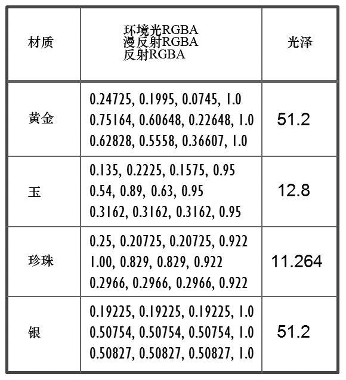

### 7.3　材质

我们场景中物体的“外观”目前仅使用颜色和纹理进行表现。增加的光照使得我们可以加入表面的反射特性。即对象如何与我们的ADS光照模型相互作用。这可以通过将每个对象视为“由某种材质制成”来建模。

通过指定4个值（我们已经熟悉其中3个值——环境光、漫反射和镜面RGB颜色），可以在ADS光照模型中模拟材质。第四种叫作光泽，正如我们将要看到的那样，它被用来为所选材质建立一个合适的镜面高光。目前许多不同类型的常见材质已经有ADS和光泽度值了。例如，“锡镴”可以指定如下：

```c
float pewterMatAmbient[4] = { .11f, .06f, .11f, 1.0f };
float pewterMatDiffuse[4] = { .43f, .47f, .54f, 1.0f };
float pewterMatSpecular[4] = { .33f, .33f, .52f, 1.0f };
float pewterMatShininess = 9.85f;
```

一些其他材质的ADS RGBA值见图7.3（引自<sup class="my_markdown">[BA16]</sup>）。

有时候一些其他特性也属于材质特性。透明度由RGBA标准中的第四个（alpha）通道的不透明度来实现。取值为1.0是表示完全不透明，取值为0时表示完全透明。对于大多数材质而言，只需要把不透明度设置为1.0就行了，但是对于某些特定的材质，加入一些透明度是很重要的。例如，图7.3中材质“玉”和“珍珠”都含有少量透明度（取值略微小于1.0）以显得更加真实。


<center class="my_markdown"><b class="my_markdown">图7.3　其他材质的ADS系数</b></center>

放射性有时也包含在ADS材质规范中。在模拟自身发光的材质（例如磷光材质）时非常有用。

没有纹理的物体在渲染时，通常需要指定材质特性。因此，预定义一些可供选择的材质，在使用时会很方便。因此我们需要在Utils.cpp文件中添加如下代码：

```c
// 黄金材质 — 环境光、漫反射、镜面反射和光泽
float * Utils::goldAmbient() { static float a[4] = { 0.2473f, 0.1995f, 0.0745f, 1 }; return 
    (float * ) a; }
float * Utils::goldDiffuse() { static float a[4] = { 0.7516f, 0.6065f, 0.2265f, 1 }; return 
    (float * ) a; }
float * Utils::goldSpecular() { static float a[4] = { 0.6283f, 0.5559f, 0.3661f, 1 }; return 
    (float * ) a; }
float Utils::goldShininess() { return 51.2f; }
// 白银材质 — 环境光、漫反射、镜面反射和光泽
float * Utils::silverAmbient() { static float a[4] = { 0.1923f, 0.1923f, 0.1923f, 1 }; return 
    (float * ) a; }
float * Utils::silverDiffuse() { static float a[4] = { 0.5075f, 0.5075f, 0.5075f, 1 }; return 
    (float * ) a; }
float * Utils::silverSpecular() { static float a[4] = { 0.5083f, 0.5083f, 0.5083f, 1 }; return 
    (float * ) a; }
float Utils::silverShininess() { return 51.2f; }
// 青铜材质 — 环境光、漫反射、镜面反射和光泽
float * Utils::bronzeAmbient() { static float a[4] = { 0.2125f, 0.1275f, 0.0540f, 1 }; return 
    (float * ) a; }
float * Utils::bronzeDiffuse() { static float a[4] = { 0.7140f, 0.4284f, 0.1814f, 1 }; return 
    (float * ) a; }
float * Utils::bronzeSpecular() { static float a[4] = { 0.3936f, 0.2719f, 0.1667f, 1 }; return 
    (float * ) a; }
float Utils::bronzeShininess() { return 25.6f; }
```

这样在init()函数中或全局中为物体指定“黄金”材质就非常容易了，如下所示。

```c
float* matAmbient = Utils::goldAmbient();
float* matDiffuse = Util::goldDiffuse();
float* matSpecular = util.goldSpecular();
float matShininess = util.goldShininess();
```

注意，目前为止的各小节中，我们所用来实现的光照和材质特性的代码并没有引入光照。这些代码仅仅提供了用于描述并存储场景中元素所需光照和材质特性的一种方式。我们仍然需要自己计算光照。编写计算光照的代码需要在我们的着色器代码中引入一些严肃的数学过程。因此，让我们先来看看在C++/OpenGL和GLSL图形程序中实现ADS光照的基础。

