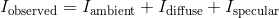
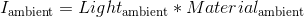
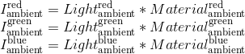
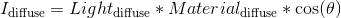
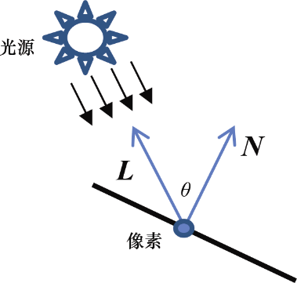
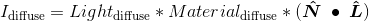
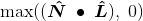
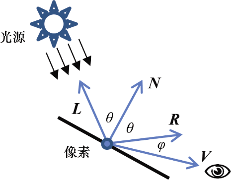
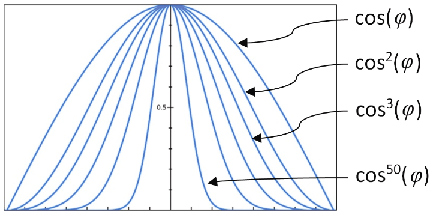
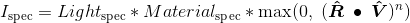

### 7.4　ADS光照计算

当我们绘制场景时，每个顶点坐标都会进行变换以将3D世界模拟到2D屏幕上。每个像素的颜色都是光栅化、纹理贴图以及插值的结果。现在我们需要加入一个新的步骤来调整这些光栅化之后的像素颜色，以便反应场景中的光照和材质。我们需要做的基础ADS计算是确定每个像素的反射强度（Reflection Intensity，I）。计算过程如下：

我们需要计算每个光源对于每个像素的环境光反射、漫反射和镜面反射分量，并求和。当然，这些计算都基于场景内的光源类型以及渲染中模型的材质类型。

环境光分量是最简单的。它的值是场景环境光与材质环境光分量的乘积：

请记住光与材质亮度都是RGB值，计算可以更准确地描述为：

漫反射分量会更复杂一些，因为它基于光对于平面的入射角。朗伯余弦定律（1760年出版）确定了表面反射的光量与光入射角的余弦成正比。可以建模为如下公式：

与上面的计算相同，实际计算中所用到的是红、绿、蓝分量。

确定入射角θ需要（a）求解从所绘制向量到光源的向量（或者与光照方向相反的向量），（b）求解所渲染物体表面的法（垂直）向量。让我们将其分别称为**L**和**N**，如图7.4所示。

<b class="my_markdown">图7.4　入射角</b>

基于场景中光的物理特性，向量**L**可以通过对光照方向向量取反，或通过计算像素位置到光源位置的向量得到。计算向量**N**会麻烦一些——法向量有可能已经在模型中给出了，但是如果模型没有给出法向量**N**，那么就需要基于周围顶点位置，在几何上对向量**N**进行估计。在本章剩下的内容中，我们假设所渲染的模型每个顶点都包含法向量（使用建模工具如MAYA或Blender创建的模型，通常都包含法向量）。

事实上，在计算法向量时，没必要计算出θ角本身的角度。我们真正需要的是cos(θ)。在第3章中讲过，这可以通过点乘计算得出。因此，漫反射分量可以通过如下公式得出：

漫反射分量仅当表面暴露在光照中时起作用，即当−90 < θ < 90，cos(θ) > 0时。因此，我们需要将之前等式的最右项替换为：

镜面反射分量决定所渲染的像素是否需要作为“镜面高光”的一部分变亮。它不止与光源的入射角相关，也与光在表面上的反射角以及观察点与反光表面之间的夹角相关。

在图7.5中，**R**代表光反射的方向，**V**（叫作观察向量view vector）是从像素到眼睛的向量。注意，**V**是对从眼睛到像素的向量取反（在相机空间中，眼睛位于原点）。在**R**与**V**之间的小夹角φ越小，眼睛越靠近光轴，或者说看向反射光，因此像素的镜面高光分量也就越大（像素看来应该更亮）。

<b class="my_markdown">图7.5　观察点入射角</b>

φ用于计算镜面反射分量的方式取决于所渲染物体的“光泽度”。极端闪亮的物体，如镜子，其镜面高光非常小——它们将入射的光直接反射给了眼睛。不那么闪亮的物体，其镜面高光会扩散开来，因此高光会包含更多的像素。

反光度通常用衰减函数来建模，这个衰减函数用来表达随着角度φ的增大，镜面反射分量降低到0的速度。我们可以用cos(φ)来对衰减进行建模，通过余弦函数的乘方来增减反光度，如cos(φ), cos2(φ), cos3(φ), cos10(φ), cos50(φ)等，如图7.6所示。

<b class="my_markdown">图7.6　以余弦指数建模的反光度</b>

注意，指数中的阶数越高，衰减越快，因此在视角光轴外的反光像素镜面反射分量越小。我们将衰减函数cosn(φ)中的指数n叫作材质的反光度因子。注意在之前的图7.3中，每个材质的反光度因子在最右列给出。

现在我们可以给出完整的镜面反射计算：

注意，与之前计算漫反射一样，我们使用了max()函数。在本例中，我们需要确保镜面反射分量不使用cos(φ)所产生的负值，如果使用了负值，则会有奇怪的伪影，如“暗”镜面高光。

同时，如之前一样，真正的计算中包含了红、绿、蓝3个分量。

