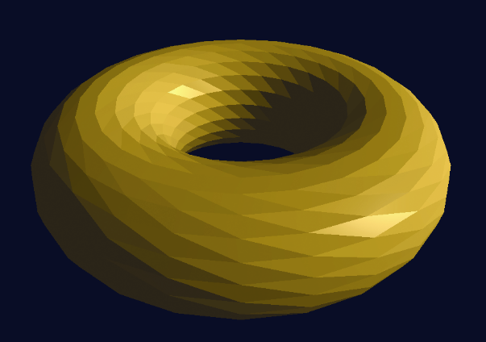

### 7.5　实现ADS光照

在7.4节中所讲述的计算目前为止都是理论上的，其中包含的假设是，我们可以对每个像素都实行这些操作。但是真实情况会更复杂，通常模型中只有用来定义模型的顶点才有法向量（**N**），而非每个像素都有。因此我们要么需要计算每个像素的法向量，这会非常耗时，要么需要使用其他方法对所需的值进行估计，以实现足够好的效果。

其中一种途径称为“面片着色”或“平坦着色”。这里我们假定所渲染图元（如多边形或三角形）中每个像素的光照值都一样。因此我们只需要对模型每个多边形的一个顶点进行光照计算，然后以每个多边形或每个三角形为基础，将计算结果的光照值复制到相邻的像素中。

现在面片着色几乎已经不再使用，因为其渲染结果看来不够真实，同时现代硬件已经可以进行更加精确的计算了。图7.7中展示了一个面片着色环面的例子，其中每个三角形都作为平坦的反射表面。

<b class="my_markdown">图7.7　面片着色的环面</b>

虽然某些情况下，面片着色可能已经够用了（或者故意使用其效果），但是通常“平滑着色”是一种更好的途径。在平滑着色的过程中，会对每个像素计算光照强度。现代显卡的并行处理功能，以及OpenGL图形管线中的插值渲染让平滑着色变得可行。

我们将会观察两个流行的平滑着色方法：Gouraud着色和Phong着色。

