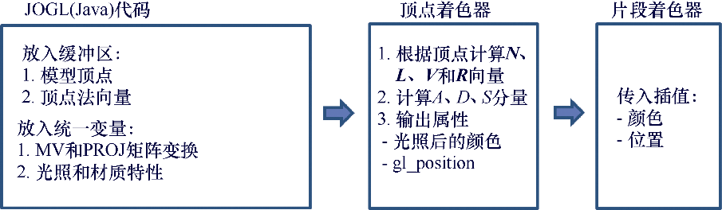
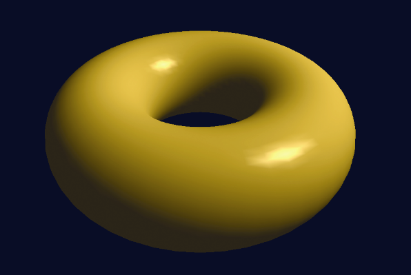

### 7.5.1　Gouraud着色（双线性光强插值法）

法国计算机科学家Henri Gouraud在1971年发表的平滑着色算法后来被称为Gouraud着色<sup class="my_markdown">[GO71]</sup>。由于使用了3D图形管线（如OpenGL）中的自动插值渲染，它特别适用于现代显卡。Gouraud着色过程如下。

（1）确定每个顶点的颜色，以及光照相关计算。

（2）允许正常的光栅化过程在插入像素时对颜色也进行插值（同时也对光照进行插值）。

在OpenGL中，这表示大多数光照计算都是在顶点着色器中完成的，片段着色器仅做传递并展示自动插值的光照后的颜色。

图7.8展示了在场景中包含环面和单一位置光的情况下，我们将会用来在OpenGL中实现Gouraud着色器的策略。程序7.1中实现了这个策略。


<center class="my_markdown"><b class="my_markdown">图7.8　实现Gouraud着色</b></center>

程序7.1　位置光和Gouraud着色器下的环面

```c
C++/OpenGL应用程序
. . .
#include "Torus.h"
#include "Utils.h"
. . .
// 用于创建着色器和渲染程序的声明，如前
// VAO、两个VBO以及环面的声明，如前
// 环面与相机位置的声明和赋值，如前
// Utils.cpp中现在已经添加有金、银、青铜材质
. . .
// 为display() 函数分配变量
GLuint mvLoc, projLoc, nLoc;
// 着色器统一变量中的位置
GLuint globalAmbLoc, ambLoc, diffLoc, specLoc, posLoc, mAmbLoc, mDiffLoc, mSpecLoc, mShiLoc; 
glm::mat4 pMat, vMat, mMat, mvMat, invTrMat;
glm::vec3 currentLightPos, lightPosV;   // 在模型和视觉空间中的光照位置，Vector3f类型
float lightPos[3];                      // 光照位置的浮点数组
// 初始化光照位置
glm::vec3 initialLightLoc = glm::vec3(5.0f, 2.0f, 2.0f);
// 白光特性
float globalAmbient[4] = { 0.7f, 0.7f, 0.7f, 1.0f }; float lightAmbient[4] = { 0.0f, 0.0f, 0.0f, 1.0f }; float lightDiffuse[4] = { 1.0f, 1.0f, 1.0f, 1.0f }; float lightSpecular[4] = { 1.0f, 1.0f, 1.0f, 1.0f };
// 黄金材质特性
float* matAmb = Utils::goldAmbient(); float* matDif = Utils::goldDiffuse(); float* matSpe = Utils::goldSpecular(); float matShi = Utils::goldShininess();
void setupVertices(void) { 
   // 该函数与之前章节中的相同，没有改动
   // 下面的部分在这里出现是为了更清晰，现在我们将真的使用法向量
   . . . 
   glBindBuffer(GL_ARRAY_BUFFER, vbo[2]); 
   glBufferData(GL_ARRAY_BUFFER, nvalues.size() * 4, &nvalues[0], GL_STATIC_DRAW);
}
void display(GLFWwindow* window, double currentTime) { 
   // 清除深度缓冲区，如之前例子中一样载入渲染程序
   . . . 
   // 用于模型-视图变换、投影以及逆转置(法向量)矩阵的统一变量
   mvLoc = glGetUniformLocation(renderingProgram, "mv_matrix"); 
   projLoc = glGetUniformLocation(renderingProgram, "proj_matrix"); 
   nLoc = glGetUniformLocation(renderingProgram, "norm_matrix"); 
   // 初始化投影及视图矩阵，如前例
   . . . 
   // 基于环面位置，构建模型矩阵
   mMat = glm::translate(glm::mat4(1.0f), glm::vec3(torLocX, torLocY, torLocZ)); 
   // 旋转环面以便更容易看到
   mMat *= glm::rotate(mMat, toRadians(35.0f), glm::vec3(1.0f, 0.0f, 0.0f)); 
   // 基于当前光源位置，初始化光照
   currentLightPos = glm::vec3(initialLightLoc.x, initialLightLoc.y, initialLightLoc.z);    installLights(vMat);    // 通过合并矩阵v和m，创建模型-视图(MV)矩阵，如前
   mvMat = vMat * mMat; 
   // 构建MV矩阵的逆转置矩阵，以变换法向量
   invTrMat = glm::transpose(glm::inverse(mvMat)); 
   // 将MV、PROJ以及逆转置(法向量)矩阵传入相应的统一变量
   glUniformMatrix4fv(mvLoc, 1, GL_FALSE, glm::value_ptr(mvMat)); 
   glUniformMatrix4fv(projLoc, 1, GL_FALSE, glm::value_ptr(pMat)); 
   glUniformMatrix4fv(nLoc, 1, GL_FALSE, glm::value_ptr(invTrMat)); 
   // 在顶点着色器中，将顶点缓冲区(VBO #0)绑定到顶点属性#0
   glBindBuffer(GL_ARRAY_BUFFER, vbo[0]); 
   glVertexAttribPointer(0, 3, GL_FLOAT, false, 0, 0); 
   glEnableVertexAttribArray(0); 
   // 在顶点着色器中，将法向缓冲区(VBO #2)绑定到顶点属性#1
   glBindBuffer(GL_ARRAY_BUFFER, vbo[2]); 
   glVertexAttribPointer(1, 3, GL_FLOAT, false, 0, 0); 
   glEnableVertexAttribArray(1); 
   glEnable(GL_CULL_FACE); 
   glFrontFace(GL_CCW); 
   glEnable(GL_DEPTH_TEST); 
   glDepthFunc(GL_LEQUAL); 
   glBindBuffer(GL_ELEMENT_ARRAY_BUFFER, vbo[3]); 
   glDrawElements(GL_TRIANGLES, myTorus.getNumIndices(), GL_UNSIGNED_INT, 0);
}
void installLights(glm::mat4 vMatrix) { 
   // 将光源位置转换为视图空间坐标，并存入浮点数组
   lightPosV = glm::vec3(vMatrix * glm::vec4(currentLightPos, 1.0)); 
   lightPos[0] = lightPosV.x; 
   lightPos[1] = lightPosV.y; 
   lightPos[2] = lightPosV.z; 
   // 在着色器中获取光源位置和材质属性
   globalAmbLoc = glGetUniformLocation(renderingProgram, "globalAmbient"); 
   ambLoc = glGetUniformLocation(renderingProgram, "light.ambient"); 
   diffLoc = glGetUniformLocation(renderingProgram, "light.diffuse"); 
   specLoc = glGetUniformLocation(renderingProgram, "light.specular"); 
   posLoc = glGetUniformLocation(renderingProgram, "light.position"); 
   mAmbLoc = glGetUniformLocation(renderingProgram, "material.ambient"); 
   mDiffLoc = glGetUniformLocation(renderingProgram, "material.diffuse"); 
   mSpecLoc = glGetUniformLocation(renderingProgram, "material.specular"); 
   mShiLoc = glGetUniformLocation(renderingProgram, "material.shininess"); 
   // 在着色器中为光源与材质统一变量赋值
   glProgramUniform4fv(renderingProgram, globalAmbLoc, 1, globalAmbient); 
   glProgramUniform4fv(renderingProgram, ambLoc, 1, lightAmbient); 
   glProgramUniform4fv(renderingProgram, diffLoc, 1, lightDiffuse); 
   glProgramUniform4fv(renderingProgram, specLoc, 1, lightSpecular); 
   glProgramUniform3fv(renderingProgram, posLoc, 1, lightPos); 
   glProgramUniform4fv(renderingProgram, mAmbLoc, 1, matAmb); 
   glProgramUniform4fv(renderingProgram, mDiffLoc, 1, matDif); 
   glProgramUniform4fv(renderingProgram, mSpecLoc, 1, matSpe); 
   glProgramUniform1f(renderingProgram, mShiLoc, matShi);
}
// init() 以及 main() 函数如前

```

程序7.1中的很多元素我们都已经熟悉了。首先，定义了环面、光照和材质特性。接着将环面顶点以及相关法向量读入缓冲区。display()函数与之前程序中的类似，在这里不同的是它同时也将光照和材质信息传入顶点着色器。为了传入这些信息，它调用installLights()，将光源在视觉空间中的位置，以及材质的ADS特性，读入相应的统一变量以供着色器使用。注意，我们提前定义了这些统一位置变量，以求更好的性能。

其中一个重要的细节是变换矩阵MV，用来将顶点位置移动到视觉空间，但它并不总能正确地将法向量也调整进视觉空间。直接对法向量应用MV矩阵不能保证法向量依然与物体表面垂直。正确的变换是MV的逆转置矩阵，在第3章“补充说明”中有描述。在程序7.1中，这个新增的矩阵叫作“invTrMat”，通过统一变量传入着色器。

变量lightPosV包含光源在相机空间中的位置。我们每帧只需要计算一次，因此我们在installLights()中[在display()中调用]而非着色器中计算。着色器在下方的续程序7.1中。其中顶点着色器使用了一些我们目前没有见过的符号。注意，在顶点着色器最后进行了向量加法——在第3章中有讲，并且在GLSL中可用。我们将会在展示着色器之后讨论其他符号。

续程序7.1

```c
顶点着色器
#version 430
layout (location=0) in vec3 vertPos;
layout (location=1) in vec3 vertNormal;
out vec4 varyingColor;
struct PositionalLight
{ vec4 ambient; 
  vec4 diffuse; 
  vec4 specular; 
  vec3 position;
};
struct Material
{ vec4 ambient; 
  vec4 diffuse; 
  vec4 specular; 
  float shininess;
};
uniform vec4 globalAmbient;
uniform PositionalLight light;
uniform Material material;
uniform mat4 mv_matrix;
uniform mat4 proj_matrix;
uniform mat4 norm_matrix;   // 用来变换法向量
void main(void)
{ vec4 color; 
  // 将顶点位置转换到视觉空间
  // 将法向量转换到视觉空间
  // 计算视觉空间光照向量(从顶点到光源)
  vec4 P = mv_matrix * vec4(vertPos,1.0); 
  vec3 N = normalize((norm_matrix * vec4(vertNormal,1.0)).xyz); 
  vec3 L = normalize(light.position - P.xyz); 
  // 视觉向量等于视觉空间中的负顶点位置
  vec3 V = normalize(-P.xyz); 
  // R是-L的相对于表面向量N的镜像
  vec3 R = reflect(-L,N); 
  // 环境光、漫反射和镜面反射分量
  vec3 ambient = ((globalAmbient * material.ambient) + (light.ambient * material.ambient)).xyz; 
  vec3 diffuse = light.diffuse.xyz * material.diffuse.xyz * max(dot(N,L), 0.0); 
  vec3 specular = 
     material.specular.xyz * light.specular.xyz * pow(max(dot(R,V), 0.0f), material.shininess); 
  // 将颜色输出发送到片段着色器
  varyingColor = vec4((ambient + diffuse + specular), 1.0); 
  // 将位置发送到片段着色器，如前
  gl_Position = proj_matrix * mv_matrix * vec4(vertPos,1.0);
}
片段着色器
#version 430
in vec4 varyingColor;
out vec4 fragColor;
// 与顶点着色器相同的统一变量
// 但并不直接在当前片段着色器使用
struct PositionalLight
{ vec4 ambient; 
  vec4 diffuse; 
  vec4 specular; 
  vec3 position;
};
struct Material
{ vec4 ambient; 
  vec4 diffuse; 
  vec4 specular; 
  float shininess;
};
uniform vec4 globalAmbient;
uniform PositionalLight light;
uniform Material material;
uniform mat4 mv_matrix;
uniform mat4 proj_matrix;
uniform mat4 norm_matrix;
void main(void)
{ fragColor = varyingColor;
}

```

程序7.1的输出如图7.9所示。


<center class="my_markdown"><b class="my_markdown">图7.9　Gouraud着色的环面</b></center>

顶点着色器代码中有我们第一次使用了结构体语法的示例。GLSL“结构体”就像一个数据类型，它有名称和一组字段。当使用结构体名称声明变量时，这个变量将包含结构体中声明的字段，并可以通过“.”语法访问字段。例如，变量“light”声明为“PositionalLight”类型，因此我们可以在其后引用其字段light.ambient，light.diffuse等。

还要注意字段选择器符号“.xyz”，我们在顶点着色器中的多个地方都使用了这种语法。这是将vec4转换为仅包含其前3个元素的等效vec3的快捷方式。

绝大多数光照计算发生在顶点着色器中。对于每个顶点，将适当的矩阵变换应用于顶点位置和相关的法向量，并计算用于光方向（**L**）和反射（**R**）的向量。然后执行7.4节中描述的ADS计算，得到每个顶点的颜色（代码中名为varyingColor）。颜色作为正常光栅化过程的一部分进行插值。之后片段着色器仅作为简单传递。冗长的统一变量声明列表也在片段着色器中（由于前面第4章中描述的原因），但实际上并没有在那里使用它们。

注意GLSL函数normalize()，它用来将向量转换为单位长度。正确地进行点积运算必须要先使用该函数。reflect()函数则计算一个向量基于另一个向量的反射。

图7.9输出的环面中有很明显的伪影。其镜面高光有着块状、面片感。这种伪影在物体移动时会更加明显（但我们在书中没法展示移动的物体）。

Gouraud着色也容易受到其他伪影影响。如果镜面高光整个范围都在模型中的一个三角形内——即高光范围内一个模型顶点也没有——那么它可能不会被渲染出来。由于镜面反射分量是依顶点计算的，因此，当模型所有顶点都没有镜面反射分量时，其光栅化后的像素也不会有镜面反射光。

