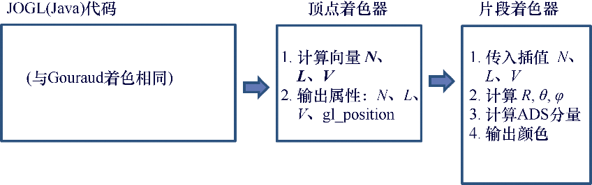
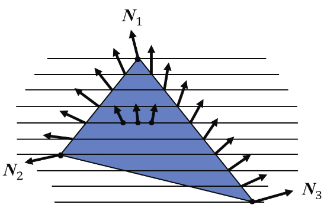
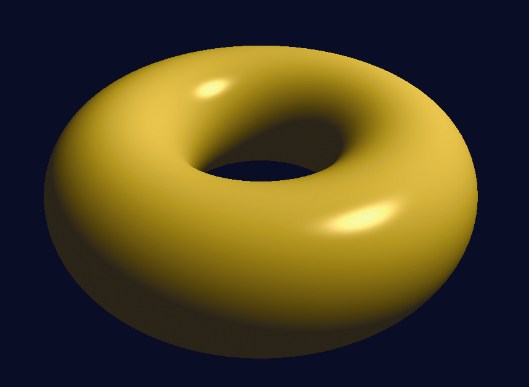
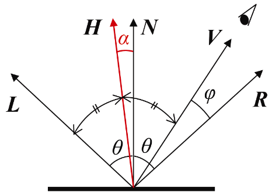
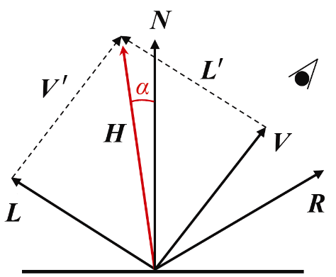
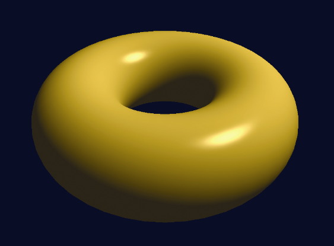
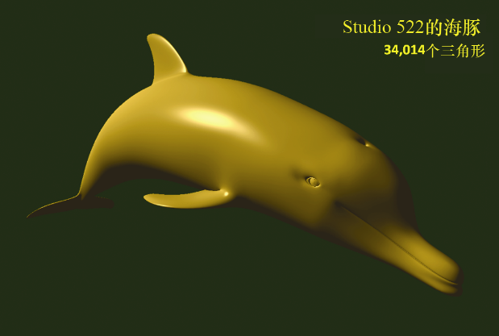
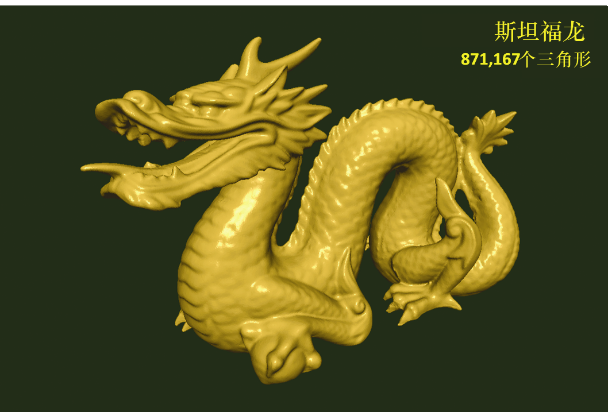

### 7.5.2　Phong着色

Bui Tuong Phong在犹他大学的研究生期间开发了一种平滑的着色算法，在1973年的论文<sup class="my_markdown">[PH73]</sup>中对其进行了描述，并在<sup>[PH75]</sup>中发表。该算法的结构类似于Gouraud着色的算法，其不同之处在于光照计算是按像素而非顶点完成。由于光照计算需要法向量**N**和光向量**L**，但在模型中仅顶点包含这些信息，因此Phong着色通常使用巧妙的“技巧”来实现，其中**N**和**L**在顶点着色器中进行计算，并在光栅化期间插值。图7.10概述了此策略。


<center class="my_markdown"><b class="my_markdown">图7.10　实现Phong着色</b></center>

C++/OpenGL代码完全如前。之前部分在顶点着色器中完成的过程现在回放入片段着色器中进行。法向量插值的效果如图7.11所示。


<center class="my_markdown"><b class="my_markdown">图7.11　法向量插值</b></center>

现在我们已经准备好使用Phong着色实现位置光照射下的环面了。大多数代码与实现Gouraud着色的代码相同。由于C++/OpenGL代码完全没有改变，在此我们只展示修改过的顶点着色器和片段着色器，见程序7.2。程序7.2的输出如图7.12所示，Phong着色修正了Gouraud着色中出现的伪影。


<center class="my_markdown"><b class="my_markdown">图7.12　Phong着色的环面</b></center>

程序7.2　Phong着色的环面

```c
顶点着色器
#version 430
layout (location=0) in vec3 vertPos;
layout (location=1) in vec3 vertNormal;
out vec3 varyingNormal;      // 视觉空间顶点法向量
out vec3 varyingLightDir;    // 指向光源的向量
out vec3 varyingVertPos;     // 视觉空间中的顶点位置
// 结构体和统一变量与Gouraud着色相同
. . .
void main(void)
{ // 输出顶点位置、光照方向和法向量到光栅器以进行插值
  varyingVertPos=(mv_matrix * vec4(vertPos,1.0)).xyz; 
  varyingLightDir = light.position - varyingVertPos; 
  varyingNormal=(norm_matrix * vec4(vertNormal,1.0)).xyz; 
  gl_Position=proj_matrix * mv_matrix * vec4(vertPos,1.0);
}
片段着色器
#version 430
in vec3 varyingNormal;
in vec3 varyingLightDir;
in vec3 varyingVertPos;
out vec4 fragColor;
// 结构体和统一变量与Gouraud着色相同
. . .
void main(void)
{ // 正规化光照向量、法向量、视觉向量
  vec3 L = normalize(varyingLightDir); 
  vec3 N = normalize(varyingNormal); 
  vec3 V = normalize(-varyingVertPos); 
  // 计算光照向量基于N的反射向量
  vec3 R = normalize(reflect(-L, N)); 
  // 计算光照与平面法向量间的角度
  float cosTheta = dot(L,N); 
  // 计算视觉向量与反射光向量的角度
  float cosPhi = dot(V,R); 
  // 计算ADS分量(按像素)，并合并以构建输出颜色
  vec3 ambient = ((globalAmbient * material.ambient) + (light.ambient * material.ambient)).xyz; 
  vec3 diffuse = light.diffuse.xyz * material.diffuse.xyz * max(cosTheta,0.0); 
  vec3 specular = 
     light.specular.xyz * material.specular.xyz * pow(max(cosPhi,0.0), material.shininess); 
  fragColor = vec4((ambient + diffuse + specular), 1.0);
}
```

虽然Phong着色有着比Gouraud着色更真实的效果，但这是建立在增大性能消耗的基础上的。James Blinn在1977年提出了一种对于Phong着色的优化方法<sup class="my_markdown">[BL77]</sup>，被称为Blinn-Phong反射模型。这种优化是基于观察到Phong着色中消耗最大的计算之一是解出反射向量**R**。

Blinn发现向量**R**在计算过程中并不是必需的——**R**只是用来计算角φ的手段。角φ的计算可以不用向量**R**，而通过**L**与**V**的角平分线向量**H**得到。如图7.13所示，**H**和**N**之间的角α刚好等于1⁄2(φ)。虽然α与φ不同，但Blinn展示了使用α代替φ就已经可以获得足够好的结果。


<center class="my_markdown"><b class="my_markdown">图7.13　Blinn-Phong反射</b></center>

角平分线向量可以简单地使用**L**+**V**得到（见图7.14），之后cos(α)可以通过的点积计算。


<center class="my_markdown"><b class="my_markdown">图7.14　Blinn-Phong计算</b></center>

这些计算可以在片段着色器中进行，甚至为了性能考虑（经过一些调整）也可以在顶点着色器中进行。图7.15展示了使用Blinn-Phong着色的环面。它在图形质量上几乎与Phong渲染相同，同时节省了大量性能损耗。


<center class="my_markdown"><b class="my_markdown">图7.15　Blinn-Phong着色的环面</b></center>

程序7.3中展示了修改后顶点着色器和片段着色器，它们用来将程序7.2中的Phong着色示例转换为Blinn-Phong着色。C++ / OpenGL代码与之前一样没有变化。

程序7.3　Blinn-Phong着色的环面

```c
顶点着色器
. . .
// 角平分线向量 H 作为新增的输出
out vec3 varyingHalfVector;
. . .
void main(void)
{ // 与之前的计算相同，增加了L+V的计算
  varyingHalfVector = (varyingLightDir + (-varyingVertPos)).xyz; 
  // (其余顶点着色器代码没有改动)
}
片段着色器
. . .
in vec3 varyingHalfVector; . . .
void main(void)
{ // 注意，现在已经不需要在片段着色器中计算R
  vec3 L = normalize(varyingLightDir); 
  vec3 N = normalize(varyingNormal); 
  vec3 V = normalize(-varyingVertPos); 
  vec3 H = normalize(varyingHalfVector); 
  . . . 
  // 计算法向量N与角平分线向量H之间的角度
  float cosPhi = dot(H,N); 
  // 角平分线向量H已经在顶点着色器中计算过，并在光栅器中进行过插值
  vec3 ambient = ((globalAmbient * material.ambient) + (light.ambient * material.ambient)).xyz; 
  vec3 diffuse = light.diffuse.xyz * material.diffuse.xyz * max(cosTheta,0.0); 
  vec3 specular = 
     light.specular.xyz * material.specular.xyz * pow(max(cosPhi,0.0), material.shininess*3.0); 
     // 最后乘以3.0作为改善镜面高光的微调
  fragColor = vec4((ambient + diffuse + specular), 1.0);
}

```

图7.16（见彩插）所示的两个例子展示了Phong着色应用在比较复杂的外部软件生成模型上所产生的效果。图7.16上图展示了Jay Turberville在Studio 522 Productions <sup class="my_markdown">[TU16]</sup>创建的OBJ格式海豚模型的渲染图。图7.16下图是著名的“斯坦福龙”的渲染，斯坦福龙是1996年对一个小模型进行3D扫描所得到的模型<sup>[ST96]</sup>。两个模型都使用我们放在“Utils.cpp”文件中的“黄金”材质进行渲染。斯坦福龙因其大小而被广泛用于测试图形算法和硬件——它包含超过800 000个三角形。



<center class="my_markdown"><b class="my_markdown">图7.16　Phong着色的外部模型</b></center>

