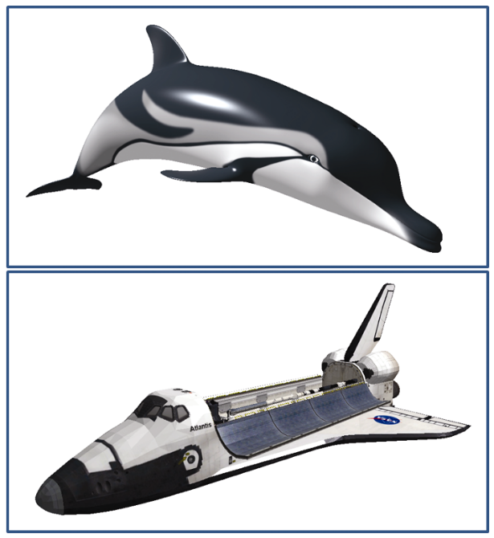

### 7.6　结合光照与纹理

目前为止，在光照模型中，都是假设我们使用按ADS定义的光源，照亮按ADS定义材质的物体。但是，正如我们在第5章中所讲的，某些对象的表面可能会指定纹理图像。因此，我们需要一种方法来结合采样纹理所得的颜色和光照模型产生的颜色。

我们结合光照和纹理的方式取决于物体的特性以及其纹理的目的。这里有多种情况，其中常见的有：

+ 纹理图像很写实地反映了物体真实的表面外观；
+ 物体同时具有材质和纹理；
+ 材质包括了阴影和反射信息（在第8章、第9章中）；
+ 有多种光和/或多个纹理。

我们先来观察第一种情景，物体拥有一个简单的纹理，同时我们对它进行光照。实现这种光照的一种简单方法是在片段着色器中完全将材质特性去除掉，之后使用纹理取样所得纹理颜色代替材质的ADS值。下面的伪代码展示了这种策略：

```c
fragColor = textureColor * ( ambientLight + diffuseLight ) + specularLight
```

这种策略下，纹理颜色影响了环境光和漫反射分量，而镜面反射颜色仅由光源决定。镜面反射分量仅由光源决定是一种很常见的做法，尤其是对于金属或“闪亮”的表面。但是，对于不那么闪亮的表面，如织物或未上漆的木材（甚至一小部分金属，如黄金），其镜面高光部分都应当包含物体表明颜色。在这些情况下，之前的策略应该做适当微调：

```c
fragColor = textureColor * ( ambientLight + diffuseLight + specularLight )
```

同时也有一些情况下，物体本身具有ADS材质，并伴有纹理图像。如银质物体使用纹理为表面添加一些氧化痕迹。在这些情况下，如之前章节中所讲过的，既用到光照又用到材质的标准ADS模型就可以与纹理颜色相结合，并加权求和。如：

```c
textureColor = texture(sampler, texCoord)
lightColor = (ambLight * ambMaterial) + (diffLight * diffMaterial) + specLight 
fragColor = 0.5 * textureColor + 0.5 * lightColor
```

这种策略结合了光照、材质、纹理，并能够扩展到多个光源以及多种材质的情况。如：

```c
texture1Color = texture(sampler1, texCoord) 
texture2Color = texture(sampler2, texCoord)
light1Color = (ambLight1 * ambMaterial) + (diffLight1 * diffMaterial) + specLight1 
light2Color = (ambLight2 * ambMaterial) + (diffLight2 * diffMaterial) + specLight2
fragColor = 0.25 * texture1Color
          + 0.25 * texture2Color
          + 0.25 * light1Color
          + 0.25 * light2Color
```

图7.17（见彩插）展示了拥有UV映射纹理图像（来自Jay Turberville<sup class="my_markdown">[TU16]</sup>）的Studio 522海豚，以及我们之前在第6章见过的NASA航天飞机模型。这两个有纹理的模型都使用了增强后的Blinn-Phong光照，没有使用材质，并在镜面高光中仅使用光照进行计算。在这两幅图中，片段着色器中颜色相关的计算为：

```c
vec4 texColor = texture(sampler, texCoord);
fragColor = texColor * (globalAmbient + lightAmb + lightDiff * max(dot(L,N),0.0))
            + lightSpec * pow(max(dot(H,N),0.0), matShininess*3.0);
```

注意，计算过程中fragColor可能产生大于1.0的值。在这种情况下，OpenGL会将它限制回1.0。


<center class="my_markdown"><b class="my_markdown">图7.17　结合光照与纹理</b></center>

