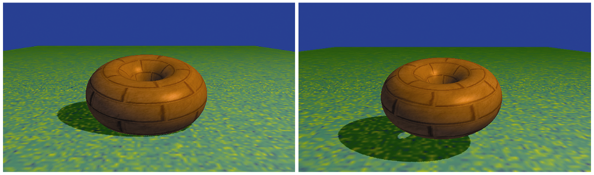

### 8.1　阴影的重要性

在第7章中，我们学会了如何为3D场景添加光照。但是，我们并没有真的添加光线，而是模拟光照在物体上的效果——使用ADS模型——并相应地调整这些物体的绘制方式。

当我们用这种方法照亮同一个场景中的多个物体时，它的局限性就体现出来了。考虑图8.1所示的场景，其中包含了砖块纹理环面以及地平面（地平面是一个巨大立方体的顶部，使用了来自[LU16]的草地纹理）。

<b class="my_markdown">图8.1　没有阴影的场景</b>

一眼望去我们的场景好像没问题。但是，仔细观察会发现有什么重要的东西没有出现。具体来说，就是我们没有办法分辨出环面距离它下方纹理立方体的距离。环面究竟是浮在立方体上面呢，还是放置在立方体顶部呢？

我们无法回答这个问题的原因正是因为场景中缺乏阴影。我们期望看到阴影，因为大脑需要通过阴影，才能针对我们所看到的物体以及他们的位置关系构建完整的心理模型。

考虑图8.2所示的同样的场景，不过添加了阴影。现在就很明显了，左图中环面放在地平面上；而右图中，环面则浮于其上。

<b class="my_markdown">图8.2　带阴影的光照</b>

