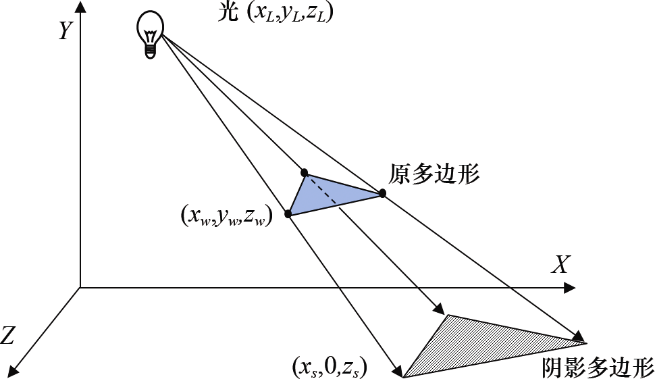

### 8.2　投影阴影

为了给3D场景添加阴影，人们设计了许多有趣的方法。其中一种很适合在地平面上（如图8.1所示）绘制阴影，又相对不需要太大计算代价的方法，叫作投影阴影（projective shadows）。给定一个位于（XL,YL,ZL）的点光源、一个需要渲染的物体以及一个投射阴影的平面，可以通过生成一个变换矩阵，将物体上的点（XW,YW,ZW）变换为相应阴影在平面上的点（XS,0,ZS）。之后将其生成的“阴影多边形”绘制出来，通常使用暗色物体与地平面纹理混合作为其纹理，如图8.3所示。

<b class="my_markdown">图8.3　投影阴影</b>

使用投影阴影进行投射的优点是它的高效和易于实现。但是，它仅适用于平坦表面——这种方法无法投射阴影于曲面或其他物体。即使如此，它仍然适用于有室外场景并对性能要求较高的应用，很多游戏中的场景都属于这类。

投影阴影变换矩阵的发展在[BL88], [AS14]以及[KS16]中有讨论。

