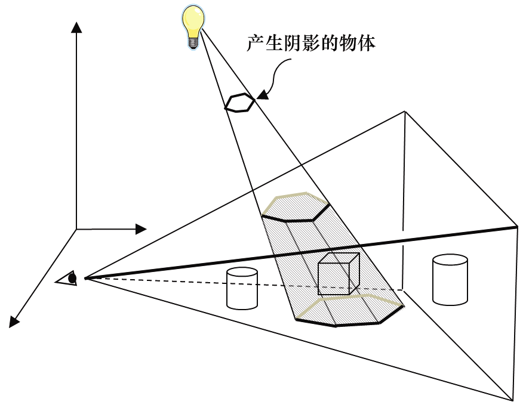

### 8.3　阴影体

Franklin C. Crow在1977年提出了另一个重要的方法，这个方法先找到被物体阴影覆盖的阴影体，之后减少视体与阴影体相交部分中的多边形的颜色强度。图8.4展示了阴影体中的立方体，因此，立方体绘制时会更暗。

<b class="my_markdown">图8.4　阴影体</b>

阴影体的优点在于其高度准确，比起其他方法来更不容易产生伪影。但是，计算出阴影体以及每个多边形是否在其中这件事，即使对于现代GPU来说，计算代价也很大。几何着色器可以用于计算阴影体，模板缓冲区[1]可以用于判断像素是否在阴影体内。有些显卡对于特定的阴影体操作优化提供了硬件支持。

