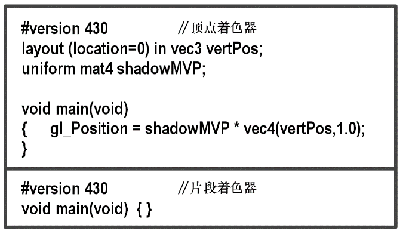

### 8.4.1　阴影贴图（第1轮）——从光源位置“绘制”物体

在第一步中，我们首先将相机移动到灯光的位置然后渲染场景。我们的目标不是在显示器上实际绘制场景，而是完成足够的渲染过程以正确填充深度缓冲区。因此，没有必要为像素生成颜色，我们的第一遍将仅使用顶点着色器，但片段着色器不执行任何操作。

当然，移动相机需要构建适当的观察矩阵。根据场景的内容，我们需要在光源处依合适的方向来看场景。通常，我们希望此方向朝向最终在第2轮中呈现的区域。

这个方向通常依场景而定——在我们的场景中，我们通常会将相机从光源指向原点。

第1轮中有几个需要处理的重要细节。

+ 配置缓冲区和阴影纹理。
+ 禁用颜色输出。
+ 从光源到视野中的物体构建一个LookAt矩阵。
+ 启用GLSL第1轮着色器程序，该程序仅包含图8.5中的简单顶点着色器，准备接收MVP矩阵。在这种情况下，MVP矩阵将包括对象的模型矩阵**M**、前一步中计算的LookAt矩阵（作为观察矩阵**V**），以及透视矩阵**P**。我们将该MVP矩阵称为“shadowMVP”，因为它是基于光而不是相机的观察点。由于实际上没有显示来自光源的视图，因此第1轮着色器程序的片段着色器不会执行任何操作。

<b class="my_markdown">图8.5　阴影贴图第1轮的顶点着色器和片段着色器</b>

+ 为每个对象创建shadowMVP矩阵，并调用glDrawArrays()。第1轮中不需要包含纹理或光照，因为对象不会渲染到屏幕上。

