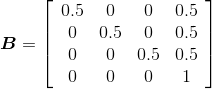
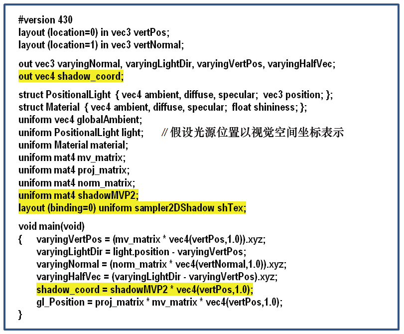
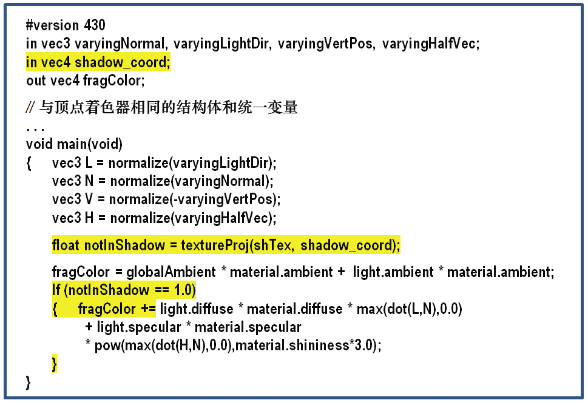
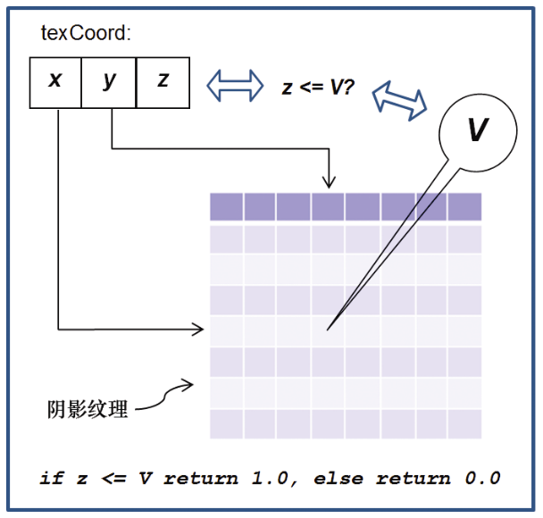

### 8.4.3　阴影贴图（第2轮）——渲染带阴影的场景

第2轮中的大部分内容与我们在第7章中看到的类似，即我们在这里渲染完整的场景及其中的所有物体，以及光照、材质和装饰场景中物体的纹理。同时，我们还需要添加必要的代码，以确定每个像素是否在阴影中。

第2轮的一个重要特征是它使用了两个MVP矩阵。一个是将对象坐标转换为屏幕坐标的标准MVP矩阵（如我们之前的大多数示例所示）。另一个是在第1轮中生成的shadowMVP矩阵，用于从光源的角度进行渲染——现在将在第2轮中用于从阴影纹理中查找深度信息。

在第2轮中，从纹理贴图尝试查找像素时，情况比较复杂。OpenGL相机使用[−1…+ 1]坐标空间，而纹理贴图使用[0…1]空间。常见的解决方案是构建一个额外的矩阵变换，通常称为**B**，它将用于从摄像机空间到纹理空间的转换（或“偏离”，biases，因此名称）。得到**B**的过程很简单——先缩放为1/2，再平移1/2。

矩阵**B**如下：

之后将**B**合并入shadowMVP矩阵以备在第2轮中使用，如下：

假设我们使用阴影纹理附加到我们的自定义帧缓冲区的方法，OpenGL提供了一些相对简单的工具，用于确定绘制对象时，像素是否处于阴影中。以下是第二阶段处理的详细信息摘要。

+ 构建变换矩阵B，用于从光照空间转换到纹理空间[更合适在init()中进行]。
+ 启用阴影纹理以进行查找。
+ 启用颜色输出。
+ 启用GLSL第2轮渲染程序，包含顶点着色器和片段着色器。
+ 根据摄像机位置（正常）为正在绘制的对象构建MVP矩阵。
+ 构建shadowMVP2矩阵（包含**B**矩阵，如前所述）——着色器将需要用它查找阴影纹理中的像素坐标。
+ 将生成的矩阵变换发送到着色器统一变量。
+ 像往常一样启用包含顶点、法向量和纹理坐标（如果使用）的缓冲区。
+ 调用glDrawArrays()。

除了渲染任务外，顶点和片段着色器还需要额外承担一些任务。

+ 顶点着色器将顶点位置从相机空间转换为光照空间，并将结果坐标发送到顶点属性中的片段着色器，以便对它们进行插值。这样片段着色器可以从阴影纹理中检索正确的值。
+ 片段着色器调用textureProj()函数，该函数返回0或1，指示像素是否处于阴影中（所涉及的机制将在后面解释）。如果它在阴影中，则着色器通过剔除其漫反射和镜面反射分量来输出更暗的像素。

阴影贴图是一种常见任务，因此GLSL为其提供了一种特殊类型的采样器变量，称为sampler2DShadow（如前所述），可以附加到C++ / OpenGL应用程序中的阴影纹理。textureProj()函数用于从阴影纹理中查找值，它类似于我们之前在第5章中看到的texture()，其区别是除了textureProj()函数使用vec3来索引纹理而不是通常的vec2。由于像素坐标是vec4，因此需要将其投影到2D纹理空间上，以便在阴影纹理贴图中查找深度值。正如我们将在下面看到的，textureProj()为完成了这些功能。

顶点着色器和片段着色器代码的其余部分实现了Blinn-Phong着色。这些着色器如图8.6和图8.7所示，并增加了阴影贴图的代码。

<b class="my_markdown">图8.6　阴影贴图第2轮顶点着色器</b>

让我们更仔细地研究一下如何使用OpenGL来执行正在渲染的像素和阴影纹理中的值之间的深度比较。首先，从顶点着色器开始，在模型空间中使用顶点坐标，我们将其与shadowMVP2相乘以生成阴影纹理坐标，这些坐标对应于投影到光照空间中的顶点坐标，是之前从光源的视角生成的。经过插值后的（3D）光照空间坐标（x, y, z）在片段着色器中使用如下。z分量表示从光到像素的距离。（x, y）分量用于检索存储在（2D）阴影纹理中的深度信息。将该检索的值（到最靠近光的物体的距离）与z进行比较。该比较产生“二元”结果，告诉我们我们正在渲染的像素是否比最接近光的物体离光更远（即像素是否处于阴影中）。

假设光源位置以视觉空间坐标表示。

与顶点着色器相同的结构体和统一变量。

如果我们在OpenGL中使用前面介绍过的glFrameBufferTexture()并启用深度测试，然后使用片段着色器（见图8.7）的sampler2DShadow和textureProj()，所渲染的结果将完全满足我们的需求。即textureProj()将输出0.0或1.0，具体取决于深度比较。基于此值，当像素离光源比离光源最近的物体更远时，我们可以在片段着色器中忽略漫反射和镜面反射分量，从而有效地创建阴影。概述如图8.8所示。

<b class="my_markdown">图8.7　阴影贴图第2轮片段着色器</b>

<b class="my_markdown">图8.8　自动深度比较</b>

我们现在准备构建C++ / OpenGL应用程序以使用上述着色器。

