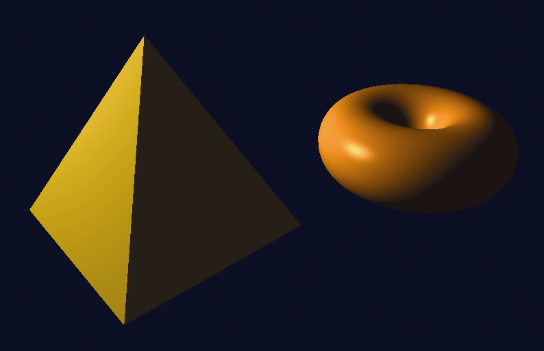
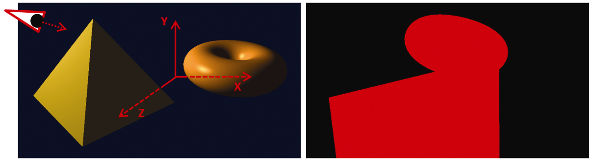

### 8.5　阴影贴图示例

考虑图8.9中包含环面和金字塔的场景。位置光源放置在左侧（注意镜面高光）。


<center class="my_markdown"><b class="my_markdown">图8.9　有光照无阴影的场景</b></center>

金字塔应该在环面上投下阴影。

为了阐明示例的开发，我们的第一步是将第1轮渲染到屏幕以确保它正常工作。为此，我们将临时添加一个简单的片段着色器（它不会包含在最终版本中）并在第1轮中仅输出一种固定颜色（如红色）；例如：

```c
#version 430
out vec4 fragColor;
void main(void)
{ fragColor = vec4(1.0, 0.0, 0.0, 0.0);
}
```

让我们假设场景的原点位于图的中心在金字塔和环面之间。在第1轮中，我们将相机放在光源的位置（图8.10中的左图）并指向（0,0,0）。然后我们用红色绘制对象，它会产生如图8.10（见彩插）右图所示的输出。注意金字塔顶部附近的环面——这个制高点附近的环面部分位于金字塔后面。


<center class="my_markdown"><b class="my_markdown">图8.10　第1轮：场景（左）和从光源视角渲染的场景（右）</b></center>

包含光照与阴影贴图的完整第2轮C++/OpenGL代码见程序8.1。

程序8.1　阴影贴图

```c
// 大部分与之前相同。高亮部分代码是新加入的，用以实现阴影
// 实现光照所需的大部分引用需要在代码开始引入，与之前相同
// 因此不在这里重复
// 在这里定义渲染程序所用的变量、缓冲区、着色器源代码等
. . .
ImportedModel pyramid("pyr.obj");     // 定义金字塔
Torus myTorus(0.6f, 0.4f, 48);        // 定义环面
int numPyramidVertices, numTorusVertices, numTorusIndices;
. . . 
// 环面、金字塔、相机和光源的位置
glm::vec3 torusLoc(1.6f, 0.0f, -0.3f);
glm::vec3 pyrLoc(-1.0f, 0.1f, 0.3f);
glm::vec3 cameraLoc(0.0f, 0.2f, 6.0f);
glm::vec3 lightLoc(-3.8f, 2.2f, 1.1f);
// 场景中所使用白光的属性(全局光和位置光)
float globalAmbient[4] = { 0.7f, 0.7f, 0.7f, 1.0f };
float lightAmbient[4] = { 0.0f, 0.0f, 0.0f, 1.0f };
float lightDiffuse[4] = { 1.0f, 1.0f, 1.0f, 1.0f };
float lightSpecular[4] = { 1.0f, 1.0f, 1.0f, 1.0f }; 
// 金字塔的黄金材质
float* goldMatAmb = Utils::goldAmbient();
float* goldMatDif = Utils::goldDiffuse();
float* goldMatSpe = Utils::goldSpecular();
float goldMatShi = Utils::goldShininess();
// 环面的青铜材质
float* bronzeMatAmb = Utils::bronzeAmbient();
float* bronzeMatDif = Utils::bronzeDiffuse();
float* bronzeMatSpe = Utils::bronzeSpecular();
float bronzeMatShi = Utils::bronzeShininess();
// 在display()中将光照传入着色器的变量
float curAmb[4], curDif[4], curSpe[4], matAmb[4], matDif[4], matSpe[4];
float curShi, matShi;
// 阴影相关变量
int screenSizeX, screenSizeY; GLuint shadowTex, shadowBuffer; glm::mat4 lightVmatrix; glm::mat4 lightPmatrix; glm::mat4 shadowMVP1; glm::mat4 shadowMVP2; glm::mat4 b;
// 这里定义类型为mat4的光源观察矩阵与相机观察矩阵的矩阵变换(mMat, vMat等)
// 其他在display中所使用的变量也在此定义
   . . . 
int main(void) {
   // 与前例相同，无改动
}
// init()函数依然执行调用以编译着色器并初始化物体
// 同时它也调用setupShadowBuffers()函数以初始化阴影贴图相关缓冲区
// 最后，它构造B矩阵以进行从光照空间到纹理空间的转换
void init(GLFWwindow* window) {
   renderingProgram1 = Utils::createShaderProgram("./vert1Shader.glsl", "./frag1Shader.glsl");
   renderingProgram2 = Utils::createShaderProgram("./vert2Shader.glsl", "./frag2Shader.glsl");
   setupVertices();
   setupShadowBuffers();
   b = glm::mat4(        0.5f, 0.0f, 0.0f, 0.0f,        0.0f, 0.5f, 0.0f, 0.0f,        0.0f, 0.0f, 0.5f, 0.0f,        0.5f, 0.5f, 0.5f, 1.0f); }
void setupShadowBuffers(GLFWwindow* window) {    glfwGetFramebufferSize(window, &width, &height);    screenSizeX = width;    screenSizeY = height; 
   // 创建自定义帧缓冲区
   glGenFramebuffers(1, &shadowBuffer);    
   // 创建阴影纹理并让它存储深度信息
   // 这些步骤与程序5.2中相似
   glGenTextures(1, &shadowTex);    glBindTexture(GL_TEXTURE_2D, shadowTex);    glTexImage2D(GL_TEXTURE_2D, 0, GL_DEPTH_COMPONENT32,       screenSizeX, screenSizeY, 0, GL_DEPTH_COMPONENT, GL_FLOAT, 0);    glTexParameteri(GL_TEXTURE_2D, GL_TEXTURE_MIN_FILTER, GL_LINEAR);    glTexParameteri(GL_TEXTURE_2D, GL_TEXTURE_MAG_FILTER, GL_LINEAR);    glTexParameteri(GL_TEXTURE_2D, GL_TEXTURE_COMPARE_MODE, GL_COMPARE_REF_TO_TEXTURE);    glTexParameteri(GL_TEXTURE_2D, GL_TEXTURE_COMPARE_FUNC, GL_LEQUAL); }
void setupVertices(void) { 
   // 与之前的例子相同。这个函数用来创建VAO和VBO
   // 之后将环面及金字塔的顶点与法向量读入缓冲区
}
// display()函数分别管理第1轮需要使用的自定义帧缓冲区
// 以及第2轮需要使用的阴影纹理初始化过程。阴影相关新功能已高亮
void display(GLFWwindow* window, double currentTime) { 
   glClear(GL_COLOR_BUFFER_BIT); 
   glClear(GL_DEPTH_BUFFER_BIT); 
   // 从光源视角初始化视觉矩阵以及透视矩阵，以便在第1轮中使用
   lightVmatrix = glm::lookAt(currentLightPos, origin, up); // 从光源到原点的矩阵
   lightPmatrix = glm::perspective(toRadians(60.0f), aspect, 0.1f, 1000.0f); 
   // 使用自定义帧缓冲区，将阴影纹理附着到其上
   glBindFramebuffer(GL_FRAMEBUFFER, shadowBuffer);    glFramebufferTexture(GL_FRAMEBUFFER, GL_DEPTH_ATTACHMENT, shadowTex, 0);
   // 关闭绘制颜色，同时开启深度计算
   glDrawBuffer(GL_NONE);    glEnable(GL_DEPTH_TEST);
   passOne(); 
   // 使用显示缓冲区，并重新开启绘制
   glBindFramebuffer(GL_FRAMEBUFFER, 0);    glActiveTexture(GL_TEXTURE0);    glBindTexture(GL_TEXTURE_2D, shadowTex);    glDrawBuffer(GL_FRONT);              // 重新开启绘制颜色
   passTwo();
}
// 接下来是第1轮和第2轮的代码
// 这些代码和之前的大体相同
// 与阴影相关的新增代码已高亮
void passOne(void) { 
   // renderingProgram1包含了第1轮中的顶点着色器和片段着色器
   glUseProgram(renderingProgram1); 
   . . . 
   // 接下来的代码段通过从光源角度渲染环面获得深度缓冲区
   mMat = glm::translate(glm::mat4(1.0f), torusLoc); 
   // 轻微旋转以便查看
   mMat = glm::rotate(mMat, toRadians(25.0f), glm::vec3(1.0f, 0.0f, 0.0f)); 
   // 我们从光源角度绘制，因此使用光源的P、V矩阵
   shadowMVP1 = lightPmatrix * lightVmatrix * mMat;    sLoc = glGetUniformLocation(renderingProgram1, "shadowMVP");    glUniformMatrix4fv(sLoc, 1, GL_FALSE, glm::value_ptr(shadowMVP1));
   // 在第1轮中我们只需要环面的顶点缓冲区，而不需要它的纹理或法向量
   glBindBuffer(GL_ARRAY_BUFFER, vbo[0]); 
   glVertexAttribPointer(0, 3, GL_FLOAT, GL_FALSE, 0, 0); 
   glEnableVertexAttribArray(0); 
   glClear(GL_DEPTH_BUFFER_BIT); 
   glEnable(GL_CULL_FACE); 
   glFrontFace(GL_CCW); 
   glEnable(GL_DEPTH_TEST); 
   glDepthFunc(GL_LEQUAL); 
   glBindBuffer(GL_ELEMENT_ARRAY_BUFFER, vbo[4]);       // vbo[4] 包含环面索引
   glDrawElements(GL_TRIANGLES, numTorusIndices, GL_UNSIGNED_INT, 0);
   // 对金字塔做同样的处理(但不清除GL_DEPTH_BUFFER_BIT)
   // 金字塔没有索引，因此我们使用glDrawArrays()而非glDrawElements()
   . . . 
   glDrawArrays(GL_TRIANGLES, 0, numPyramidVertices);
} 
void passTwo(void) { 
   glUseProgram(renderingProgram2);        // 第2轮顶点着色器和片段着色器
   // 绘制环面，这次我们需要加入光照、材质、法向量等
   // 同时我们需要为相机空间以及光照空间都提供MVP变换
   mvLoc = glGetUniformLocation(renderingProgram2, "mv_matrix"); 
   projLoc = glGetUniformLocation(renderingProgram2, "proj_matrix"); 
   nLoc = glGetUniformLocation(renderingProgram2, "norm_matrix"); 
   sLoc = glGetUniformLocation(renderingProgram2, "shadowMVP");
   // 环面是黄铜材质
   curAmb[0] = bronzeMatAmb[0];  curAmb[1] = bronzeMatAmb[1];   curAmb[2] = bronzeMatAmb[2]; 
   curDif[0] = bronzeMatDif[0];  curDif[1] = bronzeMatDif[1];   curDif[2] = bronzeMatDif[2]; 
   curSpe[0] = bronzeMatSpe[0];   curSpe[1] = bronzeMatSpe[1];  curSpe[2] = bronzeMatSpe[2]; 
   curShi = bronzeMatShi; 
   vMat = glm::translate(glm::mat4(1.0f), glm::vec3(-cameraLoc.x, -cameraLoc.y, -cameraLoc.z)); 
   currentLightPos = glm::vec3(lightLoc); 
   installLights(renderingProgram2, vMat); 
   mMat = glm::translate(glm::mat4(1.0f), torusLoc); 
   // 轻微旋转以便查看
   mMat = glm::rotate(mMat, toRadians(25.0f), glm::vec3(1.0f, 0.0f, 0.0f)); 
   // 构建相机视角环面的MV矩阵
   mvMat = vMat * mMat; 
   invTrMat = glm::transpose(glm::inverse(mvMat)); 
   // 构建光源视角环面的MV矩阵
   shadowMVP2 = b * lightPmatrix * lightVmatrix * mMat;
   // 将MV以及PROJ矩阵传入相应的统一变量
   glUniformMatrix4fv(mvLoc, 1, GL_FALSE, glm::value_ptr(mvMat)); 
   glUniformMatrix4fv(projLoc, 1, GL_FALSE, glm::value_ptr(pMat)); 
   glUniformMatrix4fv(nLoc, 1, GL_FALSE, glm::value_ptr(invTrMat)); 
   glUniformMatrix4fv(sLoc, 1, GL_FALSE, glm::value_ptr(shadowMVP2));
   // 初始化环面顶点和法向量缓冲区()
   glBindBuffer(GL_ARRAY_BUFFER, vbo[0]);       // 环面顶点
   glVertexAttribPointer(0, 3, GL_FLOAT, GL_FALSE, 0, 0); 
   glEnableVertexAttribArray(0); 
   glBindBuffer(GL_ARRAY_BUFFER, vbo[2]);       // 环面法向量
   glVertexAttribPointer(1, 3, GL_FLOAT, GL_FALSE, 0, 0); 
   glEnableVertexAttribArray(1); 
   glClear(GL_DEPTH_BUFFER_BIT); 
   glEnable(GL_CULL_FACE); 
   glFrontFace(GL_CCW); 
   glEnable(GL_DEPTH_TEST); 
   glDepthFunc(GL_LEQUAL); 
   glBindBuffer(GL_ELEMENT_ARRAY_BUFFER, vbo[4]);       // vbo[4]包含环面索引
   glDrawElements(GL_TRIANGLES, numTorusIndices, GL_UNSIGNED_INT, 0); 
   . . . 
   // 对黄金金字塔重复同样步骤
}

```

程序8.1展示了与之前详述过的第1轮、第2轮着色器交互部分的C++ / OpenGL应用程序。之前已经展示过的模块，如读取着色器、编译着色器、构建模型及相关缓冲区、在着色器中初始化位置光源ADS特性以及进行透视矩阵和LookAt矩阵计算等，这些模块同之前一样。

