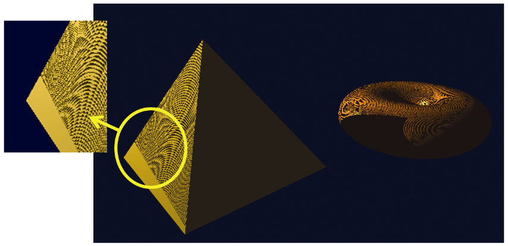
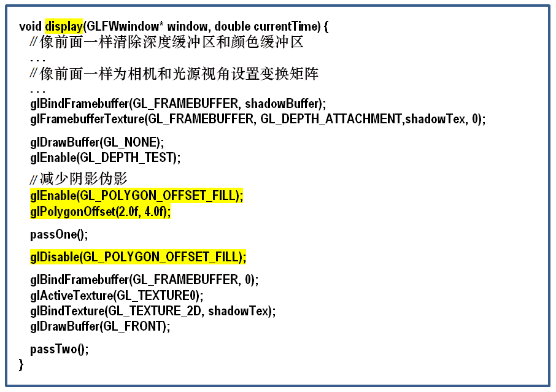
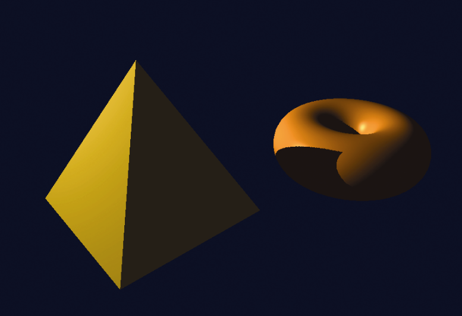
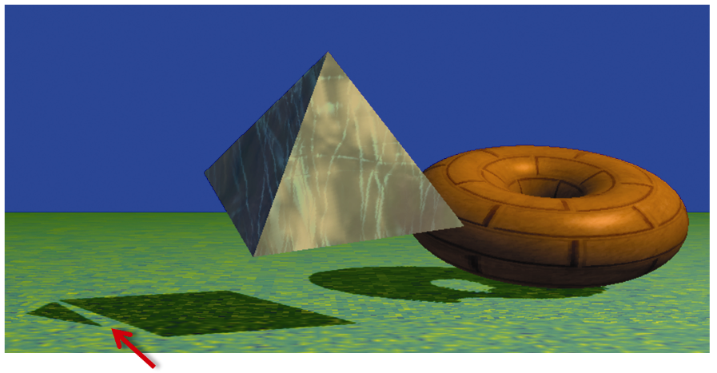
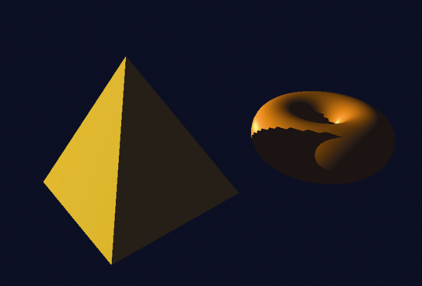

### 8.6　阴影贴图的伪影

虽然我们已经实现了为场景添加阴影的所有基本要求，但运行程序8.1会产生错杂的结果，如图8.11所示。


<center class="my_markdown"><b class="my_markdown">图8.11　阴影的“痤疮”</b></center>

好消息是我们的金字塔现在在环面上投下阴影！坏消息则是，这种成功伴随着严重的伪影。有许多波浪线覆盖在场景中的表面。这是阴影贴图的常见副作用，称为阴影痤疮（也称为阴影斑块，shadow acne）或错误的自阴影。

阴影痤疮是由深度测试期间的舍入误差引起的。在阴影纹理中查找深度信息时计算的纹理坐标通常与实际坐标不完全匹配。因此，从阴影纹理中查找到的深度值可能并非当前渲染中像素的深度，而是相邻像素的深度。如果相邻像素在更远位置，则当前像素会被错误地显示为阴影。

阴影痤疮也会由纹理贴图和深度计算之间的精度差引起。这也可能导致舍入误差，并造成对像素是否处于阴影中的误判。

幸运的是，阴影痤疮很容易修复。由于阴影痤疮通常发生在没有阴影的表面上，这里有个简单的技巧，在第1轮中将每个像素稍微移向光源，之后在第2轮将它们移回原位。通常，这么做足以补偿各类舍入误差。在我们的实现中简单地在display()函数中调用glPolygon- Offset()即可，如图8.12所示（突出显示部分）。


<center class="my_markdown"><b class="my_markdown">图8.12　与阴影痤疮的战斗</b></center>

将这几行代码添加到display()函数，可以显著改善程序的输出，如图8.13所示。还要注意，随着伪影的消失，现在可以看到环面的内圆在其自身上显示了一个正确的小阴影。


<center class="my_markdown"><b class="my_markdown">图8.13　渲染带阴影的场景</b></center>

虽然修复阴影痤疮很容易，但有时修复会引起新的伪影。在第1轮之前移动对象的“技巧”有时会导致在对象阴影中出现间隙。图8.14显示了一个这样的例子。这种伪影通常被称为“Peter Panning”，因为有时它会导致静止物体的阴影与物体底部分离的问题（从而使物体的阴影部分与阴影的其余部分分离，让人想起詹姆斯·马修·巴利笔下的角色Peter Pan<sup class="my_markdown">[PP16]</sup>）。修复此伪影需要调整glPolygonOffset()的参数。如果它们太小，就会出现阴影痤疮；如果太大，则会出现Peter Panning。


<center class="my_markdown"><b class="my_markdown">图8.14　修复引起新的伪影</b></center>

在实现阴影贴图时可能会发生许多其他伪影。如重复阴影，因为在第1轮（存入阴影缓冲区时）渲染的场景区域与第2轮中渲染的场景区域不同（来自不同的观察位置）。这种差异可能导致在第2轮中渲染的场景中，某些区域尝试使用范围[0…1]之外的特征坐标来访问阴影纹理。回想一下，在这种情况下默认行为是GL_REPEAT，因此，这可能导致错误的重复阴影。

一种可能的解决方案是将以下代码行添加到setupShadowBuffers()，将纹理换行模式设置为“夹紧到边缘”。

```c
glTexParameteri(GL_TEXTURE_2D, GL_TEXTURE_WRAP_S, GL_CLAMP_TO_EDGE);
glTexParameteri(GL_TEXTURE_2D, GL_TEXTURE_WRAP_T, GL_CLAMP_TO_EDGE);
```

这样纹理边缘以外的值会被限制为边缘处的值（而非重复）。注意，这种方法自身也有可能造成伪影，即当阴影纹理的边缘处存在阴影时，截取边缘可能产生延伸到场景边缘的“阴影条”。

另一种常见错误是锯齿状阴影边缘。当投射的阴影明显大于阴影缓冲区可以准确表示的阴影时，就有可能出问题。通常，这取决于场景中物体和灯光的位置。尤其当光源在距离物体较远时，更容易发生。一个例子如图8.15所示。


<center class="my_markdown"><b class="my_markdown">图8.15　锯齿状阴影边缘</b></center>

消除锯齿状阴影边缘就没有处理之前的伪影那么简单了。一种技术是在第1轮期间将光位置移动到更接近场景的位置，然后在第2轮放回原始位置。另一种常用的有效方法则是我们将在下面讨论的“柔和阴影”方法之一。

