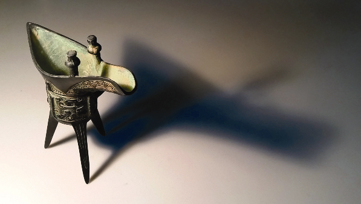
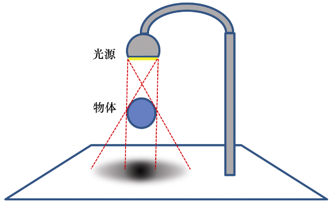

### 8.7.1　现实世界中的柔和阴影

柔和阴影的成因有很多，同时也有许多类型的柔和阴影。通常在自然界中产生柔和阴影原因是，真实世界的光源很少是点光源——它们常常是区域光源。另一个原因是材料和表面的缺陷积累，以及物体本身通过其自身的反射特性产生环境光的作用。

图8.16展示了物体向桌面投射柔和阴影的照片示例。注意，这不是计算机渲染的3D场景，而是真实的照片，是本书作者之一在家中拍摄的。

<b class="my_markdown">图8.16　现实世界中的柔和阴影示例</b>

对于图8.16中的阴影，有两点需要注意。

+ 离物体越远的阴影越“柔和”，离物体越近的阴影越“硬”。在对比物体腿附近的阴影与右边更宽的阴影时，这一点就很明显了。
+ 距离物体越近的阴影显得越暗。

光源本身的维度会导致柔和阴影。如图8.17所示，光源上各处会投射出略微不同的阴影。各种阴影不同的区域称为半影（penumbra），包括阴影边缘的柔和区域。

<b class="my_markdown">图8.17　柔和阴影的半影效果</b>

