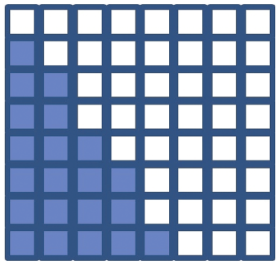
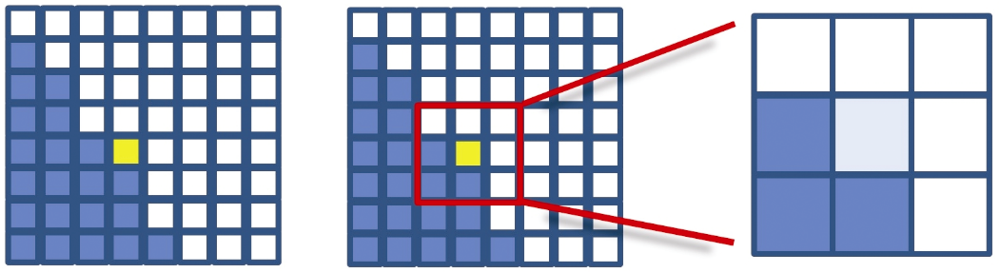
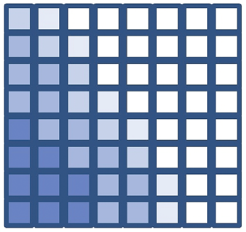
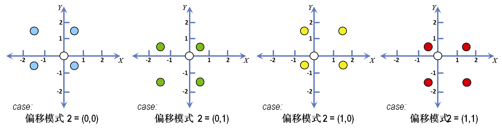
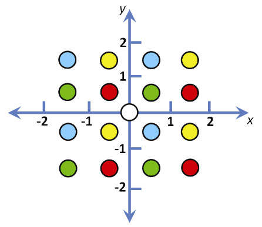
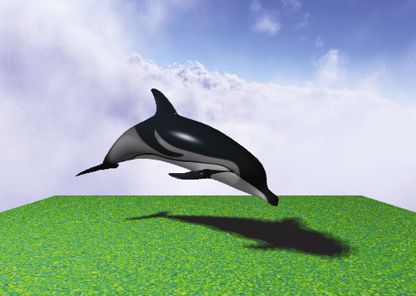

### 8.7.2　生成柔和阴影——百分比邻近滤波（PCF）

有多种方法可以用来模拟半影效果以在软件中生成柔和阴影。最简单也最常见的一种方法叫作百分比邻近滤波（Percentage Closer Filtering，PCF）。在PCF中，我们对单个点周围的几个位置的阴影纹理进行采样，以估计附近位置在阴影中的百分比。根据附近位置在阴影中的数量，对正在渲染的像素的光照分量进行修改。整个计算可以在片段着色器中完成，所以我们只需要对其中的代码进行修改。PCF还可用于减少锯齿线伪影。

在研究实际的PCF算法之前，我们先看一个类似的简单示例来展示PCF的目标。考虑图8.18中所示的输出片段（像素）集，其颜色由片段着色器计算。

<b class="my_markdown">图8.18　硬阴影渲染</b>

假设深色像素处于阴影中，这是阴影贴图计算的结果。假设我们可以访问相邻的像素信息，而不是简单地如图所示渲染像素（即包括或不包括漫反射和镜面反射分量），这样我们就可以看到有多少相邻像素处于阴影中。例如，考虑图8.19（见彩插）中以黄色突出显示的特定像素，根据图8.18，该像素不在阴影中。

<b class="my_markdown">图8.19　单像素PCF采样</b>

在高亮像素的9个像素邻域中，3个像素处于阴影中而6个像素处于阴影外。因此，渲染像素的颜色可以被计算为该像素处的环境光分量加上漫反射和镜面反射分量的9/6，这样会使像素一定程度（但不是完全）变亮。在整个网格中重复此过程将会产生图8.20所示的像素颜色。注意，对于那些邻域完全位于阴影中（或阴影外）的像素，生成的颜色与标准阴影贴图相同。

<b class="my_markdown">图8.20　柔和阴影渲染</b>

与上例不同的是，在PCF的实现中，不是对渲染像素临近区域内的每个像素进行采样。这有两个原因：（a）我们想在片段着色器中执行此计算，但片段着色器无法访问其他像素；（b）获得足够宽的半影效果（例如，10～20像素宽）将需要为每个被渲染的像素采样数百个附近的像素。

PCF解决了以下两个问题。首先，我们不试图访问附近的像素，而是在阴影贴图中对附近的纹素进行采样。片段着色器可以执行此操作，因为虽然它无法访问附近像素的值，但它可以访问整个阴影贴图。其次，为了获得足够宽的半影效果，需要对附近一定数量的阴影贴图纹素进行采样，每个采样的纹素都距离所渲染像素的纹素一定距离。

半影的宽度和采样点数可以根据场景和性能要求调整。例如，图8.21所示PCF生成的图像是，每个像素的亮度是通过对64个不同的纹素进行采样确定的，它们与像素的纹素距离各不相同。

柔和阴影的准确度或平滑度取决于所采样附近纹素的数量。因此，在性能和质量之间需要权衡——采样点越多，效果越好，但计算开销也越多。场景的复杂性和给定应用所需的帧率对于阴影可实现的质量有着相应的限制。每像素采样64个点（如图8.21所示）通常是不切实际的。

<b class="my_markdown">图8.21　柔和阴影渲染——每像素64次采样</b>

一种用于实现PCF的常见算法是对每个像素附近的4个纹素进行采样，其中样本通过指定从像素对应纹素的偏移量选择。对于每个像素，我们都需要改变偏移量，并用新的偏移量确定采样的4个纹素。用交错方式改变偏移量的方法被称为抖动，它旨在使得柔和阴影边界不会由于采样点不足看起来“结块”。

一种常见的方法是假设有4种不同偏移模式，每次取其中一种——我们可以通过计算像素的glFragCoord mod 2来选择当前像素的偏移模式。之前有提到，glFragCoord是vec2类型，包含像素位置的x、y坐标。因此，mod计算的结果有4种可能的值：(0,0)、(0,1)、(1,0)或(1,1)。我们使用glFragCoord mod 2的结果来从纹素空间（即阴影贴图）4种不同偏移模式中选择一种。

偏移模式通常在x和y方向上指定，具有−1.5，−0.5，+0.5和+1.5的不同组合（也可以根据需要进行缩放）。更具体来说，由glFragCoord mod 2计算得到的每种情况的4种常用偏移模式是：

Sx和Sy指的是与正在渲染的像素相对应的阴影贴图中的位置（Sx，Sy），在本章的代码示例中标识为shadow_coord。这4种偏移模式如图8.22所示（见彩插），每种情况都以不同的颜色显示。在每种情况下，对应于正被渲染的像素的纹素位于该情况的图的原点。请注意，当在图8.23（见彩插）中一起显示时，偏移的交错/抖动很明显。

<b class="my_markdown">图8.22　抖动的4像素PCF采样示例</b>

让我们来针对特定像素看看整个计算过程。假设正在渲染的像素位于glFragCoord =（48,13）。首先我们确定像素在阴影贴图的4个采样点。为此，我们将计算vec2(48,13) mod 2，等于（0,1）。因此我们选择（0,1）所对应的偏移，在图8.22中以绿色显示，并且在阴影贴图对相应的点进行采样（假设没有指定偏移的缩放量），得到：

+ (shadow_coord.x–1.5, shadow_coord.y+0.5)
+ (shadow_coord.x–1.5, shadow_coord.y–1.5)
+ (shadow_coord.x+0.5, shadow_coord.y+0.5)
+ (shadow_coord.x+0.5, shadow_coord.y–1.5)

（回想一下，shadow_coord是阴影贴图中与正在渲染的像素相对应的纹素的位置——在图8.22和图8.23中显示为白色圆圈）。

<b class="my_markdown">图8.23　抖动的4像素PCF采样（4种偏移模式）</b>

接下来，对我们选取的这4个点分别调用textureProj()，在每种情况下都返回0.0或1.0，具体取决于该采样点是否在阴影中。将4个结果相加并除以4.0，就可以确定阴影中采样点的百分比。然后将此百分比用作乘数，确定渲染当前像素时要应用的漫反射和镜面反射分量。

尽管采样尺寸很小——每个像素只有4个样本——这种抖动方法通常可以产生好得惊人的柔和阴影。图8.24是使用4像素抖动PCF生成的。虽然它不如之前图8.21所示的64点采样版本好，但渲染速度要快得多。

<b class="my_markdown">图8.24　柔和阴影渲染——每像素4次采样，使用抖动</b>

在下一节中，我们对GLSL片段着色器进行编码，实现4采样抖动的PCF柔和阴影以及之前展示的64采样PCF柔和阴影。

