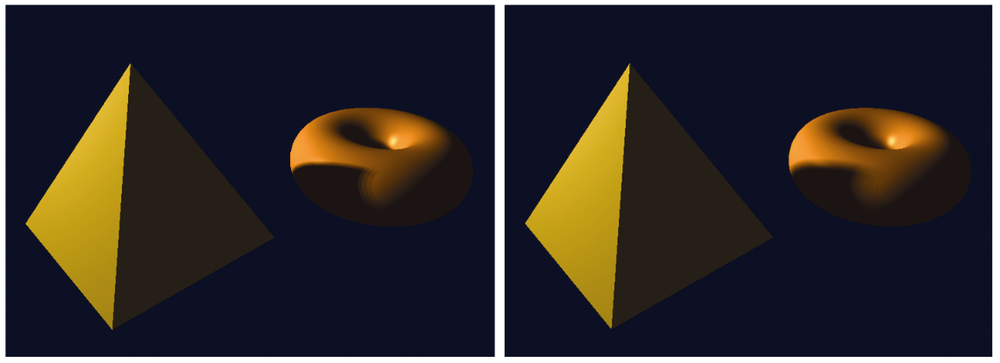

### 8.7.3　柔和阴影/PCF程序

如前所述，柔和阴影计算可以完全在片段着色器中完成。程序8.2展示了片段着色器代码，取代图8.7中的片段着色器。添加的PCF相关代码已突出显示。

程序8.2　百分比邻近滤波（PCF）

```c
片段着色器
#version 430
// 所有变量定义未改动
. . .
// 从shadow_coord返回距离（x，y）处的纹素的阴影深度值
// shadow_coord是阴影贴图中与正在渲染的当前像素相对应的位置
float lookup(float ox, float oy) { float t = textureProj(shadowTex,     shadow_coord + vec4(ox * 0.001 * shadow_coord.w, oy * 0.001 * shadow_coord.w,     -0.01, 0.0)); //第三个参数（-0.01）是用于消除阴影痤疮的偏移量
  return t; }
void main(void)
{ float shadowFactor = 0.0; 
    vec3 L = normalize(vLightDir); 
    vec3 N = normalize(vNormal); 
    vec3 V = normalize(-vVertPos); 
    vec3 H = normalize(vHalfVec); 
    // -----此部分生成一个4采样抖动的柔和阴影
    float swidth = 2.5;     //可调整的阴影扩散量
    // 根据glFragCoord mod 2生成4采样模式中的一个
    vec2 offset = mod(floor(gl_FragCoord.xy), 2.0) * swidth;     shadowFactor += lookup(-1.5*swidth + offset.x, 1.5*swidth - offset.y);     shadowFactor += lookup(-1.5*swidth + offset.x, -0.5*swidth - offset.y);     shadowFactor += lookup( 0.5*swidth + offset.x, 1.5*swidth - offset.y);     shadowFactor += lookup( 0.5*swidth + offset.x, -0.5*swidth - offset.y);     shadowFactor = shadowFactor / 4.0; // shadowFactor是4个采样点的平均值
    // ----- 取消本节注释以生成64采样的高分辨率柔和阴影
    // float swidth = 2.5;     // 可调整的阴影扩散量
    // float endp = swidth*3.0 +swidth/2.0; 
    // for (float m=-endp ; m<=endp ; m=m+swidth) 
    // { for (float n=-endp ; n<=endp ; n=n+swidth) 
    //     { shadowFactor += lookup(m,n); 
    // } } 
    // shadowFactor = shadowFactor / 64.0; 
    vec4 shadowColor = globalAmbient * material.ambient + light.ambient * material.ambient; 
    vec4 lightedColor = light.diffuse * material.diffuse * max(dot(L,N),0.0) 
                      + light.specular * material.specular 
                      * pow(max(dot(H,N),0.0),material.shininess*3.0); 
    fragColor = vec4((shadowColor.xyz + shadowFactor*(lightedColor.xyz)),1.0);
}

```

程序8.2中展示的片段着色器包含4采样和64采样的PCF柔和阴影的代码。为了更方便进行采样，我们需要定义lookup()函数。在lookup()函数中调用GLSL函数textureProj()，从而在阴影纹理中以指定偏移量(ox, oy)进行查找。偏移量需要乘以1 / windowsize，这里我们简单地假设窗口大小为1 000像素×1 000像素，将乘数硬编码为0.001。<sup class="my_markdown">[2]</sup>

4样本抖动的计算代码在main()函数中高亮显示，其实现遵循上一节中描述的算法。同时添加了一个比例因子swidth，用于调整阴影边缘的“柔和”区域的大小。

64采样代码以注释形式出现在后面。可以通过取消64采样代码注释并注释4采样代码以使用64采样。在64采样代码中，swidth比例因子用作嵌套循环中的步长，其采样距离正被渲染的像素的不同距离处的点。例如，当使用代码中的swidth值(2.5)时，程序将沿着每个轴在两个方向上以1.25、3.75、6.25和8.25的距离选择采样点——然后根据窗口大小进行缩放（如前所述）并用作纹理坐标采样阴影纹理。在这么多采样的情况下，通常不需要使用抖动来获得更好的结果。

图8.25展示了我们运行的环面/金字塔阴影贴图示例，它将PCF柔和阴影与程序8.2中的片段着色器相结合，分别使用了4采样和64采样的方法。swidth的选值取决于场景；对于环面/金字塔示例，它的值为2.5，而对于之前的图8.21中显示的海豚示例，swidth的值为8.0。


<center class="my_markdown"><b class="my_markdown">图8.25　PCF柔和阴影渲染——每像素4次采样，抖动（左）；每像素64次采样，不抖动（右）</b></center>

