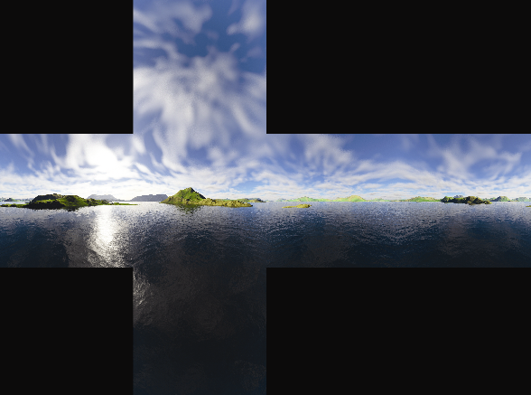
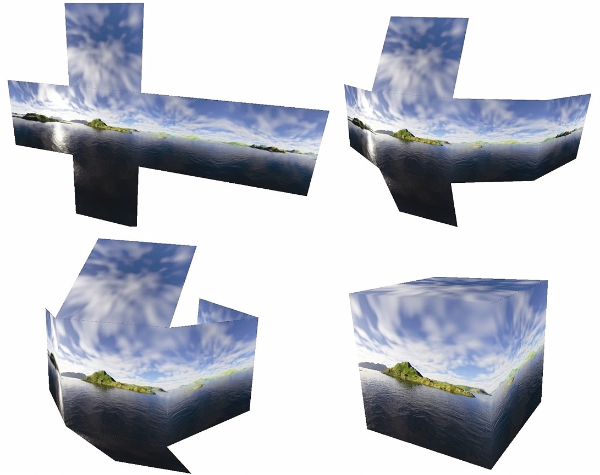
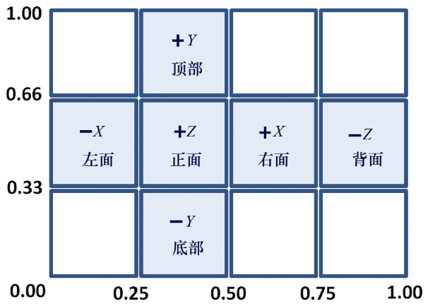
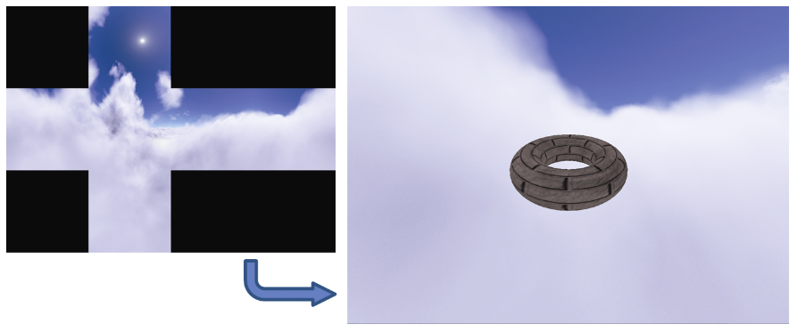

### 9.1　天空盒

天空盒的概念非常巧妙而又简单：

（1）实例化一个立方体对象；

（2）将立方体的纹理设置为所需的环境；

（3）将立方体围绕相机放置。

我们已经知道如何完成以上这些步骤。但还有少量其他细节需要注意。

+ 如何为地平线制作纹理？

立方体有6个面，我们需要为这些面都添加纹理。一种方法是使用6个图像文件和6个纹理单元。另一种常见（且高效）的方式则是使用一个包含6个面的纹理的图像，如图9.1所示。

<b class="my_markdown">图9.1　6面天空盒纹理立方体贴图</b>

上例中的纹理立方体贴图，仅用一个纹理单元，就可以为6个面添加纹理的图像。立方体贴图的6个部分对应于立方体的顶部、底部、正面、背面和两侧。当贴图“包裹”在立方体周围时，对于立方体内的相机而言，它扮演了地平线的角色，如图9.2所示。

<b class="my_markdown">图9.2　立方体贴图包裹相机</b>

使用纹理立方体贴图为立方体添加纹理需要指定适当的纹理坐标。图9.3展示了纹理坐标的分布，这些坐标接着会分配给立方体的每个顶点。

<b class="my_markdown">图9.3　立方体贴图纹理坐标</b>

+ 如何让天空盒看起来“距离很远”？

构建天空盒的另一个重要因素是确保纹理的表现看起来像是远处的地平线。首先，人们可能会认为这需要构建巨大的天空盒。然而，事实证明这并不可取，因为巨大的天空盒会拉伸和扭曲纹理。相反，通过使用以下两个技巧，可以使天空盒显得巨大（从而感觉距离很远）：

（a）禁用深度测试并先渲染天空盒（在渲染场景中的其他对象时重新启用深度测试）；

（b）天空盒随相机移动（如果相机需要移动）。

通过在禁用深度测试的情况下先绘制天空盒，深度缓冲器的值仍将全设为1.0（即最远距离）。因此，场景中的所有其他对象将被完全渲染，即天空盒不会阻挡任何其他对象。这样，无论天空盒的实际大小如何，会使天空盒的各面的位置看起来比其他物体都更远。而实际的天空盒立方体本身可以非常小，只要它在相机移动时随相机一起移动即可。图9.4展示了从天空盒内部查看简单的场景（实际上只有一个砖纹理环面）。

<b class="my_markdown">图9.4　从天空盒内部查看场景</b>

这里我们得益于对图9.4与之前图9.2和图9.3的关系的仔细研究。注意，场景中可见的天空盒部分是立方体贴图的最右侧部分。这是因为摄像机处于默认方向，面向−Z方向，因此正在观察天空盒立方体的背面（如图9.3所示）。另请注意，立方体贴图的背面在场景中渲染时会呈水平反转状态；这是因为立方体贴图的“背面”部分已经折叠在相机周围，因此看起来是经过侧向翻转的，如图9.2所示。

+ 如何构建纹理立方体贴图？

从图稿或照片构建纹理立方体贴图图像时，需要注意避免在立方体面交汇点处的“接缝”，并创建正确的透视图，才能让天空盒看起来逼真且无畸变。有许多工具可以辅助达成这一目标：Terragen、Autodesk 3Ds Max、Blender和Adobe Photoshop都有用于构建或处理立方体贴图的工具。同时，还有许多网站提供各种现成的立方体地图，既有付费的，也有免费的。

