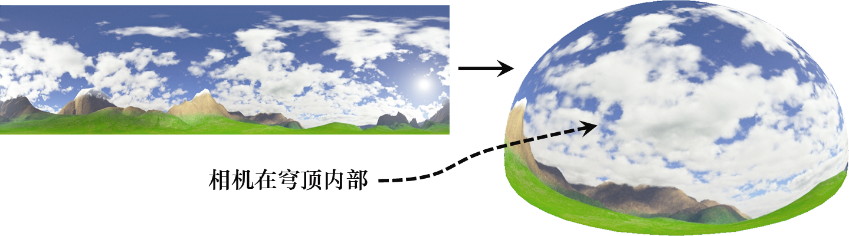
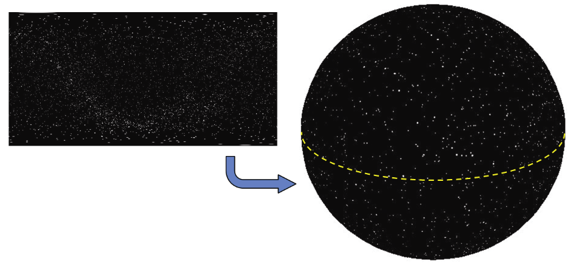

### 9.2　天空穹顶

建立地平线效果的另一种方法是使用天空穹顶。除了使用带纹理的球体（或半球体）代替带纹理的立方体，其基本思路与天空盒相同。与天空盒相同，我们首先渲染天空穹顶（禁用深度测试），并将摄像机保持在天空穹顶的中心位置（图9.5中的天空穹顶纹理是使用Terragen [TE16]制作的）。

<b class="my_markdown">图9.5　天空穹顶与其中的相机</b>

天空穹顶相比天空盒有自己的优势。例如，它们不易受到畸变和接缝的影响（尽管在纹理图像中必须考虑极点处的球形畸变）。而天空穹顶的缺点之一则是球体或穹顶模型比立方体模型更复杂，天空穹顶有更多的顶点，其数量取决于期望的精度。

当使用天空穹顶呈现室外场景时，通常与地平面或某种地形相结合。当使用天空穹顶呈现宇宙中的场景（例如星空）时，使用图9.6所示的球体通常更为实际（为了清晰地使球体可视化，球体表面添加了一道虚线）。

<b class="my_markdown">图9.6　使用球体的星空天空穹顶（星图来自[BO01]）</b>

